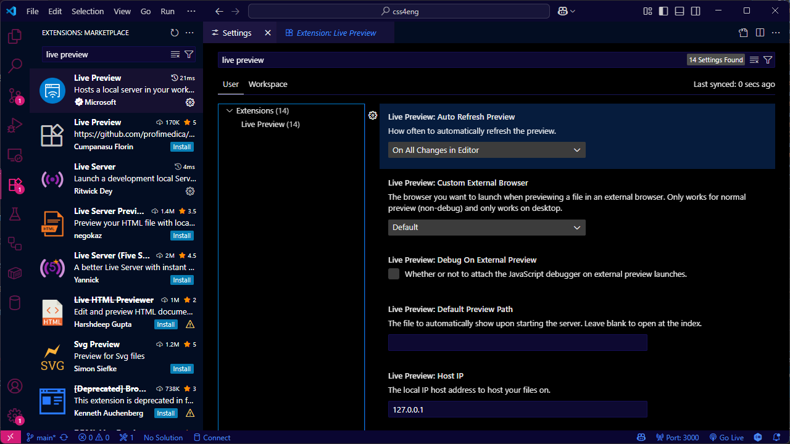
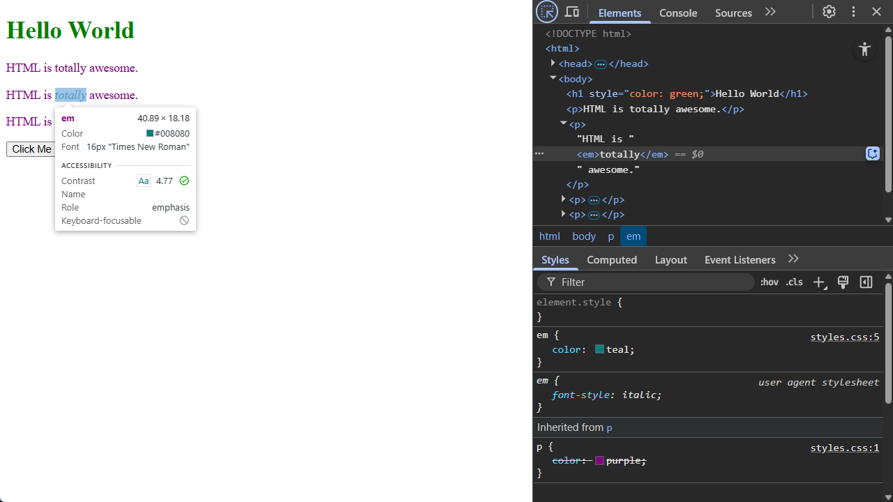
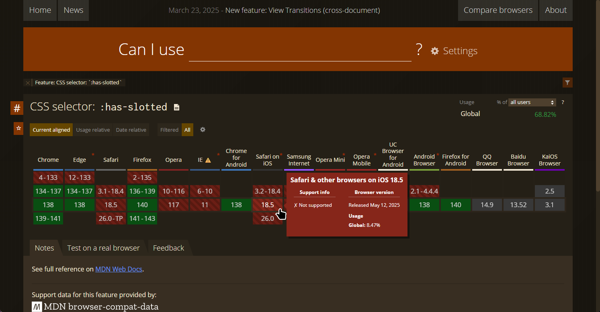

In the previous section, we learned the rudiments of CSS syntax, and how to associate styles with our web content.

Before we go any further, let's learn about some tools, tricks, and techniques we'll be using during the rest of the course, to help us develop, test, and debug CSS rules.

We're going to be using Visual Studio Code as our code editor throughout this course; it's free, it's cross-platform, and it has built-in CSS language features for formatting and syntax highlighting CSS.

## Closing The Feedback Loop: Live Reload

When you're writing CSS, the vast majority of your time will be spent checking that rules have done the right thing - which means reloading the page in your browser and seeing what's changed. The faster this feedback loop, the faster you'll be able to get things working properly.

The ideal rendering model here is sometimes called "live reload": you make a change in your editor, and it appears instantly in the browser window before you've even saved the file. Now, you might already have a setup like that, using something like Vite or Webpack - if you do; awesome. That'll work just fine. If not, here's a couple of options to try out.

### VS Live Preview

My favourite extension for this kind of development is called Live Preview:

* [https://marketplace.visualstudio.com/items?itemName=ms-vscode.live-server](https://marketplace.visualstudio.com/items?itemName=ms-vscode.live-server)

By default, Live Preview opens an embedded browser inside VS Code, and changes appear as you edit your source code - you don't even have to save the file. If you want to change that, open the VS Code Settings UI, search for "Live Preview", and you can tell it to only update when you save a file, to use an external browser (and which one to use), and a whole bunch of other settings:



> If Live Preview isn't working, or you don't get the option to preview your `.html` files, check that `*.html` hasn't ended up associated with another document type - open the VS Code settings JSON  and search for `"files.associations"` 

### VS Live Server

There's another VS plugin called Live Server, which always uses an external browser and automatically reloads your content when you save a file:

* [https://marketplace.visualstudio.com/items?itemName=ritwickdey.LiveServer](https://marketplace.visualstudio.com/items?itemName=ritwickdey.LiveServer)

and at the time I'm writing this, there's a beta version of Live Server ++ available on Github which supports live reload without saving the file, so if you like the sound of live reload and for whatever reason the Live Preview extension doesn't work for you, check that out.

## Using the Browser Dev Tools

The next thing to check out is the dev tools built into your browser. Every modern browser includes a built-in toolkit for inspecting and debugging HTML, CSS and JavaScript; they have similar feature sets, but vary slightly depending on which browser you're using.

There are really only three browser engines that are still relevant in 2025. By far the most popular is an engine called Blink: Google Chrome, Microsoft Edge, Opera, the Samsung mobile browser, boutique browsers like Arc, Brave and Vivaldi - they're all based on an open source browser project called Chromium, and Blink is the engine that powers Chromium.

The two notable exceptions are Apple's Safari browser, used on macOS and iOS devices, which is based on Apple's Webkit rendering engine, and Firefox, which uses its own rendering engine, known as Gecko.

If you're on a Chromium-based browser, you'll find the Developer Tools under More Tools - or press Ctrl-Shift-I, or right-click an element on the page and choose "Inspect". Firefox is the same - More Tools, Ctrl-Shift-I, or right-click, Inspect; you can also right-click an element and press Q to open the inspector. On Safari on macOS, they're under the Develop menu, or Cmd-Option-I.

I'm going to use the Chromium dev tools for most of the examples in this course, unless we're looking at something specific to Firefox or Safari. We'll start here, with the element inspector.

### Using the Element Inspector

The inspector lets us inspect any element in our page, to see exactly where that element fits into the structure of the page, and which CSS rules the browser is applying to that element.

What makes it particularly useful is that the inspector also shows us the HTML structure of our document, so we can either inspect an element by clicking on the rendered version - the web page - or by clicking on the source. As we learn about CSS properties like position and visibility, you'll discover there are all sorts of ways that an element can appear in a completely different place in the output than it does in the source code - or maybe even not appear at all.

Let's inspect our heading 1. It's got a `element.style` that's setting `color` to `green`, and then everything else is being provided by what's called the *user agent stylesheet*.

The term **user agent** comes from [RFC9110](https://httpwg.org/specs/rfc9110.html#user.agent), the document which defines many of the technical terms used to refer to web systems and standards. Strictly speaking, a user agent is any piece of software which makes network requests on behalf of a user. In this course, the user agent will almost always be a web browser - but user agents could also be bots, scripts, command-line tools; even something like a wifi-connected lightbulb that connects to a web API. 

In this instance, the user agent is our web browser, and the user agent stylesheet is the set of default styles that the browser will use if we haven't overridden them with CSS rules.

If we take a look at the `em` element that's inside our paragraph, you'll see that it's inheriting its color from the parent element - the paragraph - and the rest is defined by that user agent stylesheet.

Now, add another rule to `styles.css`:







When the page reloads, you can see in the inspector the new rule is being applied, that that rule is defined in styles.css, line 5 - and also that it **overrides** the existing rule which says paragraphs should be purple. This is happening because of something called *specificity*: when deciding what color to make that emphasis element, the teal rule is more *specific* than the purple rule, because the teal rule specifically targets the `em` element, whereas the purple rule is *inherited* from the paragraph. 

We'll leave it there for now, but we'll be using the element inspector and the other dev tools throughout the rest of the course. There's also an entire section coming up on selectors and  specificity, because it's one of the most important concepts to grasp if you want to understand how CSS works - and confusion about specificity has led to all sorts of bizarre layout and rendering bugs I've seen over the years.

### Using a Kitchen Sink page

Another reason why so many sites end up with messy, badly organised CSS is that it can be incredibly difficult to figure out what might be affected if you make a change to one of the CSS rules. You want to create a special kind of button... well, you could modify the existing button styles, but then you'd need to check every single button, on every single page of your site, to make sure your change doesn't introduce any weird bugs... and as the saying goes, ain't nobody got time for that.

The best solution I've ever found to this is something I call a kitchen sink page - after an old English expression about "everything but the kitchen sink". Other folks call this a spec page, sample page, comp page, reference page, but I like kitchen sink, so that's what we're going to call it.

What you want is one huge web page with every single element, component, widget, style, button, control... you name it; if it's used anywhere on your site - or even if it's just something you built 'cos you think you'll need it later - it should be included in the kitchen sink page. If your site's got a standard header, footer, navigation, include those in the kitchen sink page 

The kitchen sink page should also be static HTML. Doesn't matter if your backend is built in nodeJS, .NET, Ruby on Rails, PHP; the kitchen sink should be static. It doesn't run any code, it doesn't connect to a database - and that means you can reload it instantly, so you get the benefit of that feedback loop we talked about.

Here's an example of a kitchen sink page; you can find the code at [kitchen-sink.html](examples/01-04-tools-and-workflows/kitchen-sink.html):

<iframe src="examples/01-04-tools-and-workflows/kitchen-sink.html"></iframe>

This page includes examples of *almost* every element that's part of the current WHATWG HTML standard. It's got examples of typography, different Unicode character sets, emoji, lists, tables, figures, images, audio, video. It includes all of the input types supported in modern HTML, from the familiar text and select lists, to more esoteric input types like the colour picker and the week selector. It also includes some of the most recent additions to the HTML standard, like the details and summary elements, which provide a way to build accordion-style controls without using JavaScript, and an HTML native modal dialog control.

It doesn't include deprecated tags like `<center>`, `<marquee>`, or `<blink>` - many of these deprecated tags will still actually work in modern browsers, but if you do need to centre text, or make it blink, or move, there are much better ways to accomplish this using CSS.

Whenever you a new HTML or CSS feature to your site, add it to the kitchen sink page first. It'll give you a faster development cycle, and it'll show you right away if one of your new CSS rules is conflicting with something that's already used elsewhere on your site.

More important than that, though: as your site evolves and grows over time, the kitchen sink page forms a living reference document for all the styles, rules and components you've created. If you, or another developer, needs a date picker, or a search box, or a particular kind of button, you can check the kitchen sink page to see if somebody's already created one.

## Bare-Bones Debugging

Modern IDEs have fantastic debugging capabilities: breakpoints, traces, memory analysers, all sorts of really clever tools to help you figure out what your code's actually doing, but if you've spent much time writing software, at some point you'll have got so stuck tracking down a bug that you've gone through your code sprinkling print statements everywhere so that you can see what's actually happening - whether that's lots of `Console.WriteLine()` in C#, or `console.log()` in JavaScript.

As we've already learned, CSS doesn't work like that. It's declarative, not procedural - so the idea of logging anything to the console doesn't really doesn't make sense. And, sure, we've got the browser Dev Tools we can use to inspect elements and analyse CSS rules, but sometimes, what I really want is the CSS equivalent of console logging, and for me, that's always been background-color and outline.

Open up the kitchen sink page, and right at the top, inside the `<head>` element, we're going to add a `<style>` element with two rules:

```css
<style>
    * {
        outline: 1px solid magenta;
    }
    p {
        background-color: yellow;
    }
</style>
```

The first rule there? The selector is a star - that says "match every single element on this page". And then we're setting the `outline` property to 1 pixel, solid, magenta. The second rule is targeting paragraph elements, and setting their `background-color` property to `yellow`.

Now, when the page reloads: every single element has a magenta outline, and all the paragraphs have yellow backgrounds, so you can see at a glance how those elements affect the layout and structure of the page, and which ones are paragraph elements.

The reason why `outline` and `background-color` are so useful for this is that they don't affect the layout of the page. If we make an element larger, or draw a CSS `border` around it - we'll learn about borders in the next section - that actually changes the size of that element; the browser then has to adapt the layout, and in some cases that can actually make the bug you're looking for disappear completely. Stick to `outline` and `background-color`, and the layout doesn't change; it just gets easier to see where it's all coming from.

There's one more tool I want to share with you all, before we start diving into the mechanics of CSS itself, that's caniuse.com

## caniuse.com

HTML and CSS are constantly evolving. Proposals evolve into recommendations, various browsers roll out pre-release implementations based on those recommendations, and, eventually, they become standards. That process can take years, though, which means that if you want to use something that's relatively new, it might not be supported across all the browser you're developing for.

The best site to check the current status of a given feature, rule or property is [caniuse.com](https://caniuse.com/):



Here's an example of a particularly obscure CSS selector, [`has-slotted`](https://caniuse.com/mdn-css_selectors_has-slotted), which is part of the Web Components system which we'll talk about later in the course; I've picked this example because at the time I'm writing this, that selector isn't yet supported by any version of Safari. The colour-coded tiles correspond to browser version numbers; green indicates full support, red means no support - and hover over a specific version to see exactly what it and isn't supported.

Of course, it doesn't matter how widely supported a feature is if your biggest customer - or your boss - is stuck using an older browser which doesn't support it. It's up to you and your team to make sure you know who's going to be using your site, what devices and software they're going to be using, and how soon they're likely to upgrade; if you're building applications for a corporate intranet in a highly secure industry, like healthcare or aviation, you'll probably end up targeting a very different set of client devices than if you're building a public-facing promo site for a fast food restaurant.

## Review & Recap

* **Live Reload Tools:** Tools like *Live Preview* and *Live Server* for VS Code help create a fast feedback loop by automatically reloading your site when CSS changes are made.
* **Browser Dev Tools:** Built-in developer tools allow us to inspect elements, view applied styles, and understand how the browser interprets our CSS.
* **Use a Kitchen Sink Page:** A static HTML page with every UI component used on your site helps quickly detect style conflicts and serves as a reference for existing styles and elements.
* **CSS Debugging Techniques:** Use `outline` and `background-color` for visual debugging without affecting the site's layout — a CSS equivalent of `console.log()`.
* **Feature Compatibility:** Use [caniuse.com](https://caniuse.com) to check browser support for CSS features, especially important when working with cutting-edge or experimental properties.


