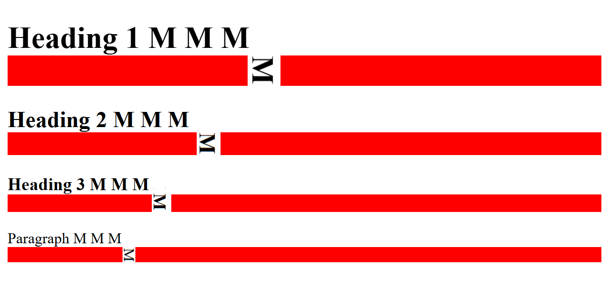

So far, we've learned about the building blocks of the CSS language - selectors, properties, and values - and the tools and techniques we can use to inspect and manipulate those properties.

Time to dive into how CSS actually works, and why.

## The Grain of the Web

If you've ever worked with wood, or textiles, you'll know that these materials have a *grain*; an intrinsic structure that's aligned in a particular direction. Experienced crafters know how to work *with* the grain of the material, because it yields better results. If you're turning a piece of tree trunk into a guitar neck, you absolutely want the grain of the wood running along the neck, not across it - and if you try to work against the grain, and you'll end up with all sorts of problems.

The web also has a grain; a natural direction and flow, derived from the printing and typesetting conventions used in many Western countries. Text starts at the top left corner of the page, every line reads left to right. If a line's too wide for the screen, it'll wrap - but if a paragraph is too tall for the screen, it'll scroll.

That might sound obvious, but it's the key to understanding how the browser lays out elements on a page - and to what we'll need to do if we *don't* want our website laid out like a printed textbook from the 1950s.

## Inline and Block Elements

Let's start here, with an empty web page.

```html

```

Anything we add to that page is going to appear in the top left corner. Let's add a paragraph that just says “Hello World!”:

<iframe style="height: 10rem;" src="{{ page.examples }}/hello-world.html"></iframe>

A paragraph is what's known as a **block-level element**: it always starts on a new line, and it always takes up the full width of the page. Copy & paste that paragraph a few times:

<iframe style="height: 10rem;" src="{{ page.examples }}/hello-world-paragraphs.html"></iframe>

Now, if you use the inspector tool to examine those paragraphs, you'll see that each one is a distinct block, and they're all the full width of the page.

Next, let's put a bunch of `<em>` tags inside the first paragraph:

<iframe style="height: 10rem;" src="{{ page.examples }}/hello-world-paragraphs-and-ems.html"></iframe>

The`em` element is what's called an **inline** element. It doesn't start a new line, and it's only as big as it needs to be to contain its own content.

Now, when you're using HTML to mark up *documents*, you'll find the built-in tags cover most of the things you'll need - headings, lists, articles, images. But once you get into using HTML to create web applications and user interfaces, it's not always quite so straightforward: sometimes, you'll want an element that doesn't intrinsically mean anything, because it's going to end up as a falling block in a puzzle game, or a support ticket you can drag around in some kind of helpdesk system.

Modern HTML provides two elements specifically for those scenarios: `div` and `span`. An HTML `div` is, literally, a block-level element that doesn't mean anything. And a `span` is - yep, you guessed it - an inline element that doesn't mean anything.

Let's throw a few `div`s and `span`s into our page to see what happens:





<iframe style="height: 20rem;" src="{{ page.examples }}/divs-and-spans.html"></iframe>

You'll notice two differences here. One: the emphasis tags are in italics, whereas the span tags are just regular text. Two: there's vertical spacing between the paragraphs, but no vertical spacing between the div elements.

Time to meet the CSS box model.

## The CSS Box Model

CSS is based on boxes. Every element on a page sits inside an invisible bounding rectangle, sometimes known as the *content box*, which the browser uses to determine where to draw that element, and how big it should be. 

**ARTWORK TO FOLLOW**

We've already met the CSS `outline` property, which tells the browser to make the bounding rectangle visible, but doesn't change the size, or shape, of the element. See what happens if we take several adjacent DIV elements and add a rule that gives them a 1 pixel red outline:

> If you crank up the browser's page zoom here, you'll see that the outline doesn't correspond exactly to the edges of the letters on all sides - there's a gap along the top, and the outline touches the descenders on lowercase letters like j and g. The exact size of the bounding box is dictated by the typeface we're using; it's related to something called *font metrics*, which we'll talk about in the section on text and typography.

If we crank up the outline - 2px, 5px, 10px, 20px - you can clearly see that the browser isn't moving anything around to make space for an outline; it's just drawing it over the top of what's already there. Useful for debugging... for actually styling pages and user interfaces? Not so much. 

Instead, CSS has a property called `border`. Let's change that rule to give our `div` elements a 1 pixel red border:

**ARTWORK TO FOLLOW**

And now, if we change the thickness to 2, 5, 10, 20 pixels, you can see how the layout changes each time so that the border doesn't obscure the contents.

**ARTWORK TO FOLLOW**

If you want a space between the content and the border, use the CSS property called `padding`. Unlike `border`, `padding` doesn't actually draw anything, it just creates empty space, so we don't give it a style or a colour - just a measurement:

```css
div {
    padding: 5px;
}
```

As before, try changing the padding to 15, 25, 50 pixels, and see how it affects the layout.

Finally, if you want space *around* an element, outside the border, use the CSS property called `margin`:

```css
div {
	margin: 5px;
}
```

## Collapsing Margins

Margins in CSS behave a little differently to borders and padding because of something called *margin collapse*. If two adjacent elements both declare a margin, they'll be rendered with their margins overlapping: CSS doesn't add their margins together; instead it ensures the elements are separated by the greater of the two margin distances specified.

Take a look at this example:





<iframe style="height: 10rem;" src="{{ page.examples }}/collapse.html"></iframe>

If you modify the rule to give the `h1` element a 20 pixel margin, you'll get this:

<iframe style="height: 20rem;" src="{{ page.examples }}/collapse-with-h1-margin.html"></iframe>

Now if you also give the `p` elements a 10px margin, you get this:

<iframe style="height: 20rem;" src="{{ page.examples }}/collapse-with-h1-and-p-margin.html"></iframe>

See how the *total* distance between the heading 1 and the first paragraph there is 20 pixels? The browser has *collapsed* the two elements' margins: the h1 is 20 pixels away from the paragraph, which is fine, and the paragraph is more than 10 pixels away from the heading, which is also fine.

## The Terrible Trouble with Borders and Margins

That last example looks a little odd, right? Using margins to create *vertical* spacing can help make the page more readable, but it shouldn't mess with the left and right alignment.

So far, we've used a **shorthand** syntax when specifying property values; we say `margin: 20px` and we get 20px of margin at the top, right, bottom, and left of every matching element. 

Instead, we can specify distances individually:

```css
p {
    margin-top: 10px;
    margin-right: 0;
    margin-bottom: 20px;
    margin-left: 0;
}

/* which is equivalent to: */
p {
    margin: 10px 0 20px 0;
}
```

The second rule there is using what's sometimes called *TRBL shorthand*: the values apply clockwise from the top: top > right > bottom > left. I usually remember this because it matches the consonants in the word *trouble*. There's also a 2-value and a 3-value shorthand syntax:

```css
/* CSS two-value syntax: top & bottom, right & left */
p {
    margin: 10px 20px;
}

/* CSS three value syntax: top, right & left, bottom */
p {
    margin: 10px 20px 30px;
}
```

When it comes to borders, there's a whole bunch of ways we can combine the various properties. Each edge of the element can have a border-width, a border-style, and a border-color - and any of these properties can use any of the shorthand syntaxes above:

```css

```

<iframe src="{{ page.examples }}/border-syntax.html"></iframe>

Now, another reason I wanted to talk about borders nice and early is that they're a great way to introduce two more fundamental CSS concepts: colours and units.

## Introducing CSS Units

Every example we've looked so far has specified the border width, padding, margin, etc. in *pixels*, but CSS has a remarkably flexible systems of units and measurements. The most common measurement you'll find in CSS is *length*, and lengths in CSS come in two varieties: absolute and relative.

### Absolute Units

Absolute units are, well, absolute: they don't depend on anything else. If we specify something has a 10px border, that border will always be 10 pixels... well, sort of. Way back when CSS was first developed, pixels referred to actual physical device pixels - if your screen resolution was 800x600, and you drew a box that was 400 pixels wide and 300 pixels high, that box would fill exactly a quarter of your screen.

Two quite important things have happened since then. First: just about every browser now has a *page zoom* feature, which makes everything bigger - and it does this by changing how many *physical* pixels are used to draw a *logical* pixel. If you have a line that's 10 pixels thick, and you crank the browser's page zoom up to 200%, that line will now be 20 pixels thick.

Second: many devices now use high-definition displays; the physical pixels on something like an iPhone Retina display are so small that a 1 pixel line would basically be invisible, so these devices use something called *pixel scaling*: if you tell an iPhone to draw a 1px border, it's actually going to use three tiny Retina pixels to draw that line.

Good news is: you don't have to worry about it. We'll see a couple of techniques later which do utilise the capabilities of high-DPI displays, but they're absolutely not required; if you want to specify things in pixels, go ahead: the devices will figure out.

The point is: if there are a bunch of things on your web page which are specified as being 10 pixels, they will all be exactly the same size as each other.

CSS also supports absolute lengths specified in centimetres, millimetres, inches, in points - a *point* is a typesetting unit equal to 1/72ndth of an inch - and *picas* - 1/6th of an inch. And, apparently, in quarter-millimetres. These kinds of units are handy if you're using CSS to style something that's going to end up printed on paper, but it's really not a good idea to use them for styling onscreen content.

There's one more absolute measurement we should mention here, and that's zero. Zero doesn't have a unit, because zero pixels is the same as zero centimetres is the same as zero inches: it's all still zero.

Absolute units are useful for creating pixel-perfect layouts, but that's not always a good idea, because there's a bunch of things you can't control. You have no control over how wide, or how tall, your user's browser window is; over what sort of device they're viewing your pages on, or whether they've adjusted their default font size. For all these reasons, it's generally a much better idea to create responsive layouts by using relative units.

### Relative Units

Relative units are how CSS lets us specify things like "make this half the height of the current window", or "this should take up two-thirds of its container", or "bigger text should have a thicker border."

### ems and rems

An `em` is another unit from the days of mechanical typesetting - and has nothing to do with the HTML `<em>` element we've seen; it's just bad luck that we're only just getting warmed up and we've already got two completely different things that are both called `em`.

Lines and columns of printing type would be set using cast metal blocks, one for each letter; the capital letter M was usually the largest shape - or glyph - in a particular typeface. Typesetters used a tool called a *composing stick* to set the width of a column of type; if the column had to be 24 ems wide, they'd use 24 capital M blocks to set the width - and because desktop publishing and digital typesetting adopted many terms and units from mechanical typesetting, one `em` became a unit as wide as a capital letter M *in the currently selected font*.

By the way, in computing, we use the terms *font* and *typeface* interchangeably, but in typesetting, a *font* is a specific *typeface* at a specific *size* and *weight*. So Arial is a *typeface*, Arial 20pt bold is a *font*. 

Here's an example page:

* [ems-and-rems.html](/examples/02-01-boxes-and-borders/ems-and-rems.html)

We've given every element on the page a bottom border that's `1em` thick:

```css

```

See how the Heading 1 has a much bigger border, because the browser renders it in a larger font and the border size is relative to the font size? If you zoom in close and crop things around a bit, you can actually see how the border in each case matches the width of the letter ‘M’ in that element:



A `rem` is an `em` but it's relative to the *root font size* - so it'll give you a consistent unit which doesn't vary between headings, paragraphs, etc., but which *does* reflect changes to the document's --- or the browser's --- default font size.

## Percentages

Let's get to know another couple of CSS properties: `width` and `height`. These ones do pretty much what you'd expect them to do:

```css

```

<iframe src="{{ page.examples }}/width-and-height.html" style="height: 10em;"></iframe>

Note how elements with a `width` are aligned to the left edge of the page. Also notice how, if you resize the browser window, these elements don't change size, because their width and height are specified in *absolute units*.

Now, change the CSS to this:

```css

```

Now, watch what happens if you change the size of your browser window. 

The `<h1>`? That's 50% of the width of its parent element --- in this case the document `<body>` - and so always takes up half the width of the screen.

The `<h2>` has its `width` set to `50vh`. `vh` is a CSS unit equal to one-hundredth of the *viewport height* - so as we change the height of the window, the width of the `<h2>` element changes so that it's always half of the window height. And the `<p>` element has its `height` set based on `vw` - the *viewport width*

Now, this is a great example of a stupid demo. You will never, ever, *ever* build a real web page or application in which a heading changes width based on the height of the window --- well, maybe if you were building some sort of bizarre online puzzle game --- but it does demonstrate really clearly what units like `vw` and `vh` actually do.

## Float Like A Butterfly...

Even if a block-level element has a defined `width`, the browser's layout engine still allocates a full page width of space for that element --- and by default, the element is drawn flush with the left edge of the page, and the next element is drawn starting underneath it.

The CSS `float` property lets us pull an element out of the regular document flow and float it to the left or right edge of its container - check out [floats.html]({{ page.examples }}/floats.html) to see it in action.






CSS Box Sizing

Take a look at this example:


___


Boxes & Borders (20m)

## Course Content

- The grain of the web: left to right, top to bottom
- Understanding inline and block elements
- The box model: margins, padding, border, outline
- Normalizers and CSS resets - what do they do (and should you use one?)
- Borders & outlines
- CSS units: `0`, `px`, `em`, `rem`, `%`, `vh/vw`
- Basic layout using floats and width
- Exercise: laying out a news site article

## Notes


