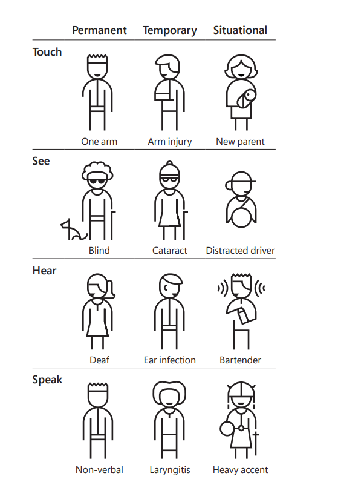
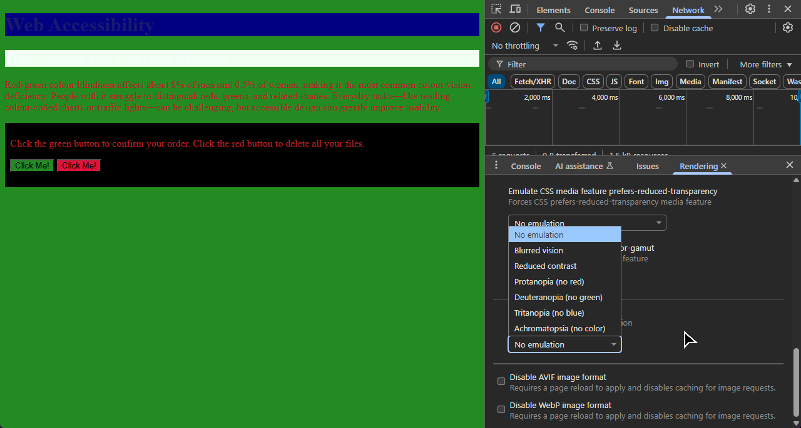
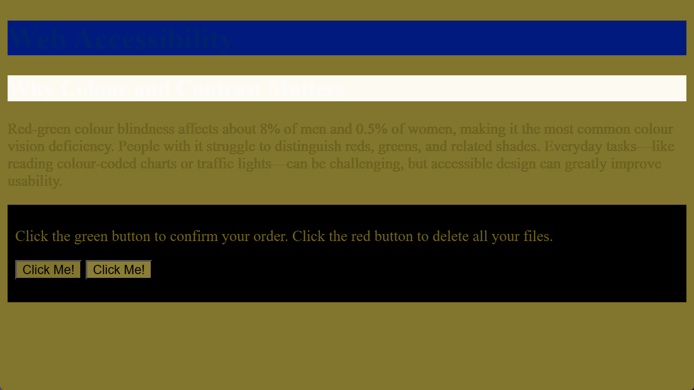
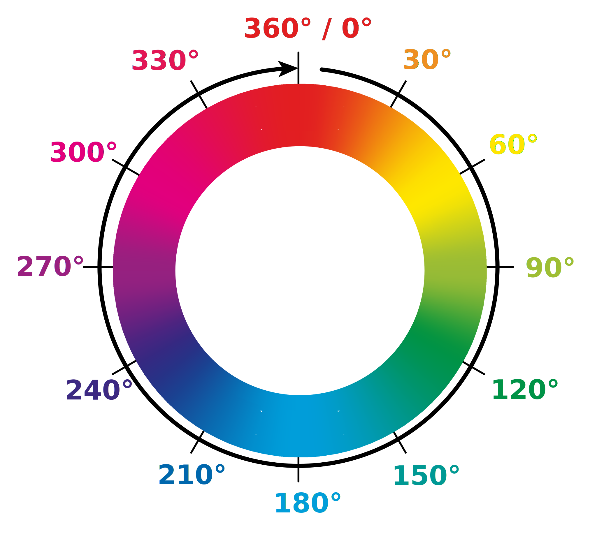

In the last section, we looked at some examples of CSS selectors, using foreground and background colours to visualize the effects of different selectors, but so far the only colours we've seen are *named colours*.

## Colour and Accessibility

Before we dive into the details of the various web colour models, I'd like to take a moment to put all this in context when it comes to accessibility and inclusive design. 

Colour and contrast is one of the most important considerations when it comes to making web content accessible. 

It's a common misconception that accessibility is about making special adaptations for people with specific disabilities. It's not. Accessibility and inclusive design are about creating content and experiences that don't *require* special adaptations --- and "disability" isn't boolean. One of the most insightful resources I've seen on the subject of inclusive design is Microsoft's [Inclusive 101 Guidebook](https://inclusive.microsoft.design/tools-and-activities/Inclusive101Guidebook.pdf), and in particular something called the Persona Spectrum:



When it comes to colour... well, I have pretty good eyesight, but every time I find myself using my phone outside on a bright sunny day, it becomes instantly apparent how much difference colour, size and contrast can make when it comes to trying to read what's on the screen in less than ideal conditions. I also have a wonderful gadget called a Boox, which is an Android tablet with a monochrome e-ink display. Fantastic for reading books and taking notes, and it runs Google Chrome, but browsing the web on it is a real hit-and-miss experience because of the number of sites that degrade to the point of being unusable when they're rendered in monochrome.

The W3C publishes Web Content Accessibility Guidelines --- WCAG, or "wuh-cag", or sometimes "wee-cag" --- as part of their Web Accessibility Initiative, along with a really useful collection of what they call the "Understanding Docs", designed to help you understand and implement those guidelines.

WCAG Understanding Doc SC 1.4.1 covers use of colour:

* [https://www.w3.org/WAI/WCAG22/Understanding/use-of-color.html](https://www.w3.org/WAI/WCAG22/Understanding/use-of-color.html)

Take a moment to read through that --- it's only a few pages. Then take a look at this example of colour accessibility done really badly. How many issues can you spot?



### Simulating Visual Deficiency with Browser DevTools

Open that page in a new browser window, then open the browser dev tools (<kbd>Ctrl</kbd>+<kbd>Shift</kbd>+<kbd>I</kbd>), find the **Quick View** panel --- press <kbd>Esc</kbd> if you can't see it --- and open the <kbd>⋮</kbd> menu. There's an option in there called *Rendering*, which includes a feature to emulate various kinds of vision deficiency. Try it out.



Here's that page with simulated deuteranopia, a common form of red/green colour-blindness:



There's two buttons there: one will confirm your order, one will delete all your files. To quote Dirty Harry: “You’ve got to ask yourself one question; ‘Do I feel lucky?’ Well, do you?”

We're ignoring some very basic rules of web accessibility here.

* There isn't enough contrast between text and background, making some elements impossible to read - even for users with perfect vision under ideal conditions.
* Red text on a green background is a bad idea, because it relies on the colour *hue* for contrast. Contrast should use *lightness* as well as hue, so that the distinction is still apparent to users who don't perceive colour.
* We have two buttons that can only be distinguished by colour. These kinds of elements should always use an additional form of distinction - labels, positions, or some kind of icon or image.

Accessibility is important, but if you approach it right, it's not complicated and it's not expensive.

## Named Colors

Back in the days of Netscape Navigator, HTML 3.0 defined a palette of sixteen named colours - the same colors supported by the Microsoft Windows VGA palette:



Over time, CSS has also adopted named colours from various sources, including the X Windows System. MDN notes that “about 150 other colours have a keyword associated to them”; [Anthony Lieuallen](https://arantius.com/anthony-lieuallen) has created this ingenious colour-wheel visualisation which you can use to explore them all:

<iframe src="{{ page.examples }}/web-color-wheel/index.html" style="height: 680px;"></iframe>

There are some interesting historical details hidden in the CSS named color system... for example, there's a color called `darkgrey`, which is actually lighter than the color called `grey` - because `grey` came from the original 16-color VGA palette, and `darkgrey` was already defined by X Windows as a lighter shade than that. Many colours have two names - the hot-pink color beloved of CGA computer games and synthwave artists is called `magenta` and `fuchsia`, and you can spell `grey` with either an "a" or an "e" wherever it appears in a colour name.

The color `orange` was added to the CSS version 2 specification, after it turned out that Eric Meyer, the web standards advocate who created the official test suites for CSS verison 1, had used orange for many of his examples... it worked, and was widely supported by browsers at the time, but wasn't actually part of the CSS  specification, which meant all Eric's test suites were technically invalid.

The most recent addition to the CSS named colour palette has a sad story behind it. It's called `rebeccapurple`, and it was added to CSS in 2014 in memory of Eric's daughter Rebecca, who tragically died of brain cancer on her sixth birthday. It's a beautiful memorial, and perhaps, a reminder that behind all the elements and attributes, technology like CSS matters because the real value of the open web is the beautiful, fragile, and very human connections which it makes possible.

CSS has borrowed named colours from all kinds of places, going way back to a couple of Unix developers, Paul Ravelling and John C. Thomas, sitting down in the late 1980s, one with a Sinclair Paints catalogue, the other with a big box of Crayola crayons, and programming colour names like Dodger Blue, Aquamarine and Orchid into the X Windows colour system.

### Named System Colours

CSS also defines a set of names for *system colours* --- the colours used by the rest of the user's operating system. The idea is that you can say “hey, make the buttons on my web page the same colour as all the other buttons on that person's computer” so you can build web apps that reflect their desktop colour scheme and preferences.



If you're viewing this on the web, the example above is live --- so what you're seeing there is based on your own system settings. For comparison, here's two screenshots showing what that preview looks like for me running Windows 11 - first in **dark mode**:


and then in **light mode**:


Look closely at `ButtonFace` and `ButtonText` --- you see how in dark mode, `ButtonFace` is a dark grey and `ButtonText` is white, because dark mode has white text on dark buttons, but in light mode it's black text on pale grey buttons?

System colours can be really useful for building sites and apps which respect your user's colour preferences, but be really careful to always use them in matching pairs. If you're setting an element's `background-color` to `Canvas`, you *must* set that element's `color` property to `CanvasText`, otherwise you risk ending up with black-on-black, or white-on-white text, or all sorts of other dreadful scenarios.

### color: transparent

`transparent` is actually a valid colour name in CSS; it's usually used when we've, say, created a rule to style every paragraph on a page with a background colour, but then we've got one particular paragraph that *shouldn't* have a background colour:



### currentcolor

The final named colour to know about is `currentcolor`, which will always evaluate to the `color` property of the current element -- useful if you want to, say set a border colour which matches the colour of the element's text:



> If you haven't seen `margin`, `border` and `padding` before, don't worry - we'll cover those in the next section.

Named colours are human. They have character, and history, and they're easy to read --- as long as you know that `gainsboro` is a light grey and `peru` is a sort of pale brown color. But, as you saw with the Swedish flag exercise in the last section: if the color you want doesn't have a name, you're out of luck.

Fortunately, named colours isn't the only way to specify colour values in CSS.

## The RGB Colour Model

Inside every computer screen are millions of tiny pixels, and every pixel is made up of three elements - one red, one green, one blue. If you zoom in really close with a magnifying glass or something, you can see the individual RGB components of each pixel, but in everyday use, they're so tiny, and so close together, that your eyes just kinda smush the elements together. If they're all dark, that pixel looks black. If they're all lit up as bright as they can, that pixel looks white.

This is the additive color model, and it works because of how human eyes work... inside our eyes are two different kinds of photosensitive cells. One set of cells, known as *rods*, are sensitive to light and shade; we've got about a hundred million of those, they work great in dim light, they're great at perceiving fine detail, but they can't detect colour. The other set are called *cones*, and there are three types of cones: some are sensitive to red light, some to green, some to blue. Say you go outside on a bright sunny day and look at a yellow car. Sunlight is white - it's a mixture of all visible frequencies. Everything turned all the way up. Sunlight bounces off the car, which absorbs most of that light, but one particular frequency bounces off the car and into your eye. You don't have a receptor for yellow light; what actually happens is that light activates the red and green cone cells, but not the blue one - and, because it's bright, it activates the rods as well, and then your brain kinda mashes those inputs all together and goes "oh, hey, bright yellow!"

By the way, you might have learned in school that the primary colours are red, yellow and blue... that's true when you're mixing paint, or printer ink, because when you're working with paint or ink you're starting with a bright white surface, like a blank sheet of paper, and then making it darker. This is known as a *subtractive* color model; artists mixing paint use red, blue, and yellow, while printer ink mixes cyan, magenta, and yellow. Screens and projectors use an *additive* colour model: you start with black and make it brighter by adding different colours of light until you get the colour you want.

So... you can get pretty much any colour you like on a computer screen, by specifying how much red, how much green, and how much blue to mix together.

Next question, then: how do you specify that? Most modern computers use 24-bit colour; we get eight bits for each of the red, green and blue channels, and eight bits is enough to count from zero up to two hundred and fifty five.

That gives us sixteen million, seven hundred and seventy seven thousand, two hundred and sixteen different possible colours. That sounds like a lot, but there's actually some applications where that's not enough: professional video editing systems often use 30-bit color - 10 bits per channel - and many of the effects in Adobe applications like Photoshop use 48-bit color internally, with 16 bits per channel, so that color precision doesn't get lost if, say, you put a darken filter on top of a brighten filter. I'm not sure why you'd do that... but if you did, Photoshop's got your back.

For the web, though, 8 bits per channel is plenty.

### Opacity and Alpha

The real world is full of transparent colours -- think about stained glass in a church window, or the dark lenses in a pair of sunglasses. The technical term for this is *opacity*, and it's normally expressed as a percentage: a piece of perfectly transparent glass is zero percent opaque, something like a sheet of thick cardboard is one hundred percent opaque. You'll also see it referred to as *alpha*; several of the pioneering research papers on using transparency in computer graphics used the Greek letter alpha to represent opacity, and the folks who wrote those papers --- Alvy Ray Smith, Ed Catmull, Thomas Porter, and Tom Duff --- they went on to found Pixar Animation Studios and make movies like Toy Story and Monsters Inc, so I think we can safely assume they knew what they were doing.

CSS allows us to do all sorts of interesting things with opacity. We'll learn later on about how to create transparent elements, and how to combine and compose transparent elements to create some really neat visual effects. For now, though, we're focusing on colours - and yes, CSS has transparent colours.

## CSS Colour Models

OK, listen up, because this is where it gets a bit gnarly. Modern CSS has nine different models you can use to specify a colour. We've already seen named colours - that's one.

You can specify the red, green and blue components, either using the `rgb` function - that's two - or by using hexadecimal digits - that's three. There's the hue, saturation, and lightness model - that's four; there's hue, whiteness and blackness - that's five - and then there are two colour systems based on industrial printing and publishing standards: LAB colour - six- and LCH colour - seven - and finally, eight and nine are two variants on this systems, created as recently as 2020 and explicitly designed to look OK on computer screens, hence they're called Oklab and Oklch.

You notice I said "modern CSS" there... there's also a thing called legacy syntax, which, of course, still works, because of the countless millions of websites that were built that way back when it wasn't legacy syntax, it was just how CSS worked.

## Specifying Colors with rgb() and rgba()

Let's start with `rgb`. The `rgb()` function creates a colour based on red, green, and blue values - which can either be a percentage, or a decimal number between 0 and 255, with values separated using spaces:

```css
color: rgb(100% 0% 0%);
color: rgb(255 0 0);
```

If you want to include alpha transparency, add a fourth component separated by a forward slash - and the alpha is either a percentage, or a value between zero and one. Remember, `0` (or `0%`) is fully transparent; `1` (or `100%`) is fully opaque:

```css
color: rgb(100% 0 0 / 50%);
color: rgb(100% 0 0 / 0.5);
```

### Legacy RGB Syntax

Historically, the `rgb()` function took three values separated by commas, with a separate `rgba()` function took a fourth value for alpha:

```css
color: rgb(255, 0, 0);
color: rgb(100%, 0, 0);

color: rgba(255, 0, 0, 0.5);
color: rgba(255, 0, 0, 50%);

color: rgba(100%, 0, 0, 0.5);
color: rgba(100%, 0, 0, 50%);
```

This still works in every mainstream browser, and it won't be going away any time soon, but it's been officially designed as "legacy" syntax; all the stuff that used to work still works, but as new colour functions and models are added to the CSS standard, they only support the modern syntax with values separated by spaces.

## Hex Codes

By far the most common way to write RGB colors on the web, though, is to use something called hexadecimal notation, often known as a hex code.

Now, if your background is in computer science, you've worked with languages like C or done any systems programming, you've probably seen hexadecimal before - in which case you might want to skip ahead a few minutes. But if you've found your way into web development via graphic design, or art, or publishing --- as many, many people have --- hex codes are one of those things that might make you stop and go "hold on... what?"

I'm going to give a very short explanation, but if you're still not clear on it, by all means go away and read up on it before coming back to this course; this next section is going make way more sense if you're happy reading and writing hexadecimal numbers.

Short version: humans have ten digits, because we have ten digits. We have the numerals zero, one, two, three, four, five, six, seven, eight, nine, we have ten fingers --- well, eight fingers and two thumbs --- on our hands, and we count in base ten. We don't have a numeral for ten; we get as far as nine, then we stick a one in the tens column and the units goes back to zero. And when we get to ninety-nine, stick a one in the hundreds column and the others go back to zero.

Hexadecimal --- which gets its name from the Greek word for six, `hex`, and the Latin word for tenth, `decimal`, because English is a messed-up language --- is base sixteen. When we get past nine, we don't move to the tens... we count a, b, c, d, e, f, and THEN add a column. So zero through nine are the same as decimal numbers. a in hexadecimal is ten of something, b is eleven, c is twelve, f is fifteen, and then one-zero is sixteen.

A CSS hex colour code looks like `#7a0bdc`

The hash `#` indicates it's a colour code, and it's followed by six hexadecimal numbers  `7a` `0b` `dc`.

* `7b` in decimal is 122 - so 122/255ths, or about 50%, of the maximum amount of red
* `0b` in decimal is 11, and 11/255ths is quite close to zero, so there's not a lot of green
* `dc` in decimal is 220, and 220/255ths is quite close to one, so our colour has a lot of blue in it

So... half red, very little green, lots of blue -- that's going to give us a <span style="background-color: #7a0bdc;">sort of bright purple color</span>

You'll also occasionally see hex codes written with three digits instead of six - `#abc`, which the parser expands to `#aabbcc`. 

If a hex code has four or eight digits, it includes transparency; ` #00f8` is a transparent blue, and `#00ff0088` is a transparent green.

There are some developers out there who can glance at a colour and make a pretty good guess at the RGB values - and hex codes - for that colour, and who can glance at a hex code and know exactly what tint and shade it is. I am not one of those developers. I can spot the easy ones - `#00ff00` is obviously bright green, a colour code like `#252525`, where all three digits are the same, is obviously a shade of grey - but fortunately, editors like VS Code have fantastic support for editing CSS colour codes.

## Hue, Saturation and Lightness

Hang out in a store that sells paint for a while, and you'll overhear people talking about what colour they want to paint their living room --- and they don't talk about RGB values. They'll say things like "that colour's nice but it's a bit too dark", "I like this one but it's a bit too pastel", "this one's the right intensity but it's too purple - I want something a bit more blue".

Humans - at least, humans who aren't software developers - tend to think about colour in terms of hue, saturation, and lightness. 

Hue specifies whether the colour is red, yellow, blue, purple... it's based on the idea of angles around a colour wheel, where red is at the top - zero degrees - and you turn clockwise through yellow, green, cyan, blue, purple, magenta, and finally around to red again.

<figure>
    
    <figcaption>The HSL colour wheel</figcaption>
</figure>

Saturation specifies how intense, how rich, the colour is --- zero saturation is grayscale --- and lightness specifies how bright is it? Zero lightness is always black, regardless of the hue and saturation.



As with `rgb`, `hsl` colors can have an alpha component:



> The `hue` component of an HSL colour is specified as an *angle*. Angles in CSS are usually used for geometric transformations, like rotation, which we'll learn about later, but because the HSL color module uses the same parser as the geometry module, you can specify a hue using any valid CSS angle syntax. A decimal number on its own - `150` - is interpreted as an angle in degrees, but you can also specify hue in explicit degrees (`150deg`), radians (`3.5rad`), gradians (`4.2grad`), or turns (`0.4turn`, where `1turn` is a full turn around the wheel.)
>
> I can't imagine any scenario in real life where you'd want to specify a CSS colour hue in gradians, but I can imagine it's the kind of thing somebody might throw at you in a job interview or an exam.

And, as with `rgb()`, `hsl()` supports the legacy colour syntax - `hsl(90deg, 50%, 50%)` - and the `hsla()` alias for specifying alpha - `hsla(90deg, 50%, 50%, 0.5)`.

That covers everything we'll need for the next few modules. We'll come back to CSS a little later, when we talk about colour and composition.

## Review & Recap

You can specify a colour in CSS using:

* Named colours, like `black`, `aliceblue` and `goldenrod`
* Named system colours, which represent elements of the user's operating system 
* 


