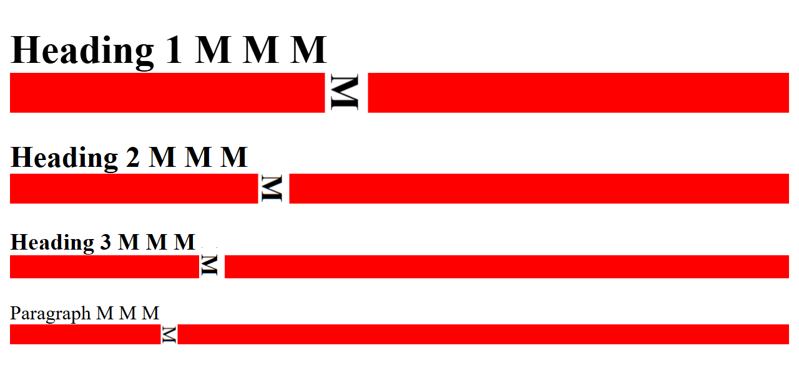
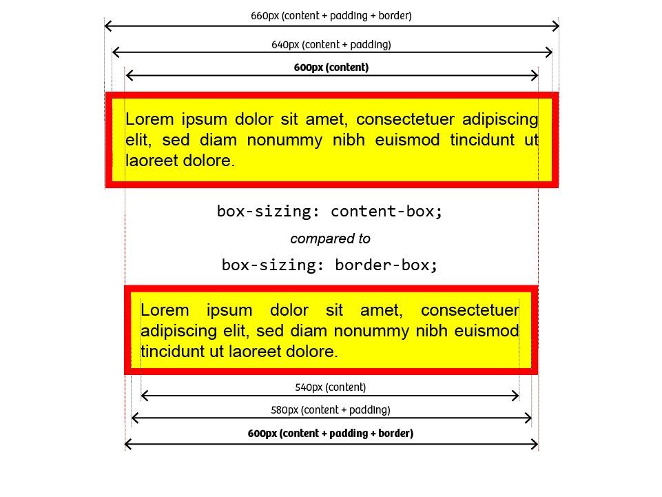
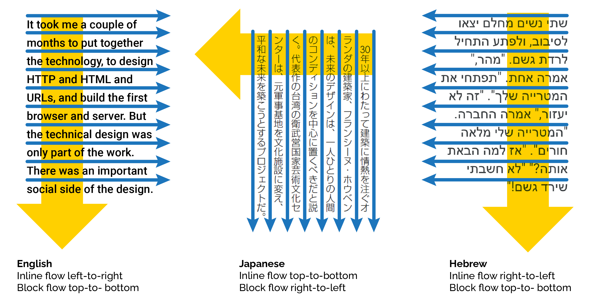

So far, we've learned about the building blocks of the CSS language - selectors, properties, and values - and the tools and techniques we can use to inspect and manipulate those properties.

Time to dive into how CSS actually works, and why.

## The Grain of the Web

If you've ever worked with wood, or textiles, you'll know that these materials have a *grain*; an intrinsic structure that's aligned in a particular direction. Experienced crafters know how to work *with* the grain of the material, because it yields better results. If you're turning a piece of tree trunk into a guitar neck, you absolutely want the grain of the wood running along the neck, not across it - and if you try to work against the grain, and you'll end up with all sorts of problems.

The web also has a grain; a natural direction and flow, derived from the printing and typesetting conventions used in many Western countries. Text starts at the top left corner of the page, every line reads left to right. If a line's too wide for the screen, it'll wrap - but if a paragraph is too tall for the screen, it'll scroll.

That might sound obvious, but it's the key to understanding how the browser lays out elements on a page - and to what we'll need to do if we *don't* want our website laid out like a printed textbook from the 1950s.

## Inline and Block Elements

Let's start here, with an empty web page.



Anything we add to that page is going to appear in the top left corner. Let's add a paragraph that just says “Hello World!”:

<iframe style="height: 10rem;" src="{{ page.examples }}/hello-world.html"></iframe>

A paragraph is what's known as a **block-level element**: it always starts on a new line, and it always takes up the full width of the page. Copy & paste that paragraph a few times:

<iframe style="height: 10rem;" src="{{ page.examples }}/hello-world-paragraphs.html"></iframe>

Now, if you use the inspector tool to examine those paragraphs, you'll see that each one is a distinct block, and they're all the full width of the page.

Next, let's put a bunch of `<em>` tags inside the first paragraph:

<iframe style="height: 10rem;" src="{{ page.examples }}/hello-world-paragraphs-and-ems.html"></iframe>

The`em` element is what's called an **inline** element. It doesn't start a new line, and it's only as big as it needs to be to contain its own content.

Now, when you're using HTML to mark up *documents*, you'll find the built-in tags cover most of the things you'll need - headings, lists, articles, images. But once you get into using HTML to create web applications and user interfaces, it's not always quite so straightforward: sometimes, you'll want an element that doesn't intrinsically mean anything, because it's going to end up as a falling block in a puzzle game, or a support ticket you can drag around in some kind of helpdesk system.

Modern HTML provides two elements specifically for those scenarios: `div` and `span`. An HTML `div` is, literally, a block-level element that doesn't mean anything. And a `span` is - yep, you guessed it - an inline element that doesn't mean anything.

Let's throw a few `div`s and `span`s into our page to see what happens:



You'll notice two differences here. One: the emphasis tags are in italics, whereas the span tags are just regular text. Two: there's vertical spacing between the paragraphs, but no vertical spacing between the div elements.

Time to meet the CSS box model.

## The CSS Box Model

CSS is based on boxes. Every element on a page sits inside an invisible bounding rectangle, sometimes known as the *content box*, which the browser uses to determine where to draw that element, and how big it should be. 

**TODO: artwork illustrating CSS content box**

We've already met the CSS `outline` property, which tells the browser to make the bounding rectangle visible, but doesn't change the size, or shape, of the element. See what happens if we take several adjacent DIV elements and add a rule that gives them a 1 pixel red outline:

> If you crank up the browser's page zoom here, you'll see that the outline doesn't correspond exactly to the edges of the letters on all sides - there's a gap along the top, and the outline touches the descenders on lowercase letters like j and g. The exact size of the bounding box is dictated by the typeface we're using; it's related to something called *font metrics*, which we'll talk about in the section on text and typography.

If we crank up the outline - 2px, 5px, 10px, 20px - you can clearly see that the browser isn't moving anything around to make space for an outline; it's just drawing it over the top of what's already there. Useful for debugging... for actually styling pages and user interfaces? Not so much. 

Instead, CSS has a property called `border`. Let's change that rule to give our `div` elements a 1 pixel red border:

**TODO: artwork demonstrating CSS border**

And now, if we change the thickness to 2, 5, 10, 20 pixels, you can see how the layout changes each time so that the border doesn't obscure the contents.

**TODO: artwork demonstrating border-width**

If you want a space between the content and the border, use the CSS property called `padding`. Unlike `border`, `padding` doesn't actually draw anything, it just creates empty space, so we don't give it a style or a colour - just a measurement:

```css
div {
    padding: 5px;
}
```

As before, try changing the padding to 15, 25, 50 pixels, and see how it affects the layout.

Finally, if you want space *around* an element, outside the border, use the CSS property called `margin`:

```css
div {
	margin: 5px;
}
```

## Collapsing Margins

Margins in CSS behave a little differently to borders and padding because of something called *margin collapse*. If two adjacent elements both declare a margin, they'll be rendered with their margins overlapping: CSS doesn't add their margins together; instead it ensures the elements are separated by the greater of the two margin distances specified.

Take a look at this example:



If you modify the rule to give the `h1` element a 20 pixel margin, you'll get this:

<iframe style="height: 20rem;" src="{{ page.examples }}/collapse-with-h1-margin.html"></iframe>

Now if you also give the `p` elements a 10px margin, you get this:

<iframe style="height: 20rem;" src="{{ page.examples }}/collapse-with-h1-and-p-margin.html"></iframe>

See how the *total* distance between the heading 1 and the first paragraph there is 20 pixels? The browser has *collapsed* the two elements' margins: the h1 is 20 pixels away from the paragraph, which is fine, and the paragraph is more than 10 pixels away from the heading, which is also fine.

## The Terrible Trouble with Borders and Margins

That last example looks a little odd, right? Using margins to create *vertical* spacing can help make the page more readable, but it shouldn't mess with the left and right alignment.

So far, we've used a **shorthand** syntax when specifying property values; we say `margin: 20px` and we get 20px of margin at the top, right, bottom, and left of every matching element. 

Instead, we can specify distances individually:

```css
p {
    margin-top: 10px;
    margin-right: 0;
    margin-bottom: 20px;
    margin-left: 0;
}

/* which is equivalent to: */
p {
    margin: 10px 0 20px 0;
}
```

The second rule there is using what's sometimes called *TRBL shorthand*: the values apply clockwise from the top: top > right > bottom > left. I usually remember this because it matches the consonants in the word *trouble*. There's also a 2-value and a 3-value shorthand syntax:

```css
/* CSS two-value syntax: top & bottom, right & left */
p {
    margin: 10px 20px;
}

/* CSS three value syntax: top, right & left, bottom */
p {
    margin: 10px 20px 30px;
}
```

When it comes to borders, there's a whole bunch of ways we can combine the various properties. Each edge of the element can have a `border-width`, a `border-style`, and a `border-color` - and any of these properties can use any of the shorthand syntaxes above:



The `border-style` property must take one of the values defined in the CSS spec:

<figure>
<iframe style="height: 16em;" src="{{ page.examples }}/border-styles.html"></iframe>
<figcaption>CSS border styles</figcaption>
</figure>
> Wondering why `none` and `hidden` do the same thing? It's all to with *border collapse*, which we'll meet in a later section, but the short answer is: if you combine a `solid` border with a `none` border, the `solid` border wins. If you combine a `solid` border with `hidden` border, the `hidden` wins.

The `border-color` can be any CSS color --- we'll learn all about those in the section on colors and composition a little later --- and the `border-width` can be any CSS length unit, so now's probably a great time to learn about CSS units and how they work.

## Introducing CSS Units

Every example we've looked so far has specified the border width, padding, margin, etc. in *pixels*, but CSS has a remarkably flexible systems of units and measurements. The most common measurement you'll find in CSS is *length*, and lengths in CSS come in two varieties: absolute and relative.

### Absolute Units

Absolute units are, well, absolute: they don't depend on anything else. If we specify something has a 10px border, that border will always be 10 pixels... well, sort of. Way back when CSS was first developed, pixels referred to actual physical device pixels - if your screen resolution was 800x600, and you drew a box that was 400 pixels wide and 300 pixels high, that box would fill exactly a quarter of your screen.

Two quite important things have happened since then. First: just about every browser now has a *page zoom* feature, which makes everything bigger - and it does this by changing how many *physical* pixels are used to draw a *logical* pixel. If you have a line that's 10 pixels thick, and you crank the browser's page zoom up to 200%, that line will now be 20 pixels thick.

Second: many devices now use high-definition displays; the physical pixels on something like an iPhone Retina display are so small that a 1 pixel line would basically be invisible, so these devices use something called *pixel scaling*: if you tell an iPhone to draw a 1px border, it's actually going to use three tiny Retina pixels to draw that line.

Good news is: you don't have to worry about it. We'll see a couple of techniques later which do utilise the capabilities of high-DPI displays, but they're absolutely not required; if you want to specify things in pixels, go ahead: the devices will figure out.

The point is: if there are a bunch of things on your web page which are specified as being 10 pixels, they will all be exactly the same size as each other.

CSS also supports absolute lengths specified in centimetres, millimetres, inches, in points - a *point* is a typesetting unit equal to 1/72ndth of an inch - and *picas* - 1/6th of an inch. And, apparently, in quarter-millimetres. These kinds of units are handy if you're using CSS to style something that's going to end up printed on paper, but it's really not a good idea to use them for styling onscreen content.

There's one more absolute measurement we should mention here, and that's zero. Zero doesn't have a unit, because zero pixels is the same as zero centimetres is the same as zero inches: it's all still zero.

Absolute units are useful for creating pixel-perfect layouts, but that's not always a good idea, because there's a bunch of things you can't control. You have no control over how wide, or how tall, your user's browser window is; over what sort of device they're viewing your pages on, or whether they've adjusted their default font size. For all these reasons, it's generally a much better idea to create responsive layouts by using relative units.

### Relative Units

Relative units are how CSS lets us specify things like "make this half the height of the current window", or "this should take up two-thirds of its container", or "bigger text should have a thicker border."

#### ems and rems

An `em` is another unit from the days of mechanical typesetting - and has nothing to do with the HTML `<em>` element we've seen; it's just bad luck that we're only just getting warmed up and we've already got two completely different things that are both called `em`.

Lines and columns of printing type would be set using cast metal blocks, one for each letter; the capital letter M was usually the largest shape - or glyph - in a particular typeface. Typesetters used a tool called a *composing stick* to set the width of a column of type; if the column had to be 24 ems wide, they'd use 24 capital M blocks to set the width - and because desktop publishing and digital typesetting adopted many terms and units from mechanical typesetting, one `em` became a unit as wide as a capital letter M *in the currently selected font*.

By the way, in computing, we use the terms *font* and *typeface* interchangeably, but in typesetting, a *font* is a specific *typeface* at a specific *size* and *weight*. So Arial is a *typeface*, Arial 20pt bold is a *font*. 

Here's an example page:

* [ems-and-rems.html](/examples/02-01-boxes-and-borders/ems-and-rems.html)

We've given every element on the page a bottom border that's `1em` thick:



See how the Heading 1 has a much bigger border, because the browser renders it in a larger font and the border size is relative to the font size? If you zoom in close and crop things around a bit, you can actually see how the border in each case matches the width of the letter ‘M’ in that element:



A `rem` is an `em` but it's relative to the *root font size* - so it'll give you a consistent unit which doesn't vary between headings, paragraphs, etc., but which *does* reflect changes to the document's --- or the browser's --- default font size.

Modern CSS also supports the following units; relative to the element's font, and their `r-` versions relative to the document root font:

* `cap` / `rcap` = *cap height*, the height of a capital letter
* `ch` / `rch` = the *advance measure* of the digit 0; width if text is flowing horizontally, height if text is flowing vertically.
* `ex` / `rex`, the height of a lowercase "x" 
* `lh` / `rlh`, the *line height* 
* `ic` / `ric` the width of the "水" glyph (CJK water ideograph, U+6C34)



> As of August 2025, Firefox doesn't support `rcap`, `rch`, `rex`, or `ric`. 

#### Percentages

Let's get to know another couple of CSS properties: `width` and `height`. These ones do pretty much what you'd expect them to do:



<iframe src="{{ page.examples }}/width-and-height-absolute.html" style="height: 10em;"></iframe>

Note how elements with a `width` are aligned to the left edge of the page. Also notice how, if you resize the browser window, these elements don't change size, because their width and height are specified in *absolute units*.

Now, change the CSS to this:



➡️ [width-and-height-relative.html]({{ page.examples }}/width-and-height-relative.html)

Now watch what happens if you change the size of your browser window.

The `<h1>`? That's 50% of the width of its parent element --- in this case the document `<body>` - and so always takes up half the width of the screen.

The `<h2>` has its `width` set to `50vh`. `vh` is a CSS unit equal to one-hundredth of the *viewport height* - so as we change the height of the window, the width of the `<h2>` element changes so that it's always half of the window height. And the `<p>` element has its `height` set based on `vw` - the *viewport width*

Now, this is a great example of a stupid demo. You will never, ever, *ever* build a real web page or application in which a heading changes width based on the height of the window --- well, maybe if you were building some sort of bizarre online puzzle game --- but it does demonstrate really clearly what units like `vw` and `vh` actually do.

### Auto

One more relative unit that's remarkably useful in CSS is `auto`. Most of the time, `auto` happens automatically --- the height of a paragraph will be automatically set to the size of its content, for example.

One extremely useful, but slightly counter-intuitive, application of `auto` is that if you give an element a fixed width and then set the left and right `margin` of that element to `auto`, the browser will centre the element horizontally.



## Float Like A Butterfly...

Even if a block-level element has a defined `width`, the browser's layout engine still allocates a full page width of space for that element --- and by default, the element is drawn flush with the left edge of the page, and the next element is drawn starting underneath it.

The CSS `float` property lets us pull an element out of the regular document flow and float it to the left or right edge of its container. - check out [floats.html]({{ page.examples }}/floats.html) to see it in action.



## CSS Box Sizing

Take a look at the code in [box-sizing.html]({{ page.examples }}/box-sizing.html):

<iframe src="{{ page.examples }}/box-sizing.html"></iframe>

There's a `<section>` containing two `<div>` elements; there's a rule saying `<div>` elements have `width: 50%` and `float: left` - so the first one should take up half of the `section` and leave space for the second one alongside it... right?

Welcome to another historical quirk of CSS: *box sizing*. CSS uses two different sizing models --- `border-box` and `content-box`. 

<figure>
    
    <figcaption>
        CSS box sizing models compared: <code>content-box</code> vs <code>border-box</code>
    </figcaption>
</figure>

* With `content-box` sizing, the element's *content* is drawn at the specified width and height, and then the padding and border are drawn *outside* the content.
* With `border-box` sizing, the width and height are applied to the *outside of the border*, so if you say something's 50% wide, that element, including its padding and border, will be half the width of its container.

In 25 years of web development, I have never, ever encountered a situation where `content-box` solved my problem; it's `border-box` every single time. Except... `content-box` is the default. It shouldn't be the default, but it is.

If we modify our example CSS to override the default:



we can get our `<div>` elements to render side-by-side:



## Using `inline-block`

We've met block elements and inline elements, but sometimes you need an element which behaves like a block - width, height, margins - but is treated as an inline element for layout purposes. That's what `display: inline-block` is for.



Let's meet a classic "gotcha" that almost every web developer will meet at some point in their career. We've got three `<div>` elements, we're going to give them a width of `33%` and `display: inline-block` to get three elements side-by-side... 

{% example inline-block-thirds.html elements="style,body" iframe_style="zoom: 80%;" %}

But then you look at the same page in a slightly narrower viewport:

{% iframe inline-block-thirds.html style="width: 60%; zoom: 80%;" %}

...and one of the `<div>` elements has dropped to the next line. What's going on?

This is one of those classic scenarios that's completely baffling until you work it out... and completely obvious in hindsight.

**First**: there is actually space between those elements. If there's whitespace between inline elements in the HTML source, it'll get preserved - multiple spaces get collapsed down to a single space, but you'll still get a single space. If you don't want whitespace between your elements, you can't have any whitespace between them in the HTML source:



**Second**: when you specify `display: inline-block`, the target elements are treated as `inline` for display purposes - which means if there's any whitespace between them, you'll get a space in your output. And our source looks like this:

```html
    <div></div>
    <div></div>
    <div></div>
```

...so there's a newline and a tab between each `<div>` element.

**Third**: percentages and rounding. Three elements with `width: 33%` adds up to a total width of `99%` - so we've got one percent of the total viewport width left to play with. On my system, as long as the viewport is over 812px wide, those two whitespaces are smaller than the 1% of available space, so nothing wraps... but if I shrink the viewport below 812px, it won't fit on one line any more, and the browser wraps it only multiple lines as it would with any other inline content.4340
---
So far, we've learned about the building blocks of the CSS language - selectors, properties, and values - and the tools and techniques we can use to inspect and manipulate those properties.

Time to dive into how CSS actually works, and why.

## The Grain of the Web

If you've ever worked with wood, or textiles, you'll know that these materials have a *grain*; an intrinsic structure that's aligned in a particular direction. Experienced crafters know how to work *with* the grain of the material, because it yields better results. If you're turning a piece of tree trunk into a guitar neck, you absolutely want the grain of the wood running along the neck, not across it - and if you try to work against the grain, and you'll end up with all sorts of problems.

The web also has a grain; a natural direction and flow, derived from the printing and typesetting conventions used in many Western countries. Text starts at the top left corner of the page, every line reads left to right. If a line's too wide for the screen, it'll wrap - but if a paragraph is too tall for the screen, it'll scroll.

That might sound obvious, but it's the key to understanding how the browser lays out elements on a page - and to what we'll need to do if we *don't* want our website laid out like a printed textbook from the 1950s.

## Inline and Block Elements

Let's start here, with an empty web page.



Anything we add to that page is going to appear in the top left corner. Let's add a paragraph that just says “Hello World!”:

<iframe style="height: 10rem;" src="{{ page.examples }}/hello-world.html"></iframe>

A paragraph is what's known as a **block-level element**: it always starts on a new line, and it always takes up the full width of the page. Copy & paste that paragraph a few times:

<iframe style="height: 10rem;" src="{{ page.examples }}/hello-world-paragraphs.html"></iframe>

Now, if you use the inspector tool to examine those paragraphs, you'll see that each one is a distinct block, and they're all the full width of the page.

Next, let's put a bunch of `<em>` tags inside the first paragraph:

<iframe style="height: 10rem;" src="{{ page.examples }}/hello-world-paragraphs-and-ems.html"></iframe>

The`em` element is what's called an **inline** element. It doesn't start a new line, and it's only as big as it needs to be to contain its own content.

Now, when you're using HTML to mark up *documents*, you'll find the built-in tags cover most of the things you'll need - headings, lists, articles, images. But once you get into using HTML to create web applications and user interfaces, it's not always quite so straightforward: sometimes, you'll want an element that doesn't intrinsically mean anything, because it's going to end up as a falling block in a puzzle game, or a support ticket you can drag around in some kind of helpdesk system.

Modern HTML provides two elements specifically for those scenarios: `div` and `span`. An HTML `div` is, literally, a block-level element that doesn't mean anything. And a `span` is - yep, you guessed it - an inline element that doesn't mean anything.

Let's throw a few `div`s and `span`s into our page to see what happens:



You'll notice two differences here. One: the emphasis tags are in italics, whereas the span tags are just regular text. Two: there's vertical spacing between the paragraphs, but no vertical spacing between the div elements.

Time to meet the CSS box model.

## The CSS Box Model

CSS is based on boxes. Every element on a page sits inside an invisible bounding rectangle, sometimes known as the *content box*, which the browser uses to determine where to draw that element, and how big it should be. 

**TODO: artwork illustrating CSS content box**

We've already met the CSS `outline` property, which tells the browser to make the bounding rectangle visible, but doesn't change the size, or shape, of the element. See what happens if we take several adjacent DIV elements and add a rule that gives them a 1 pixel red outline:

> If you crank up the browser's page zoom here, you'll see that the outline doesn't correspond exactly to the edges of the letters on all sides - there's a gap along the top, and the outline touches the descenders on lowercase letters like j and g. The exact size of the bounding box is dictated by the typeface we're using; it's related to something called *font metrics*, which we'll talk about in the section on text and typography.

If we crank up the outline - 2px, 5px, 10px, 20px - you can clearly see that the browser isn't moving anything around to make space for an outline; it's just drawing it over the top of what's already there. Useful for debugging... for actually styling pages and user interfaces? Not so much. 

Instead, CSS has a property called `border`. Let's change that rule to give our `div` elements a 1 pixel red border:

**TODO: artwork demonstrating CSS border**

And now, if we change the thickness to 2, 5, 10, 20 pixels, you can see how the layout changes each time so that the border doesn't obscure the contents.

**TODO: artwork demonstrating border-width**

If you want a space between the content and the border, use the CSS property called `padding`. Unlike `border`, `padding` doesn't actually draw anything, it just creates empty space, so we don't give it a style or a colour - just a measurement:

```css
div {
    padding: 5px;
}
```

As before, try changing the padding to 15, 25, 50 pixels, and see how it affects the layout.

Finally, if you want space *around* an element, outside the border, use the CSS property called `margin`:

```css
div {
	margin: 5px;
}
```

## Collapsing Margins

Margins in CSS behave a little differently to borders and padding because of something called *margin collapse*. If two adjacent elements both declare a margin, they'll be rendered with their margins overlapping: CSS doesn't add their margins together; instead it ensures the elements are separated by the greater of the two margin distances specified.

Take a look at this example:



If you modify the rule to give the `h1` element a 20 pixel margin, you'll get this:

<iframe style="height: 20rem;" src="{{ page.examples }}/collapse-with-h1-margin.html"></iframe>

Now if you also give the `p` elements a 10px margin, you get this:

<iframe style="height: 20rem;" src="{{ page.examples }}/collapse-with-h1-and-p-margin.html"></iframe>

See how the *total* distance between the heading 1 and the first paragraph there is 20 pixels? The browser has *collapsed* the two elements' margins: the h1 is 20 pixels away from the paragraph, which is fine, and the paragraph is more than 10 pixels away from the heading, which is also fine.

## The Terrible Trouble with Borders and Margins

That last example looks a little odd, right? Using margins to create *vertical* spacing can help make the page more readable, but it shouldn't mess with the left and right alignment.

So far, we've used a **shorthand** syntax when specifying property values; we say `margin: 20px` and we get 20px of margin at the top, right, bottom, and left of every matching element. 

Instead, we can specify distances individually:

```css
p {
    margin-top: 10px;
    margin-right: 0;
    margin-bottom: 20px;
    margin-left: 0;
}

/* which is equivalent to: */
p {
    margin: 10px 0 20px 0;
}
```

The second rule there is using what's sometimes called *TRBL shorthand*: the values apply clockwise from the top: top > right > bottom > left. I usually remember this because it matches the consonants in the word *trouble*. There's also a 2-value and a 3-value shorthand syntax:

```css
/* CSS two-value syntax: top & bottom, right & left */
p {
    margin: 10px 20px;
}

/* CSS three value syntax: top, right & left, bottom */
p {
    margin: 10px 20px 30px;
}
```

When it comes to borders, there's a whole bunch of ways we can combine the various properties. Each edge of the element can have a `border-width`, a `border-style`, and a `border-color` - and any of these properties can use any of the shorthand syntaxes above:



The `border-style` property must take one of the values defined in the CSS spec:

<figure>
<iframe style="height: 16em;" src="{{ page.examples }}/border-styles.html"></iframe>
<figcaption>CSS border styles</figcaption>
</figure>
> Wondering why `none` and `hidden` do the same thing? It's all to with *border collapse*, which we'll meet in a later section, but the short answer is: if you combine a `solid` border with a `none` border, the `solid` border wins. If you combine a `solid` border with `hidden` border, the `hidden` wins.

The `border-color` can be any CSS color --- we'll learn all about those in the section on colors and composition a little later --- and the `border-width` can be any CSS length unit, so now's probably a great time to learn about CSS units and how they work.

## Introducing CSS Units

Every example we've looked so far has specified the border width, padding, margin, etc. in *pixels*, but CSS has a remarkably flexible systems of units and measurements. The most common measurement you'll find in CSS is *length*, and lengths in CSS come in two varieties: absolute and relative.

### Absolute Units

Absolute units are, well, absolute: they don't depend on anything else. If we specify something has a 10px border, that border will always be 10 pixels... well, sort of. Way back when CSS was first developed, pixels referred to actual physical device pixels - if your screen resolution was 800x600, and you drew a box that was 400 pixels wide and 300 pixels high, that box would fill exactly a quarter of your screen.

Two quite important things have happened since then. First: just about every browser now has a *page zoom* feature, which makes everything bigger - and it does this by changing how many *physical* pixels are used to draw a *logical* pixel. If you have a line that's 10 pixels thick, and you crank the browser's page zoom up to 200%, that line will now be 20 pixels thick.

Second: many devices now use high-definition displays; the physical pixels on something like an iPhone Retina display are so small that a 1 pixel line would basically be invisible, so these devices use something called *pixel scaling*: if you tell an iPhone to draw a 1px border, it's actually going to use three tiny Retina pixels to draw that line.

Good news is: you don't have to worry about it. We'll see a couple of techniques later which do utilise the capabilities of high-DPI displays, but they're absolutely not required; if you want to specify things in pixels, go ahead: the devices will figure out.

The point is: if there are a bunch of things on your web page which are specified as being 10 pixels, they will all be exactly the same size as each other.

CSS also supports absolute lengths specified in centimetres, millimetres, inches, in points - a *point* is a typesetting unit equal to 1/72ndth of an inch - and *picas* - 1/6th of an inch. And, apparently, in quarter-millimetres. These kinds of units are handy if you're using CSS to style something that's going to end up printed on paper, but it's really not a good idea to use them for styling onscreen content.

There's one more absolute measurement we should mention here, and that's zero. Zero doesn't have a unit, because zero pixels is the same as zero centimetres is the same as zero inches: it's all still zero.

Absolute units are useful for creating pixel-perfect layouts, but that's not always a good idea, because there's a bunch of things you can't control. You have no control over how wide, or how tall, your user's browser window is; over what sort of device they're viewing your pages on, or whether they've adjusted their default font size. For all these reasons, it's generally a much better idea to create responsive layouts by using relative units.

### Relative Units

Relative units are how CSS lets us specify things like "make this half the height of the current window", or "this should take up two-thirds of its container", or "bigger text should have a thicker border."

#### ems and rems

An `em` is another unit from the days of mechanical typesetting - and has nothing to do with the HTML `<em>` element we've seen; it's just bad luck that we're only just getting warmed up and we've already got two completely different things that are both called `em`.

Lines and columns of printing type would be set using cast metal blocks, one for each letter; the capital letter M was usually the largest shape - or glyph - in a particular typeface. Typesetters used a tool called a *composing stick* to set the width of a column of type; if the column had to be 24 ems wide, they'd use 24 capital M blocks to set the width - and because desktop publishing and digital typesetting adopted many terms and units from mechanical typesetting, one `em` became a unit as wide as a capital letter M *in the currently selected font*.

By the way, in computing, we use the terms *font* and *typeface* interchangeably, but in typesetting, a *font* is a specific *typeface* at a specific *size* and *weight*. So Arial is a *typeface*, Arial 20pt bold is a *font*. 

Here's an example page:

* [ems-and-rems.html](/examples/02-01-boxes-and-borders/ems-and-rems.html)

We've given every element on the page a bottom border that's `1em` thick:



See how the Heading 1 has a much bigger border, because the browser renders it in a larger font and the border size is relative to the font size? If you zoom in close and crop things around a bit, you can actually see how the border in each case matches the width of the letter ‘M’ in that element:


A `rem` is an `em` but it's relative to the *root font size* - so it'll give you a consistent unit which doesn't vary between headings, paragraphs, etc., but which *does* reflect changes to the document's --- or the browser's --- default font size.

Modern CSS also supports the following units; relative to the element's font, and their `r-` versions relative to the document root font:

* `cap` / `rcap` = *cap height*, the height of a capital letter
* `ch` / `rch` = the *advance measure* of the digit 0; width if text is flowing horizontally, height if text is flowing vertically.
* `ex` / `rex`, the height of a lowercase "x" 
* `lh` / `rlh`, the *line height* 
* `ic` / `ric` the width of the "水" glyph (CJK water ideograph, U+6C34)



> As of August 2025, Firefox doesn't support `rcap`, `rch`, `rex`, or `ric`. 

#### Percentages

Let's get to know another couple of CSS properties: `width` and `height`. These ones do pretty much what you'd expect them to do:



<iframe src="{{ page.examples }}/width-and-height-absolute.html" style="height: 10em;"></iframe>

Note how elements with a `width` are aligned to the left edge of the page. Also notice how, if you resize the browser window, these elements don't change size, because their width and height are specified in *absolute units*.

Now, change the CSS to this:



➡️ [width-and-height-relative.html]({{ page.examples }}/width-and-height-relative.html)

Now watch what happens if you change the size of your browser window.

The `<h1>`? That's 50% of the width of its parent element --- in this case the document `<body>` - and so always takes up half the width of the screen.

The `<h2>` has its `width` set to `50vh`. `vh` is a CSS unit equal to one-hundredth of the *viewport height* - so as we change the height of the window, the width of the `<h2>` element changes so that it's always half of the window height. And the `<p>` element has its `height` set based on `vw` - the *viewport width*

Now, this is a great example of a stupid demo. You will never, ever, *ever* build a real web page or application in which a heading changes width based on the height of the window --- well, maybe if you were building some sort of bizarre online puzzle game --- but it does demonstrate really clearly what units like `vw` and `vh` actually do.

### Auto

One more relative unit that's remarkably useful in CSS is `auto`. Most of the time, `auto` happens automatically --- the height of a paragraph will be automatically set to the size of its content, for example.

One extremely useful, but slightly counter-intuitive, application of `auto` is that if you give an element a fixed width and then set the left and right `margin` of that element to `auto`, the browser will centre the element horizontally.



## Float Like A Butterfly...

Even if a block-level element has a defined `width`, the browser's layout engine still allocates a full page width of space for that element --- and by default, the element is drawn flush with the left edge of the page, and the next element is drawn starting underneath it.

The CSS `float` property lets us pull an element out of the regular document flow and float it to the left or right edge of its container. - check out [floats.html]({{ page.examples }}/floats.html) to see it in action.



## CSS Box Sizing

Take a look at the code in [box-sizing.html]({{ page.examples }}/box-sizing.html):

<iframe src="{{ page.examples }}/box-sizing.html"></iframe>

There's a `<section>` containing two `<div>` elements; there's a rule saying `<div>` elements have `width: 50%` and `float: left` - so the first one should take up half of the `section` and leave space for the second one alongside it... right?

Welcome to another historical quirk of CSS: *box sizing*. CSS uses two different sizing models --- `border-box` and `content-box`. 

<figure>
    
    <figcaption>
        CSS box sizing models compared: <code>content-box</code> vs <code>border-box</code>
    </figcaption>
</figure>

* With `content-box` sizing, the element's *content* is drawn at the specified width and height, and then the padding and border are drawn *outside* the content.
* With `border-box` sizing, the width and height are applied to the *outside of the border*, so if you say something's 50% wide, that element, including its padding and border, will be half the width of its container.

In 25 years of web development, I have never, ever encountered a situation where `content-box` solved my problem; it's `border-box` every single time. Except... `content-box` is the default. It shouldn't be the default, but it is.

If we modify our example CSS to override the default:



we can get our `<div>` elements to render side-by-side:



## Using `inline-block`

We've met block elements and inline elements, but sometimes you need an element which behaves like a block - width, height, margins - but is treated as an inline element for layout purposes. That's what `display: inline-block` is for.



Let's meet a classic "gotcha" that almost every web developer will meet at some point in their career. We've got three `<div>` elements, we're going to give them a width of `33%` and `display: inline-block` to get three elements side-by-side... 

{% example inline-block-thirds.html elements="style,body" iframe_style="zoom: 80%;" %}

But then you look at the same page in a slightly narrower viewport:

{% iframe inline-block-thirds.html style="width: 60%; zoom: 80%;" %}

...and one of the `<div>` elements has dropped to the next line. What's going on?

This is one of those classic scenarios that's completely baffling until you work it out... and completely obvious in hindsight.

**First**: there is actually space between those elements. If there's whitespace between inline elements in the HTML source, it'll get preserved - multiple spaces get collapsed down to a single space, but you'll still get a single space. If you don't want whitespace between your elements, you can't have any whitespace between them in the HTML source:



**Second**: when you specify `display: inline-block`, the target elements are treated as `inline` for display purposes - which means if there's any whitespace between them, you'll get a space in your output. And our source looks like this:

```html
    <div></div>
    <div></div>
    <div></div>
```

...so there's a newline and a tab between each `<div>` element.

**Third**: percentages and rounding. Three elements with `width: 33%` adds up to a total width of `99%` - so we've got one percent of the total viewport width left to play with. On my system, as long as the viewport is over 812px wide, those two whitespaces are smaller than the 1% of available space, so nothing wraps... but if I shrink the viewport below 812px, it won't fit on one line any more, and the browser wraps it only multiple lines as it would with any other inline content.

The fix is to put the `<div>` elements on the same line in source... but that brings us to the **fourth** problem: most code editors are smart enough that if you've got adjacent inline elements with no spaces between them, it'll keep them on the same line... but they don't do that with `<div>` elements 'cos the editor isn't smart enough to read the CSS and figure out those elements are going to be inline. 

If you ask VS Code to reformat `<em>one</em><em>two</em><em>three</em>`, it won't insert any line breaks... but if you reformat a file with 

```html
<div>one</div><div>two</div><div>three</div>
```

you'll end up with:

```html
<div>one</div>
<div>two</div>
<div>three</div>
```

As a general rule, it's safe to apply `inline-block` to elements that are intrinsically inline --- `<span>`, `<code>`, `<strong>`, `<em>` --- but if you apply it to block-level elements like `<div>`, `<pre>`, `<h1>`, watch out for whitespace getting introduced when you reformat the HTML source code. 

## Writing Modes and Text Orientations

As we've already seen, most CSS defaults are based on the assumption that we're reading top-to-bottom, left-to-right, so we can assume that, say, the *left margin* is the leading edge of the text. 

That's not always true, though. In right-to-left writing systems like Arabic and Hebrew, there may be scenarios where we don't mean the *actual left* border, we mean the border that appears at the leading edge of a line of text.

Han-based writing systems, which include Chinese, Japanese, and Korean, and so are sometimes known as CJK languages, were traditionally written vertically: start at the top right, the inline direction flows top-to-bottom, the block direction flows right-to-left. Today, it's common to see a mixture of horizontal (left-to-right) and vertical writing - this page from the Japanese edition of *Vogue* magazine includes text using both writing modes:


In CSS, text can be horizontal, vertical, or sideways --- with *vertical* intended for CJK languages that were traditionally written vertically, and *sideways* intended for rotating languages which are traditionally written horizontally.

Here's "hello world" in English, Japanase (katakana ハロー ワールド, literally "Harō wārudo", the transliterated title of the 2019 film "[HELLO WORLD](https://en.wikipedia.org/wiki/Hello_World_(film))"), and Hebrew ([שלום עולם](https://he.wikipedia.org/wiki/%D7%A9%D7%9C%D7%95%D7%9D_%D7%A2%D7%95%D7%9C%D7%9D_(%D7%A9%D7%99%D7%A8)) - "Hello World", a song by Galit Bell, which failed to qualify as Israel's entry for the 1996 Eurovision Song Contest); each one is shown using the nine different combinations of `writing-mode` and `text-orientation` supported by CSS:



Even if you're working on internationalised sites with some fairly complex design, the examples highlighted in <span style="display: inline-block; padding: 2px; background-color: royalblue; color: white">blue</span> are the only ones you're ever likely to use in production - and the faded-out examples are duplicates; they produce the same effect as another combination.

> The exception here is if you need to support Mongolian script, which is written top-to-bottom, left-to-right, but with glyphs oriented with their "baseline" towards the left edge. But we're not going to get into that, no matter how interesting it sounds.

Things to note:

* `text-orientation` only affects `vertical` text - not `sideways` text. 
* Glyphs have an intrinsic orientation. If we write English text vertically, we rotate the letters *and* the lines - if we want the lines flowing vertically but don't want to rotate the letters, we need to specify `text-orientation: upright`. If we write Japanese text vertically, the glyphs stay upright; if we want to rotate them, we have to specify `text-orientation: sideways`

## Top, Right, Bottom, Left, Inline, Block, Start, End

Specifying borders, margins and padding in terms of top/left/bottom/right doesn't always cope well with alternative writing systems, so CSS encourages us to think in terms of the block and inline axis of each element:



As well as the individual top, right, bottom, and left variants of each property, CSS also lets us specify them in terms of the `block` and `inline` axis, with `-start` and `-end` variants for each axis property.



## Review & Recap

* Elements on a page are either **block-level** or **inline** elements
* **Block-level elements** (e.g., `<p>`, `<div>`) start on a new line and occupy the full width of the page.
* **Inline elements** (e.g., `<em>`, `<span>`) flow within text and take only as much space as their content.
* Elements have a **content box**, surrounded by **padding**, then **border**, and then a **margin** - this is known as the **CSS box model**
* Margins of adjacent elements will **collapse**
* The `padding`, `border` and `margin` width are specified using CSS units, in the order top, right, bottom, left - it's clockwise from the top, or you can use the mnemonic *trouble* to remember the order.
* CSS units are **absolute** (`px`, `cm`, `pt`) or **relative**. Relative units include `em` (relative to the current font size), `rem` (relative to the document's root font size), `vw` and `vh` (relative to the viewport width and height), or a percentage `%` of the parent element.
* The `float` property will pull an element out of normal flow, allowing text or other elements to wrap around it.
* The `box-sizing` property controls whether an element's width *includes* padding and border (`border-box`)  or the padding and border are *added* to the specified width (`content-box`). `border-box` is far more useful and intuitive, but for historical reasons `content-box` is the default.

## Exercises

### Exercise 1: CSS Flags

You're going to use the CSS properties we've learned about so far to recreate some country flags.

<figure>
    
</figure>

The specification for each flag is above, or you can find a PDF version here:

* **[css-flags.pdf](./images/box-model/css-flags.pdf)**

You'll find the HTML code in [flags.html](examples/02-01-boxes-and-borders/flags.html), and the linked stylesheet in [flags.css]({{page.examples}}/flags.css)



**Do not edit the HTML.** Your task is to turn the provided HTML into the four flags of the countries above using **pure CSS**.

### Boxes and Borders Exercise: News Article

TODO: exercise: laying out a news article

The fix is to put the `<div>` elements on the same line in source... but that brings us to the **fourth** problem: most code editors are smart enough that if you've got adjacent inline elements with no spaces between them, it'll keep them on the same line... but they don't do that with `<div>` elements 'cos the editor isn't smart enough to read the CSS and figure out those elements are going to be inline. 

If you ask VS Code to reformat `<em>one</em><em>two</em><em>three</em>`, it won't insert any line breaks... but if you reformat a file with 

```html
<div>one</div><div>two</div><div>three</div>
```

you'll end up with:

```html
<div>one</div>
<div>two</div>
<div>three</div>
```

As a general rule, it's safe to apply `inline-block` to elements that are intrinsically inline --- `<span>`, `<code>`, `<strong>`, `<em>` --- but if you apply it to block-level elements like `<div>`, `<pre>`, `<h1>`, watch out for whitespace getting introduced when you reformat the HTML source code. 

## Writing Modes and Text Orientations

As we've already seen, most CSS defaults are based on the assumption that we're reading top-to-bottom, left-to-right, so we can assume that, say, the *left margin* is the leading edge of the text. 

That's not always true, though. In right-to-left writing systems like Arabic and Hebrew, there may be scenarios where we don't mean the *actual left* border, we mean the border that appears at the leading edge of a line of text.

Han-based writing systems, which include Chinese, Japanese, and Korean, and so are sometimes known as CJK languages, were traditionally written vertically: start at the top right, the inline direction flows top-to-bottom, the block direction flows right-to-left. Today, it's common to see a mixture of horizontal (left-to-right) and vertical writing - this page from the Japanese edition of *Vogue* magazine includes text using both writing modes:


In CSS, text can be horizontal, vertical, or sideways --- with *vertical* intended for CJK languages that were traditionally written vertically, and *sideways* intended for rotating languages which are traditionally written horizontally.

Here's "hello world" in English, Japanase (katakana ハロー ワールド, literally "Harō wārudo", the transliterated title of the 2019 film "[HELLO WORLD](https://en.wikipedia.org/wiki/Hello_World_(film))"), and Hebrew ([שלום עולם](https://he.wikipedia.org/wiki/%D7%A9%D7%9C%D7%95%D7%9D_%D7%A2%D7%95%D7%9C%D7%9D_(%D7%A9%D7%99%D7%A8)) - "Hello World", a song by Galit Bell, which failed to qualify as Israel's entry for the 1996 Eurovision Song Contest); each one is shown using the nine different combinations of `writing-mode` and `text-orientation` supported by CSS:



Even if you're working on internationalised sites with some fairly complex design, the examples highlighted in <span style="display: inline-block; padding: 2px; background-color: royalblue; color: white">blue</span> are the only ones you're ever likely to use in production - and the faded-out examples are duplicates; they produce the same effect as another combination.

> The exception here is if you need to support Mongolian script, which is written top-to-bottom, left-to-right, but with glyphs oriented with their "baseline" towards the left edge. But we're not going to get into that, no matter how interesting it sounds.

Things to note:

* `text-orientation` only affects `vertical` text - not `sideways` text. 
* Glyphs have an intrinsic orientation. If we write English text vertically, we rotate the letters *and* the lines - if we want the lines flowing vertically but don't want to rotate the letters, we need to specify `text-orientation: upright`. If we write Japanese text vertically, the glyphs stay upright; if we want to rotate them, we have to specify `text-orientation: sideways`

## Top, Right, Bottom, Left, Inline, Block, Start, End

Specifying borders, margins and padding in terms of top/left/bottom/right doesn't always cope well with alternative writing systems, so CSS encourages us to think in terms of the block and inline axis of each element:


As well as the individual top, right, bottom, and left variants of each property, CSS also lets us specify them in terms of the `block` and `inline` axis, with `-start` and `-end` variants for each axis property.



## Review & Recap

* Elements on a page are either **block-level** or **inline** elements
* **Block-level elements** (e.g., `<p>`, `<div>`) start on a new line and occupy the full width of the page.
* **Inline elements** (e.g., `<em>`, `<span>`) flow within text and take only as much space as their content.
* Elements have a **content box**, surrounded by **padding**, then **border**, and then a **margin** - this is known as the **CSS box model**
* Margins of adjacent elements will **collapse**
* The `padding`, `border` and `margin` width are specified using CSS units, in the order top, right, bottom, left - it's clockwise from the top, or you can use the mnemonic *trouble* to remember the order.
* CSS units are **absolute** (`px`, `cm`, `pt`) or **relative**. Relative units include `em` (relative to the current font size), `rem` (relative to the document's root font size), `vw` and `vh` (relative to the viewport width and height), or a percentage `%` of the parent element.
* The `float` property will pull an element out of normal flow, allowing text or other elements to wrap around it.
* The `box-sizing` property controls whether an element's width *includes* padding and border (`border-box`)  or the padding and border are *added* to the specified width (`content-box`). `border-box` is far more useful and intuitive, but for historical reasons `content-box` is the default.

## Exercises

### Boxes and Borders Exercise: News Article

TODO: exercise: laying out a news article

  

