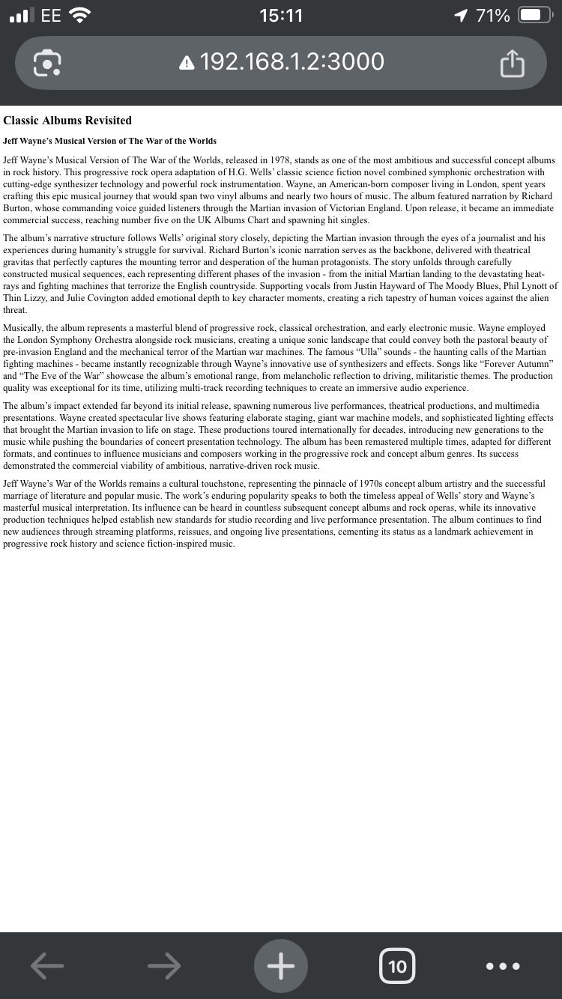
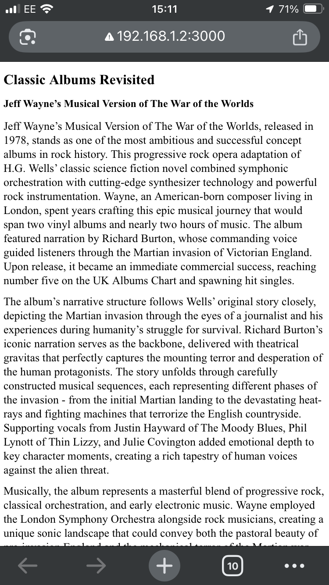
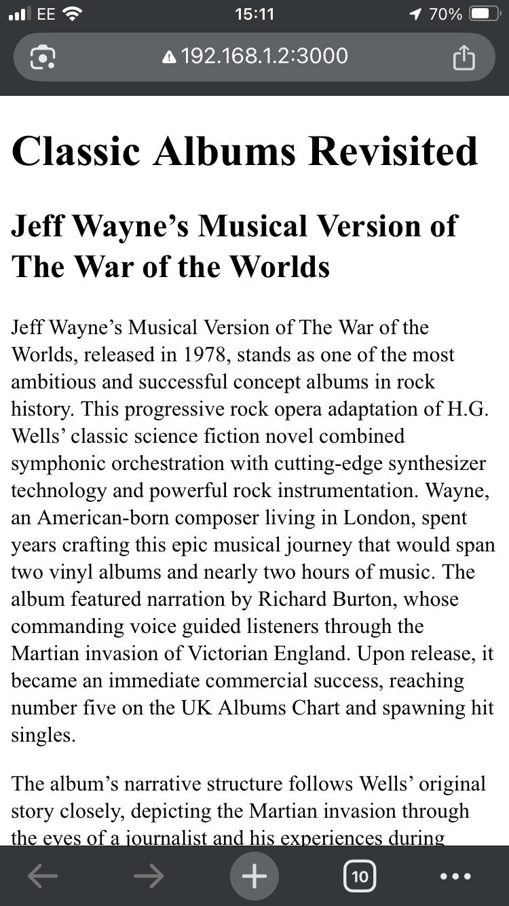
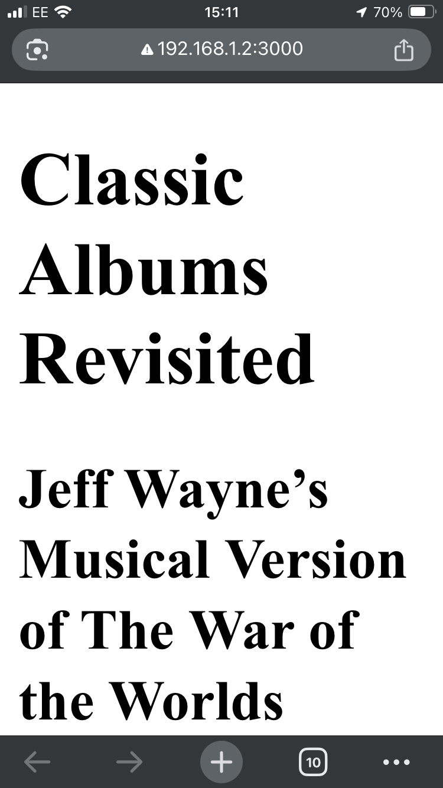

As we saw a little while ago, most web pages have an intrinsic document flow, based around the idea of block and inline elements. We've also learned about the CSS box model --- content, padding, border, and margins --- and about how to specify sizes and layout using pixels, relative units like ems and rems, and the viewport-based units vh and vw.

In this section, we're going to learn some techniques we can use to break out of the document flow model and take much greater control of our page layouts.

Before we get into that, though, let's have a quick refresh about viewports.

## Viewports and Scrolling

When we use the word *screen*, we mean the entire physical display. A screen has a size, and a resolution. Size is physical: my laptop screen is 30 by 20 centimetres; my phone screen is 6 by 10 centimetres; the projector screen in a conference auditorium is 20 metres wide. The resolution tells us how many pixels that screen has - and with high-DPI displays, physical pixels aren't the same as logical pixels. My iPhone has 750 by 1334 physical pixels, but if you ask JavaScript to print the screen width and height, it says it's 375 x 667 - which is exactly half the physical resolution, because on my phone each logical pixel is actually a 2x2 block of physical pixels.

Next, there's the window. On a desktop or laptop, this is the browser window, which you can move and resize - and that window might have a title bar, address bar, toolbar, bookmarks, tabs, developer tools, status bar... and, somewhere in the middle, the *viewport*. 

The viewport is the bit which actually shows you the web page - or part of it, because the page is often bigger than the viewport. In computer graphics, you'll sometimes hear this referred to as the canvas, but on the web, if we use the word *canvas* we usually mean an HTML `<canvas>` element, so the thing that scrolls around behind the viewport is usually just called the *document*.

One final thing to bear in mind is what happens when the user zooms the page --- because there's two different kinds of zoom to think about. Desktop browsers have a feature called page zoom: that's the one you get by pressing <kbd>Ctrl</kbd>+<kbd>+</kbd>, or holding <kbd>Ctrl</kbd> and rolling the mouse wheel. Page zoom makes everything on the page bigger --- text, images, videos --- but it usually doesn't affect the viewport; the browser recalculates the page layout.

On mobile devices like smartphones, there's a feature called *pinch zoom*, which enlarges the whole page but doesn't affect the layout. Instead, you end up with two viewports - there's the *visual viewport*, which is the bit that's still on the screen, and the *layout viewport*, which is the one the browser uses to lay out the page.

Sometimes, they're all the same. If you view a really short page on your mobile phone screen --- short enough that it doesn't scroll --- then the screen, the window, the viewport and the document are all the same size, and things are very easy indeed. But as we learn about more complex layouts, it's important to think about whether we're arranging elements relative to the document or to the viewport. 

### The viewport meta tag

When smartphone browsers adapt a page layout for their screens, they'll usually render the page as it would appear on a desktop device, and then zoom out until it fits on the screen. This can lead to very, very small text, and can cause layout problems.

You can change this behaviour by using a `<meta>` tag in the document `<head`>, to specify the viewport width, and the initial scale factor - how much the page should be zoomed when it first loads.

<div id="initial-scale-gallery">
    <figure>
    
        <figcaption><code>initial-scale: 0.1</code></figcaption>
    </figure>
        <figure>
    
        <figcaption><code>initial-scale: 0.5</code></figcaption>
    </figure>
        <figure>
    
        <figcaption><code>initial-scale: 1.0</code></figcaption>
    </figure>
        <figure>
    
        <figcaption><code>initial-scale: 2.0</code></figcaption>
    </figure>
</div>

You can set the viewport width to a specific number of pixels, from 1 to 10000, but by far the most common use of the `<meta name="viewport">` tag is using it to set the viewport width to the `device-width`:

```html
<meta name="viewport" content="width=device-width; initial-scale=1.0" />
```

## Responsive Width

Page width --- and consequently, the length of each line of text --- can have a huge impact on readability, so when you're authoring a page that's going to be read on everything from an iPhone SE to a 48" Samsung ultrawide high definition monitor, you really want to be able to adjust the page width dynamically based on the device. This technique --- using styles that adapt to the device that's displaying them --- is known as *responsive design*, and we'll be talking about it a lot throughout the rest of this course.

The simplest example is to fix the page width:

```css
body { width: 720px; margin: 0 auto; }
```

but CSS gives us some useful functions we can use to create a layout which is responsive up to a point, but won't become unusable on very large or very small devices. There's `min-width` and `max-width`:

```css
body {
  width: 60%;
  max-width: 960px;
  min-width: 420px;
}
```

Modern CSS also defines two general-purpose functions `min` and `max`, which take any number of arguments, including other functions, and return their minimum or maximum argument:

```css
body { width: min(960px, 60%); }
body { width: max(420px, 60%); }
body { width: max(420px, min(960px, 60%)); }
```

But that last syntax is a little unwieldly, so CSS also provides a `clamp()` function:

```css
body { width: clamp(420px, 60%, 960px); }
```

Open up this example in new window and try changing the window width to see how they behave:



## Using CSS Position

In most of the examples we've looked at so far, the browser decides where to place each element on the page. Inline elements go next to the previous element, block elements go underneath the previous element; if the page ends up too wide, elements will wrap onto the next line, and if the page ends up too tall, we get a vertical scrollbar.

This behaviour is known as *static* positioning, and it's the default: every element in HTML has `position: static` unless we change it. Static layout works really well for articles, documents, blog posts, that kind of thing, but as we start incorporating more sophisticated navigation and interaction into our websites, we're going to need more options when it comes to layout.

## Positioning properties

CSS exposes six properties which affect the position and size of an element: `top`, `bottom`, `left`, `right`, `width`, and `height` - they're all linear measurements, so they can be pixels, `ems`, `rems`, `points`, percentages, or any of the other units we met earlier. What these properties actually *do* depends on which positioning model we've applied to the element, so let's meet them.

### `position: relative`

We'll start with *relative* positioning. This lets us move an element relative to its original position, hence the name. If we say `top: 10px`, it'll move it down the page by ten pixels - remember, coordinates start at the top left and increase downwards and to the right.



You see that middle paragraph? The one that's going places? It's moved down and to the right --- but also, because the paragraph *width* is still based on the width of the *viewport*, the content is now too wide for the container, so we end up with a horizontal scrollbar.

Relative positioning is useful if you've got an icon or a button that's not *quite* in the right place and you just need to nudge it by a few pixels, but it's mostly used because it has an incredibly useful side-effect we'll learn about in a moment.

### position: absolute

First, though, let's meet *absolute positioning*. Using `position: absolute`, we can specify exactly where an element should be placed within its parent element:



Unlike relative positioned elements, absolute positioned elements don't take up any space in the document flow. The browser doesn't leave a gap where they used to be; it yanks them out of the flow, draws everything else, and then slaps them over the top --- which means if you're not careful, you can easily end up with text that's unreadable because it's hidden behind another element.

You can also create styles which don't make any sense:



There's no way an element can be 6% left, 6% right and 41% wide, because percentages have to add up to 100 - so the browser has to ignore something. If `top`, `height` and `bottom` are all specified, `bottom` is ignored. 

If `left`, `right` and `width` are all specified, then it depends on the reading order of the text;  the English version of the joke is aligned left --- and the `right` property is discarded --- but the Hebrew version of the joke is aligned right, with the `left` property discarded, because Hebrew reads right-to-left.

In the example above, the absolute-positioned elements are all positioned relative to the document's body... but if you create a parent element with `position: relative`, any absolute-positioned child elements will be positioned relative to that parent. That's the superpower side-effect we talked about a moment ago; relative positioned elements create a new layout context.



And yes, the terminology here can get very confusing when we talk about absolute-positioned elements being positioned relative to relative-positioned elements.

### position: fixed

Fixed positioning works like absolute positioning, but elements are positioned relative to the *viewport*, not the *document* --- in other words, they won't move when you scroll the page. Fantastic for headers, footers and navigation menus.



### position: sticky

Sticky is a relatively recent addition to CSS, and it's a fantastic example of the kind of thing that used to mean writing quite a lot of complicated JavaScript but now CSS just does it with one rule. Which is sad news if you enjoy writing --- and maintaining --- lots of complicated JavaScript, but it's fantastic news for the rest of us.

Sticky gives you an element that'll stay visible for as long as its container is visible... it's kinda hard to explain, so here's an example:



It's usually used for vertical scrolling, but you can use sticky horizontally as well:



## Scrolling and Overflow

In plain old HTML, the only thing which ever scrolls is the viewport, but when we start giving elements specific widths and heights, it's trivially easy to create a container that isn't big enough for its content. In CSS, this is known as *overflow*, and we can handle it in a few different ways.



The last two examples there use the `text-overflow` property, but the second one --- `text-overflow: "😥";` --- is a draft specification, that, at the time I'm writing this, August 2025, is only supported in Firefox.

You can specify horizontal and vertical overflow separately, using the `overflow-x` and `overflow-y` properties:



## Review & Recap

In this section, we've learned about viewports, element positioning, overflow, and introduced several techniques we can use to create responsive CSS layouts.

- **Start with static layouts.** Most web pages start with a natural block/inline flow and the CSS box model. To create more complex layouts we need to break out of the default document flow.
- **Screens, windows and viewports** - and how high-DPI screens and browser zoom modes (page vs. pinch zoom) affect layouts.
- Using the **viewport meta tag** to control how your page scales on mobile, ensuring text remains readable and layouts look good on all devices.
- Creating **responsive widths** using CSS units, `min-width`, `max-width`, and functions like `min()`/`max()`
- **CSS Positioning Models:**
  - `static` (default): elements follow the document flow.
  - `relative`: nudge elements from their default position *(and as a handy side-effect, create a new layout container we can use with absolute-positioned child elements)*
  - `absolute`: place elements anywhere, relative to their nearest positioned ancestor.
  - `fixed`: anchor elements to the viewport for sticky headers/footers.
  - `sticky`: elements stay visible as you scroll until their container moves out of view.
- **Overflow**, and how to control scrollbars and content visibility with `overflow`, `overflow-x`, `overflow-y`, and `text-overflow`.
