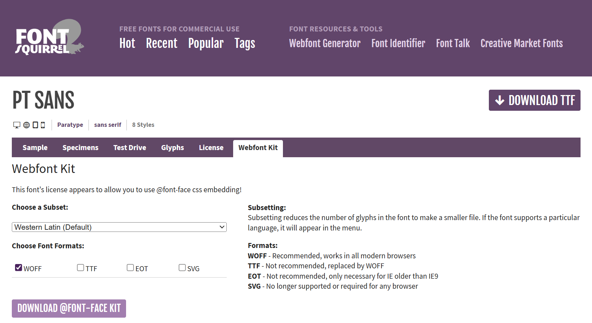

Every example we've looked at so far has used the browser's default font, and in my case, that's Times New Roman. And I don't know about you folks, but I'm getting a little bored of Times New Roman... nothing wrong with it, it's just a bit... nondescript, you know?

Let's mix things up a bit.

Using CSS, we can control just about every detail of how text is rendered onto the screen, starting with the font. By specifying a `font-family`, we tell the browser "hey, render this element using this font" - well, kinda. The problem is, we can't guarantee that a particular font will be available on every machine, so instead, we specify something called a font stack:

```css
p {
    font-family: "Franklin Gothic", Arial, Helvetica, sans-serif;
}
```

The browser's going to start at the beginning: "do I have Franklin Gothic?" If that font's available, use it, otherwise check for Arial; if Arial's not available, use Helvetica, and if that's not available either, use any generic sans-serif font.

The keyword `sans-serif` there isn't a font, it's a generic font family name. CSS defines five of these --- `serif`, `sans-serif`, `monospace`, `cursive`, and `fantasy` --- but it's up to the browser to decide what typeface to use for each generic family.



This example shows a range of CSS font stacks, along with a sample image showing what they look like on my Windows 11 workstation.

## Using Web Fonts

If you want to use a font which isn't widely available, you can tell the browser to download the font file from the web - either directly from your own site, or from an external provider like Google Fonts. First, find the font you want to use. I've always liked the font PT Sans Narrow, so we're going to use that one as our example. Head over to [www.fontsquirrel.com/fonts/pt-sans](https://www.fontsquirrel.com/fonts/pt-sans), click on "Webfont Kit": 



You'll get the option to download a subset of the font - if you know your website is only ever going to include Latin text, you can download a version of the font file that doesn't include glyphs for Greek, Cyrillic, and other alphabets. You can also choose a format: the Web Open Font Format, WOFF, is really the only one that matters these days. Hit the Download button, and you'll get a ZIP file containing your fonts, along with a load of sample sheets, notes, and the license file.

All we actually need here are the WOFF files, so unzip that file and search through it for the files with .woff extension. You might want to rename them as you go - FontSquirrel's default filenames aren't terribly helpful. If you're using PT Sans, you can grab a ZIP file of just the WOFF files (and the license!) here: [pt-sans.zip]({{page.examples}}/pt-sans.zip)

Next, we need to create the CSS rules which will import those font files and register them with the associated `font-family` name:



Note that the `font-family` designator here is completely arbitrary; it's a good idea to use a `font-family` name that matches the font you're using, but it's not required; you can use any name you like.



What's interesting here is that the WOFF file we've provided, `pt-sans.woff`, only defines the regular version of that typeface -- it doesn't include a bold version or an italic version. So where are those variants coming from?

Those are what are called *synthetic fonts*; they're created by the operating system using something called font synthesis. To make a font italic, the OS sort of skews everything sideways a bit; to make it bold, it'll draw every letter with a heavy outline stroke.

That works great, right up to the point where you have a client who is really, *really* particular about fonts and typography --- maybe they've even hired a font foundry to design their company font; they've paid a lot of money for those bold and italic versions and by golly they want to make sure they get used.

First thing to do if you find yourself in this situation is to disable font synthesis:



Now, we know that if we're seeing bold or italic, it's coming from the font file, not being synthesised by the operating system.

Next, we'll add `@font-face` rules for each variant, specifying the URL to the `.woff` file containing that variant, and using `font-weight` and `font-style` to specify which variant it is:



Notice how the rules all use the same `font-family: 'PT Sans'`, so that we can set a document in PT Sans, and elements with intrinsic styling, like `<h1>` and `<em>` , will use the correct font variant.

## Variable Fonts

Regular fonts come in one variety per file: our `pt-sans.woff` file only contains the regular, normal version of PT Sans; if we want it to be bold or italic, we either need to find another font, or rely on font synthesis.

A variable font gives you a lot more flexibility; the font designers can choose to turn just about any property of the font into a parameter. Check out Roboto Flex at v-fonts.com for a live demo:

* [https://v-fonts.com/fonts/roboto-flex](https://v-fonts.com/fonts/roboto-flex)

Variable fonts are part of the OpenType font specification, which defines literally dozens of variables. As far as CSS is concerned, there's five fields we care about:

* `font-weight` maps to the variable `weight`
* `font-stretch` maps to the variable `width`
* `font-style: italic | oblique` maps to the `slant` and `italic` properties
* `font-optical-size` maps to the `optical-size` property.

If you do need to modify any other variables, the `font-variation-settings` property will let specify name/value pairs for any number of font variables.

Variable fonts are so powerful, and so flexible, that we're not even going to attempt an exhaustive description of what they can do, but here's an example of how to define different font weights and widths when using a variable font file.



## CSS Text Properties

As well as the choice of font, we can change the appearance of text using `font` and `text` properties.

Now, folks, web typography can get unbelievably complicated. A lot of very smart people have spent decades figuring out how to make all of this stuff work, and a fair amount of that time and effort has been spent covering edge cases that the vast majority of us will never encounter: if you want to use CSS to lay out a panel from a graphic novel where one character's arguing in Hebrew and the other one's arguing back in Japanese and the whole thing's rotated by 30% for dramatic effect, you can absolutely do that -- but if we go into every possible option of every typographic property in CSS, we'll be here for hours and you'll learn a whole bunch of things that I'd bet good money you'll never have to use. So I'm going to focus on the ones I think are relevant to the most common scenarios, and I'll leave you some links & pointers where you can go and read up on the rest of it if you really, really want to.

First up, the font properties - `font-family`, `font-size`, `font-stretch`, `font-style`, `font-variant`, `font-weight`, and `line-height`.

Font-family, we've already seen.

Font-size can be one of what I call the T-shirt sizes: `xx-small`, `x-small`, `small`, `medium`, `large`, `x-large`, `xx-large`, `xxx-large`, a relative size keyword `larger` or `smaller`, a length value, or a percentage.



For units like `em`, which are relative, font size is relative to the parent element, so watch out for compounding font sizes:



`font-style` is pretty simple: it's either `normal` - sometimes referred to as *Roman type*, `oblique` or `italic`. 

Technically, *oblique* text is regular text that's been skewed at an angle, and *italic* text is a different version of the font. In practice many fonts just use an oblique font for italics rather than creating a completely separate font variant, and if an italic version of a font is available, the browser will often use that instead of rendering a true oblique version, so the whole thing is a bit of a mess. The CSS spec allows you to specify an angle for oblique text, which can even be negative, creating a backwards-italic effect - but right now that only works in Firefox.

By the way, to tell whether a font is using synthetic oblique or true italics, compare the lowercase letters --- a, f, g, j and z often have very different glyphs in true italic vs synthetic oblique versions of the font.



`font-weight` can be `normal`, `bold`, `lighter`, `bolder`, or a number between 1 and 1000, and `line-height` is the distance between the baseline of adjacent lines of text.


# Text & Typography (20m)

## Course Content

- Fonts, weights, styles and variants
- Whitespace, wrap and overflow
- Working with web fonts

## Notes

https://opentype.js.org/font-inspector.html

https://fonts.google.com/knowledge/introducing_type/introducing_variable_fonts


