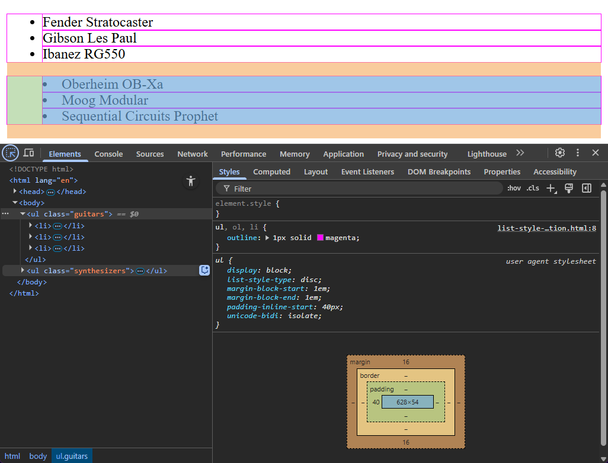

HTML defines three different elements we can use to create lists.

**Unordered lists**, denoted by `<ul>` with the item tag `<li>`, are for lists with no intrinsic order - like the musicians in a band; as long as they're all there, the order doesn't really matter.



**Ordered lists,** denoted by the tag `<ol>` and the item tag `<li>`, denote items with a meaningful order, such as the track listing on a record:



And **description lists** (which were called *definition lists* until HTML5, since they were originally intended for marking up content like dictionaries and glossaries) - a `<dl>`  containing *description term* `<dt>` elements, each with an associated *description details* `<dd>`:



## Styling Lists

Let's start with the easy ones. You want to change the style of the bullets used on an unordered list? There's a bunch of built-in bullets you can use:



If you want the bullets to appear inside the element's content, instead of alongside it, use `list-style-position`:



This screenshot shows how the list markers are actually drawn into the left padding on the `<ul>` element:

To style the marker itself, CSS exposes the `::marker` pseudo-element:



## Defining Custom Counters with `@counter-style`

The `@counter-style` rule, available across all mainstream browsers since 2023, provides a way to define our own custom counter styles.

It's incredibly powerful and flexible; check out the [MDN documentation](https://developer.mozilla.org/en-US/docs/Web/CSS/@counter-style) for full details of how `@counter-style` works; here's a few examples to give you some idea of what it can do.



The thing to remember about an unordered list is that, while the browser typically displays it as a list of bullet points, it doesn't have to be bullets. One very common scenario is to wrap a `<ul>` inside a `<nav>` element, to create the main navigation menu for a page or a site:



## CSS Counter Functions

As well as using lists for elements like menus, we can use CSS counters for things which aren't lists.

* `counter-reset` and `counter-increment` will modify the value of a named counter
* Using pseudo-elements, `content` and the `counter()` function, we can add counters to elements during the styling process.

For example, to create a document with legal-style numbered paragraphs:



# Lists and Counters (20m)

## Course Content

- Lists! All the lists.
- Understanding CSS counters
- Modifying counters with `counter-reset` and `counter-increment`
- Using counters in `content`

## Notes

