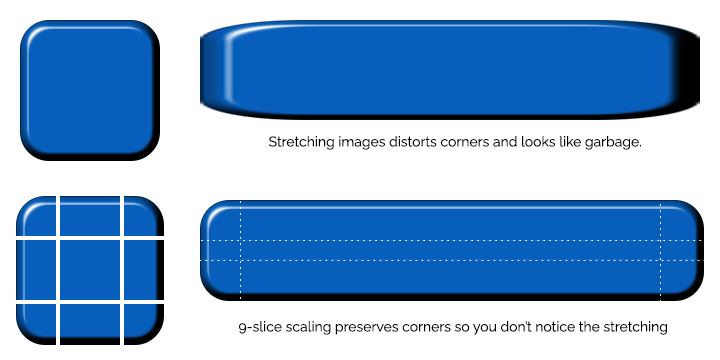
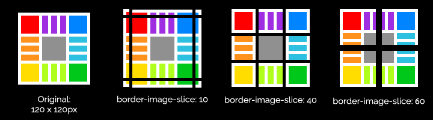
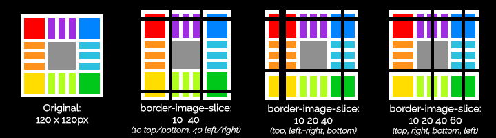
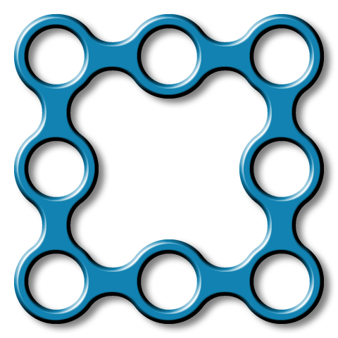
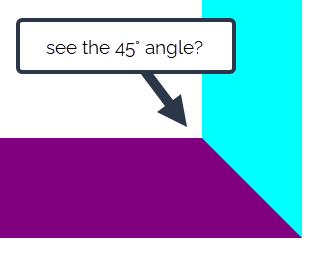

In the section on boxes & borders, we learned about `border-width`, `border-style` and `border-color` - basically, a bunch of ways to draw a line around a box. 

Let's meet some of the more advanced things we can do with CSS borders

## Rounded Corners with `border-radius`

For a long while, rounded corners was a sure sign somebody had spent a great deal of time --- and money --- on a website; with no native support in HTML or CSS, rounded corners meant painstakingly creating button and UI elements in Photoshop or Macromedia Fireworks, exporting tiny slices of images and reassembling them using HTML tables.

Thankfully, these days, if you want rounded corners on an element, you just specify a `border-radius` - and boy howdy, we have a lot of syntaxes to choose from.

If we specify the radius as a length, we get

`border-radius: 10px`
: apply a 10px radius to all four corners

`border-radius: 10px 20px`
: apply a 10px radius top-left and bottom-right; 20px radius top-right and bottom-left

`border-radius: 10px 20px 30px`
: 10px top-left, 20px top-right and bottom-left; 30px bottom-right

`border-radius: 10px 20px 30px 40px`
: 10px top-left, 20px top-right; 30px bottom-right, 40px bottom-left



If you specify the border radius as a percentage, and the element isn't a square, you'll get an elliptical border:



You can also create an elliptical border by specifying a second set of radii, separated from the first set with a forward slash `/`:



## Using Border Images

If you can't achieve the border effect you need using the built-in styles, CSS also allows you to use an image as an element border -- and as we saw in the last section, CSS images include several different kinds of gradient function.

Border images in CSS are based on [9-slice scaling](https://en.wikipedia.org/wiki/9-slice_scaling), a technique for resizing an image that preserves the borders and corners:

This means that to use an image as a border, we need to consider how the image will be sliced, and how those slices will be assigned to the nine parts of the border (well, actually eight parts - four corners, four edges - but you can also use the `fill` keyword to preserve the middle part of the border image as an extra background layer on the element's content)

Border images can be a little baffling because you need to provide multiple properties in the right combination for them to do anything at all --- get one wrong, or miss one out, and you just won't get a border.

* You must provide a `border-image-source`, `border-image-slice` and `border-image-width`
* You must also  

To understand how slice works, we're going to use this background image:

The `border-image-slice` property takes one or more numbers - either unitless numbers or percentages. If they're unitless, and the `border-image-source` is a bitmap, the numbers are pixels (if you're using something like an SVG as a border image, unitless numbers are interpreted as coordinates, so you're better off using percentages.)

The number specifies where to slice the image. If you specify one number, it'll slice that distance from each edge:

 

The key to understanding this is that if the number is more than half the size of the image, there's nothing left for the edges - and if the number is equal to, or greater than, the size of the image, it'll just give you a copy of the border image in each corner.



If you provide more than one number, it uses the same `t-r-b-l` shorthand syntax as other CSS border properties:

`border-image-slice: 10% 50%`
: 10% top and bottom; 50% left and right

`border-image-slice: 10% 20% 30%`
: 10% top, 20% left and right, 30% bottom

`border-image-slice: 10% 20% 30% 40%`
: 10% top, 20% right, 30% bottom, 40% left

Finally, if you include the `fill` keyword anywhere in the border slice property, it'll use the central slice as the element background:



Border Image Outset and Border Image Repeat

For these examples, we're using this transparent PNG as our border image: [9-slice-chain.png]({{ page.examples}}/9-slice-chain.png)

`border-image-outset` --- another `t-b-r-l` property --- specifies the distance between the element's border box and the border image.



`border-image-repeat` specifies how the slices should be repeated along the edges of the element:



and finally, `border-image-width` works like `border-width`, but for the image border rather than the regular CSS border:



## Using `border-image` shorthand

Yep, you guessed it: there's a shorthand syntax if you don't want to specify each property individually. To recap, the complete set of border image properties is:

- [`border-image-source`](https://developer.mozilla.org/en-US/docs/Web/CSS/border-image-source) - an image URL or a gradient function
- [`border-image-slice`](https://developer.mozilla.org/en-US/docs/Web/CSS/border-image-slice) - one to four unitless values or percentages
- [`border-image-width`](https://developer.mozilla.org/en-US/docs/Web/CSS/border-image-width) - one to four lengths
- [`border-image-outset`](https://developer.mozilla.org/en-US/docs/Web/CSS/border-image-outset) - one to four lengths
- [`border-image-repeat`](https://developer.mozilla.org/en-US/docs/Web/CSS/border-image-repeat) - one of the keywords `stretch`, `repeat`, `round` or `space`

The shorthand syntax is:

`border-image: source slice / width / outset repeat`

Should you use it?

Well... it depends. If you're specifying a single value for `slice`, a single value for `width` and maybe a `repeat`, it's probably fine. But take a look at these examples and tell me if *you* want to maintain a project that uses this sort of code.



## CSS Border Hacks

OK, we've looked at a bunch of things CSS borders were *supposed* to do. Time to learn about some things that definitely weren't part of the design, but turn out to be incredibly useful anyway.

Perhaps the most useful one is a way to make triangles. CSS is great at rectangles, and using border-radius we can create all kinds of curved shaped, but triangles has always been a bit tricky.

Take a look at this example:



Look closely at the corners of the `
`, you'll see the borders create a 45° mitre joint:

Now, watch what happens if we set the width and height of the element to `0`, so it ends up all border and no content:



Next we're going to change the border widths:



That purple border is starting to look distinctly triangular, hey?

Now, if we set the top border to zero, and change the colours of the other borders to `transparent`:



...we've made a triangle using pure CSS. 

OK, so what can we do with it? 

I've used this kind of technique on several projects to create a navigation indicator, adding a tiny triangle beneath the nav link for whichever page is currently active. This example uses the `:target` pseudo-class to target the navigation element matching the current URL, along with an absolute-positioned `::after` pseudo-element that creates the triangular border effect.



Another scenario that's come up several times in my own career is creating a "speech bubble" callout.

## Exercise: Creating Pure CSS Speech Bubbles



