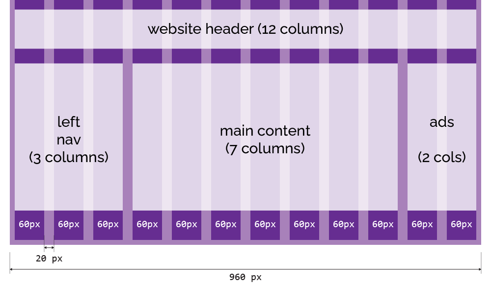

<<<<<<< HEAD:211-column-based-layouts/index.md
---
layout: home
nav_order: 211
target_minutes: 15
title: "Column-Based Layouts"
word_count: 2233
---
Since the earliest days of the web, designers have been coming up with beautiful column-based layouts and asking developers to build them --- and for a long, long while, the only tool we had to do this was tables. Fortunately, things have improved a great deal since then, and today there's quite a few different ways to build responsive column-based layouts for websites and apps. Before we get into how we actually build them, let's talk about one of the most popular layout systems, something called a 12-column grid.

OK, before we get started, three very important things to bear in mind.

### 1. Layout Grids Are Not CSS Grids

First: this isn't the same as a CSS grid, which we're going to meet shortly. Designers and developers were referring to this kind of column layout as a 960 grid, or a twelve-column grid, for a long while before the grid module was added to CSS, and they are not the same thing. I'll try very hard to always refer to layout grids and CSS grids if there could be confusion between the two, so if I talk about a layout grid, I mean a column-based system built using floats or flexbox, and if I talk about CSS grids, I mean the grid module that's actually part of CSS.

### 2. Layout Grids Aren't “Cool”

The second thing to realise: these kinds of layout grids all originated in print, where designers would use them to lay out magazine pages, posters, that kind of thing - and in print, nothing moves. There's no such thing as a responsive magazine. CSS layout grids started out as a way to take ideas from conventional typesetting and incorporate them into web design; these days, with the prevalence of smartphones and other mobile devices, we've got a whole new set of challenges when it comes to layout and information design.

One solution to this is to build on the existing layout grid systems and figure out how to make them responsive; we'll look at some techniques for doing this in a moment. But a lot of designers now skip the layout grid in favour of using things like flexboxes and CSS grids to create optimised layouts for each site, and opinions are divided as to whether layout grids are still relevant or not.

Here's how I look at it. If you're a developer at a boutique agency, working on high-profile websites for high-profile clients, and looking to create unique, memorable user experiences... you probably aren't going to use a layout grid. But for the rest of us, they're a useful tool and a very simple way to get some basic layout and responsiveness into our sites and apps. 

### 3. Don't Reinvent the Wheel

We're going to look at putting together a simple grid system, to demonstrate the principles involved, but if you want to build a site from scratch using a grid system, don't roll your own unless you have a good reason. There are many excellent layout grid systems out there. Bootstrap includes a [powerful layout grid system](https://getbootstrap.com/docs/5.3/layout/grid/), which you can use on your own sites even if you're not using any other Bootstrap features; the Foundation Framework also [includes a 12-column grid system](https://get.foundation/sites/docs/grid.html), and there are a bunch of older systems, like [960gs](https://960.gs/), [Unsemantic](https://unsemantic.com/), and [Skeleton](http://getskeleton.com/); some of them haven't been updated in a decade, but they're more finished than abandoned, and while I wouldn't suggest you use any of them on a greenfield project, you might find they're being used on legacy sites you end up maintaining.

## Using a 12-Column Grid

Fundamentally, a 12-column grid splits the page into twelve equally-sized columns, which creates a layout grid we can use to organise our content by specifying how many columns each element should occupy. Most versions you'll see in the wild are based on a 960-pixel site width, with twelve 60-pixel columns, each surrounded by 10px of space, creating a 20px gap --- known as a *gutter* --- between adjacent columns.

<figure>
    
    <figcaption>
960 Grid System: <a href="/images/960-grid-layout.png">960-grid-layout.png</a></figcaption>
</figure>

Using predefined widths and `float`, you can create a very simple 960 grid system in under  20 lines of code:



Here, you can see the effects of the various `col-*` classes applied to elements within a container:

{% iframe fixed-grid.html style="height: 22em; zoom: 70%;" %}

> There's a `zoom: 70%` applied to the `iframe` for the demo here; open the example in a new window to see it at 1:1 size.

Here's an example of a full site layout built around that 960 grid system:



## Responsive Grids

One drawback of a fixed layout grid is that it's always 960px wide; on narrower devices, the layout doesn't adjust to the screen width, and you get a horizontal scrollbar.

> Horizonal scrolling is almost always a terrible idea unless it's done on purpose.

Instead, we can give the container a `max-width`, and set the width of the column elements as a percentage of the container width:





{% iframe fluid-grid.html style="width: 50%; height: 20em;" %}

The Guitar Garage demo site using a responsive layout looks like this:



and on a narrower screen:

{% iframe guitar-garage-fluid.html style="border: 2px solid #fff; height: 25em; width: 50%;" %}

It works OK up to a point, but when you get down to something like a mobile device, the whole idea of side-by-side content doesn't really make sense. We'd be much better off with a layout that uses the full width of the device on desktops and tablets, but on something like a smartphone, it switches to a completely different layout which stacks items vertically instead of displaying them side-by-side.

## Responsive Layouts with @media Queries

It wasn't all that long ago that developers would find themselves building, and maintaining, two completely different versions of the same website; one built for desktops, the other built for mobile devices. This generally turned out to be a frustrating and expensive proposition, especially since it would double the time, and cost, it took to add new features, and so you'd rapidly end up with a bunch of features that were only available on desktop or vice versa.

A much better approach is to create a single site, running from a single codebase, which adapts to the device it's running on. This is the fundamental principle behind **responsive design**: smaller devices don't just show a smaller version of your site, they actually apply a different layout so that the same elements and content are optimised for use on a smaller screen.

Now, there are two different approaches to responsive design. One is to use what's called a *fluid layout*; elements are defined using relative units, and the layout scales smoothly to fit the current viewport. You'll also hear this referred to as a "liquid layout", but that term's fallen out of favour since Shopify created an open-source templating language called Liquid in 2006, which has become incredibly popular for building static websites and content management systems. Liquid's great --- this handbook site is built using Liquid --- but it also means googling "liquid layout" produces very confusing results. We've see a fluid layout based on layout grids above, and later in the workshop we'll look at how you can use CSS flexbox to create truly fluid layouts that don't rely on an underlying grid system.

The other approach is to use what we call **breakpoints** to create styles which will only be applied at specific viewport sizes. 

CSS does this using something called a **media query**, created using the `@media` rule; a way to define CSS rules that only apply in specific circumstances. You'll sometimes see this used to include rules that should only apply when content is printed:

```css
body { font-size: 16pt; }

@media print {
    /* Remove unnecessary elements when printing */
    header, nav, footer { display: none; }
    /* Adjust body width and font to improve readability */
    body { width: 100%; font-size: 10pt; }
}
```

We can also define media queries based on device characteristics. Open this example in a new browser window and change the screen width:



Now, let's take our fluid layout grid and add a rule that says when we get below a certain screen width - say 600px - we're going to scrap the side-by-side layout sections and just display every element at 100% width:





{% iframe fluid-grid-breakpoint.html style="width: 50%; height: 18em;" %}

Here's the Guitar Garage demo site using a 600px breakpoint:



{% iframe guitar-garage-breakpoint.html style="border: 1px solid #fff; width: 50%;" %}

This approach is very simple, but it doesn't give us a huge amount of control over how the layout will respond to different device widths, so most layout grid systems go a step further and include multiple column classes so that you can define exactly how specific elements should react to specific breakpoints.

The convention here is to define a set of named breakpoints; [Bootstrap's grid system](https://getbootstrap.com/docs/4.0/layout/grid/) defines these as:

* `xs`: extra small (0 -- 576px)
* `sm`: small (576px -- 768px)
* `md`: medium (768px -- 992px)
* `lg`: large (992px -- 1200px)
* `xl`: extra large (> 1200px)

Then we can create a set of CSS classes based on those breakpoints, and use those classes to define how many columns an element should take up at each screen width.

This snippet:

```html
<div class="col-6 col-4-lg col-3-xl"></div>
```

defines a `<div>` which is six columns wide on most devices, four columns on large screens, and three on extra-large.

### Desktop-First or Mobile-First?

When using breakpoint-based layouts, it's vitally important to decide up front whether you're going to build a mobile-first layout that adapts to desktop and widescreen devices, or a widescreen device that adapts to tablets and mobile devices. In this example, the layout is mobile-first: every element defaults to 12 columns - full width - and then I've used override classes to switch to a 2, 3, 4, or 6-column layout on larger devices:

{% example breakpoints.html elements="body" iframe_style="height: 20em; zoom: 75%;" %}

## Column Offsets

One more feature of most grid systems is *offsets*: a way to define an element that doesn't start in the left-most column, or which leaves a gap.



And, yes, you can combine offset classes with media queries, to create offsets which only kick in at specific display sizes.

## Putting It All Together

Let's wire up the checkout form for our Guitar Garage site, using a combination of all the layout grid techniques we've seen in this section.



Here's the same page, but with a background on the `.container` element that makes the layout grid structure visible so you can see what's lining up with what:



Here's that same example in a narrow screen format:

{% iframe guitar-garage-checkout-with-guides.html style="width: 50%;" %}

Things to look for:

* The rows in the checkout form are full-width on narrow devices, but on larger devices are either 10 columns offset by 1, or 8 columns offset by 2 -- this avoids uncomfortably wide rows on very large displays.
* We're using a combination of columns and offsets to simulate a tabular layout for the Order Details section.
* The customer details form uses one, two, or three columns depending on the screen size
* It's not just `<div>` elements being styled by the grid system; we've also used the `col-*` classes on `<h3>` and `<hr>` elements.

## Review & Recap

In this section, we’ve learned:

- How **column-based layout grids** work, and why they’re different from CSS Grid.
- That layout grids originated in **print design**, and while not always “cool,” they remain a practical way to create simple, responsive layouts.
- Why it’s usually better to **use an existing grid system** (like Bootstrap or Foundation) instead of building your own from scratch.
- How a **12-column grid** provides a flexible foundation for structuring content, using gutters, columns, and offsets.
- The difference between **fixed** and **fluid** grids, and why fluid layouts scale better across different screen widths.
- How to make grids **responsive** using `@media` queries and **breakpoints**, so designs adapt smoothly to different devices.
- The importance of deciding between a **mobile-first** or **desktop-first** strategy before implementing breakpoints.
- How **offsets** can create spacing and alignment options beyond simple left-aligned layouts.
- Finally, how all these techniques come together in a practical example (the Guitar Garage site), combining grids, offsets, and breakpoints to build a layout that works well across devices.

We're not going to spend any more time on layout grids. I think they're a really important technique, one that you'll still find used in many sites and frontend design frameworks, but there are good reason they're not really considered "best practice" any more.

Most significantly, they need a *lot* of extraneous classes and markup; we need to wrap our content up in row elements, wrap those in a container element, add column and offset classes to our content elements - and we'll often end up having to wrap those in *another* layer of divs. 

The good news is: there's a much, much better way to deliver the same kind of results; a set of capabilities that were added to CSS about ten years ago, influenced and inspired by the kind of layouts people were creating using layout grids. Together, they're known as CSS flexbox, so let's meet flexbox and see what it can do.

## Links and References

Fixed vs. Fluid vs. Elastic Layout: What’s The Right One For You?
: [https://www.smashingmagazine.com/2009/06/fixed-vs-fluid-vs-elastic-layout-whats-the-right-one-for-you/](https://www.smashingmagazine.com/2009/06/fixed-vs-fluid-vs-elastic-layout-whats-the-right-one-for-you/)

Bootstrap Grid System
: [https://getbootstrap.com/docs/4.0/layout/grid/](https://getbootstrap.com/docs/4.0/layout/grid/)
=======
---
examples: examples/211-column-based-layouts
layout: home
nav_order: 211
target_minutes: 15
title: "Column-Based Layouts"
word_count: 2233
---
Since the earliest days of the web, designers have been coming up with beautiful column-based layouts and asking developers to build them --- and for a long, long while, the only tool we had to do this was tables. Fortunately, things have improved a great deal since then, and today there's quite a few different ways to build responsive column-based layouts for websites and apps. Before we get into how we actually build them, let's talk about one of the most popular layout systems, something called a 12-column grid.

OK, before we get started, three very important things to bear in mind.

### 1. Layout Grids Are Not CSS Grids

First: this isn't the same as a CSS grid, which we're going to meet shortly. Designers and developers were referring to this kind of column layout as a 960 grid, or a twelve-column grid, for a long while before the grid module was added to CSS, and they are not the same thing. I'll try very hard to always refer to layout grids and CSS grids if there could be confusion between the two, so if I talk about a layout grid, I mean a column-based system built using floats or flexbox, and if I talk about CSS grids, I mean the grid module that's actually part of CSS.

### 2. Layout Grids Aren't “Cool”

The second thing to realise: these kinds of layout grids all originated in print, where designers would use them to lay out magazine pages, posters, that kind of thing - and in print, nothing moves. There's no such thing as a responsive magazine. CSS layout grids started out as a way to take ideas from conventional typesetting and incorporate them into web design; these days, with the prevalence of smartphones and other mobile devices, we've got a whole new set of challenges when it comes to layout and information design.

One solution to this is to build on the existing layout grid systems and figure out how to make them responsive; we'll look at some techniques for doing this in a moment. But a lot of designers now skip the layout grid in favour of using things like flexboxes and CSS grids to create optimised layouts for each site, and opinions are divided as to whether layout grids are still relevant or not.

Here's how I look at it. If you're a developer at a boutique agency, working on high-profile websites for high-profile clients, and looking to create unique, memorable user experiences... you probably aren't going to use a layout grid. But for the rest of us, they're a useful tool and a very simple way to get some basic layout and responsiveness into our sites and apps. 

### 3. Don't Reinvent the Wheel

We're going to look at putting together a simple grid system, to demonstrate the principles involved, but if you want to build a site from scratch using a grid system, don't roll your own unless you have a good reason. There are many excellent layout grid systems out there. Bootstrap includes a [powerful layout grid system](https://getbootstrap.com/docs/5.3/layout/grid/), which you can use on your own sites even if you're not using any other Bootstrap features; the Foundation Framework also [includes a 12-column grid system](https://get.foundation/sites/docs/grid.html), and there are a bunch of older systems, like [960gs](https://960.gs/), [Unsemantic](https://unsemantic.com/), and [Skeleton](http://getskeleton.com/); some of them haven't been updated in a decade, but they're more finished than abandoned, and while I wouldn't suggest you use any of them on a greenfield project, you might find they're being used on legacy sites you end up maintaining.

## Using a 12-Column Grid

Fundamentally, a 12-column grid splits the page into twelve equally-sized columns, which creates a layout grid we can use to organise our content by specifying how many columns each element should occupy. Most versions you'll see in the wild are based on a 960-pixel site width, with twelve 60-pixel columns, each surrounded by 10px of space, creating a 20px gap --- known as a *gutter* --- between adjacent columns.

<figure>
    
    <figcaption>
960 Grid System: <a href="/images/960-grid-layout.png">960-grid-layout.png</a></figcaption>
</figure>

Using predefined widths and `float`, you can create a very simple 960 grid system in under  20 lines of code:



Here, you can see the effects of the various `col-*` classes applied to elements within a container:

{% iframe fixed-grid.html style="height: 22em; zoom: 70%;" %}

> There's a `zoom: 70%` applied to the `iframe` for the demo here; open the example in a new window to see it at 1:1 size.

Here's an example of a full site layout built around that 960 grid system:



## Responsive Grids

One drawback of a fixed layout grid is that it's always 960px wide; on narrower devices, the layout doesn't adjust to the screen width, and you get a horizontal scrollbar.

> Horizonal scrolling is almost always a terrible idea unless it's done on purpose.

Instead, we can give the container a `max-width`, and set the width of the column elements as a percentage of the container width:





{% iframe fluid-grid.html style="width: 50%; height: 20em;" %}

The Guitar Garage demo site using a responsive layout looks like this:



and on a narrower screen:

{% iframe guitar-garage-fluid.html style="border: 2px solid #fff; height: 25em; width: 50%;" %}

It works OK up to a point, but when you get down to something like a mobile device, the whole idea of side-by-side content doesn't really make sense. We'd be much better off with a layout that uses the full width of the device on desktops and tablets, but on something like a smartphone, it switches to a completely different layout which stacks items vertically instead of displaying them side-by-side.

## Responsive Layouts with @media Queries

It wasn't all that long ago that developers would find themselves building, and maintaining, two completely different versions of the same website; one built for desktops, the other built for mobile devices. This generally turned out to be a frustrating and expensive proposition, especially since it would double the time, and cost, it took to add new features, and so you'd rapidly end up with a bunch of features that were only available on desktop or vice versa.

A much better approach is to create a single site, running from a single codebase, which adapts to the device it's running on. This is the fundamental principle behind **responsive design**: smaller devices don't just show a smaller version of your site, they actually apply a different layout so that the same elements and content are optimised for use on a smaller screen.

Now, there are two different approaches to responsive design. One is to use what's called a *fluid layout*; elements are defined using relative units, and the layout scales smoothly to fit the current viewport. You'll also hear this referred to as a "liquid layout", but that term's fallen out of favour since Shopify created an open-source templating language called Liquid in 2006, which has become incredibly popular for building static websites and content management systems. Liquid's great --- this handbook site is built using Liquid --- but it also means googling "liquid layout" produces very confusing results. We've see a fluid layout based on layout grids above, and later in the workshop we'll look at how you can use CSS flexbox to create truly fluid layouts that don't rely on an underlying grid system.

The other approach is to use what we call **breakpoints** to create styles which will only be applied at specific viewport sizes. 

CSS does this using something called a **media query**, created using the `@media` rule; a way to define CSS rules that only apply in specific circumstances. You'll sometimes see this used to include rules that should only apply when content is printed:

```css
body { font-size: 16pt; }

@media print {
    /* Remove unnecessary elements when printing */
    header, nav, footer { display: none; }
    /* Adjust body width and font to improve readability */
    body { width: 100%; font-size: 10pt; }
}
```

We can also define media queries based on device characteristics. Open this example in a new browser window and change the screen width:



Now, let's take our fluid layout grid and add a rule that says when we get below a certain screen width - say 600px - we're going to scrap the side-by-side layout sections and just display every element at 100% width:





{% iframe fluid-grid-breakpoint.html style="width: 50%; height: 18em;" %}

Here's the Guitar Garage demo site using a 600px breakpoint:



{% iframe guitar-garage-breakpoint.html style="border: 1px solid #fff; width: 50%;" %}

This approach is very simple, but it doesn't give us a huge amount of control over how the layout will respond to different device widths, so most layout grid systems go a step further and include multiple column classes so that you can define exactly how specific elements should react to specific breakpoints.

The convention here is to define a set of named breakpoints; [Bootstrap's grid system](https://getbootstrap.com/docs/4.0/layout/grid/) defines these as:

* `xs`: extra small (0 -- 576px)
* `sm`: small (576px -- 768px)
* `md`: medium (768px -- 992px)
* `lg`: large (992px -- 1200px)
* `xl`: extra large (> 1200px)

Then we can create a set of CSS classes based on those breakpoints, and use those classes to define how many columns an element should take up at each screen width.

This snippet:

```html
<div class="col-6 col-4-lg col-3-xl"></div>
```

defines a `<div>` which is six columns wide on most devices, four columns on large screens, and three on extra-large.

### Desktop-First or Mobile-First?

When using breakpoint-based layouts, it's vitally important to decide up front whether you're going to build a mobile-first layout that adapts to desktop and widescreen devices, or a widescreen device that adapts to tablets and mobile devices. In this example, the layout is mobile-first: every element defaults to 12 columns - full width - and then I've used override classes to switch to a 2, 3, 4, or 6-column layout on larger devices:

{% example breakpoints.html elements="body" iframe_style="height: 20em; zoom: 75%;" %}

## Column Offsets

One more feature of most grid systems is *offsets*: a way to define an element that doesn't start in the left-most column, or which leaves a gap.



And, yes, you can combine offset classes with media queries, to create offsets which only kick in at specific display sizes.

## Putting It All Together

Let's wire up the checkout form for our Guitar Garage site, using a combination of all the layout grid techniques we've seen in this section.



Here's the same page, but with a background on the `.container` element that makes the layout grid structure visible so you can see what's lining up with what:



Here's that same example in a narrow screen format:

{% iframe guitar-garage-checkout-with-guides.html style="width: 50%;" %}

Things to look for:

* The rows in the checkout form are full-width on narrow devices, but on larger devices are either 10 columns offset by 1, or 8 columns offset by 2 -- this avoids uncomfortably wide rows on very large displays.
* We're using a combination of columns and offsets to simulate a tabular layout for the Order Details section.
* The customer details form uses one, two, or three columns depending on the screen size
* It's not just `<div>` elements being styled by the grid system; we've also used the `col-*` classes on `<h3>` and `<hr>` elements.

## Review & Recap

In this section, we’ve learned:

- How **column-based layout grids** work, and why they’re different from CSS Grid.
- That layout grids originated in **print design**, and while not always “cool,” they remain a practical way to create simple, responsive layouts.
- Why it’s usually better to **use an existing grid system** (like Bootstrap or Foundation) instead of building your own from scratch.
- How a **12-column grid** provides a flexible foundation for structuring content, using gutters, columns, and offsets.
- The difference between **fixed** and **fluid** grids, and why fluid layouts scale better across different screen widths.
- How to make grids **responsive** using `@media` queries and **breakpoints**, so designs adapt smoothly to different devices.
- The importance of deciding between a **mobile-first** or **desktop-first** strategy before implementing breakpoints.
- How **offsets** can create spacing and alignment options beyond simple left-aligned layouts.
- Finally, how all these techniques come together in a practical example (the Guitar Garage site), combining grids, offsets, and breakpoints to build a layout that works well across devices.

We're not going to spend any more time on layout grids. I think they're a really important technique, one that you'll still find used in many sites and frontend design frameworks, but there are good reason they're not really considered "best practice" any more.

Most significantly, they need a *lot* of extraneous classes and markup; we need to wrap our content up in row elements, wrap those in a container element, add column and offset classes to our content elements - and we'll often end up having to wrap those in *another* layer of divs. 

The good news is: there's a much, much better way to deliver the same kind of results; a set of capabilities that were added to CSS about ten years ago, influenced and inspired by the kind of layouts people were creating using layout grids. Together, they're known as CSS flexbox, so let's meet flexbox and see what it can do.

## Links and References

Fixed vs. Fluid vs. Elastic Layout: What’s The Right One For You?
: [https://www.smashingmagazine.com/2009/06/fixed-vs-fluid-vs-elastic-layout-whats-the-right-one-for-you/](https://www.smashingmagazine.com/2009/06/fixed-vs-fluid-vs-elastic-layout-whats-the-right-one-for-you/)

Bootstrap Grid System
: [https://getbootstrap.com/docs/4.0/layout/grid/](https://getbootstrap.com/docs/4.0/layout/grid/)
>>>>>>> 11c62976dce45c47dbb069f9a3901d41e6923bac:211-column-based-layouts.md
