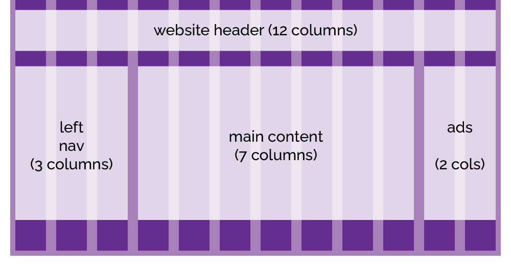

Since the earliest days of the web, designers have been coming up with beautiful column-based layouts and asking developers to build them --- and for a long, long while, the only tool we had to do this was tables. Fortunately, things have improved a great deal since then, and today there's quite a few different ways to build responsive column-based layouts for websites and apps. Before we get into how we actually build them, let's talk about one of the most popular layout systems, something called a 12-column grid.

OK, before we get started, three very important things to bear in mind.

### 1. Layout Grids Are Not CSS Grids

First: this isn't the same as a CSS grid, which we're going to meet shortly. Designers and developers were referring to this kind of column layout as a 960 grid, or a twelve-column grid, for a long while before the grid module was added to CSS, and they are not the same thing. I'll try very hard to always refer to layout grids and CSS grids if there could be confusion between the two, so if I talk about a layout grid, I mean a column-based system built using floats or flexbox, and if I talk about CSS grids, I mean the grid module that's actually part of CSS.

### 2. Layout Grids Aren't “Cool”

The second thing to realise: these kinds of layout grids all originated in print, where designers would use them to lay out magazine pages, posters, that kind of thing - and in print, nothing moves. There's no such thing as a responsive magazine. CSS layout grids started out as a way to take ideas from conventional typesetting and incorporate them into web design; these days, with the prevalence of smartphones and other mobile devices, we've got a whole new set of challenges when it comes to layout and information design.

One solution to this is to build on the existing layout grid systems and figure out how to make them responsive; we'll look at some techniques for doing this in a moment. But a lot of designers now skip the layout grid in favour of using things like flexboxes and CSS grids to create optimised layouts for each site, and opinions are divided as to whether layout grids are still relevant or not.

Here's how I look at it. If you're a developer at a boutique agency, working on high-profile websites for high-profile clients, and looking to create unique, memorable user experiences... you probably aren't going to use a layout grid. But for the rest of us, they're a useful tool and a very simple way to get some basic layout and responsiveness into our sites and apps. 

### 3. Don't Reinvent the Wheel

We're going to look at putting together a simple grid system, to demonstrate the principles involved, but if you want to build a site from scratch using a grid system, don't roll your own unless you have a good reason. There are many excellent layout grid systems out there. Bootstrap includes a [powerful layout grid system](https://getbootstrap.com/docs/5.3/layout/grid/), which you can use on your own sites even if you're not using any other Bootstrap features; the Foundation Framework also [includes a 12-column grid system](https://get.foundation/sites/docs/grid.html), and there are a bunch of older systems, like [960gs](https://960.gs/), [Unsemantic](https://unsemantic.com/), and [Skeleton](http://getskeleton.com/); some of them haven't been updated in a decade, but they're more finished than abandoned, and while I wouldn't suggest you use any of them on a greenfield project, you might find they're being used on legacy sites you end up maintaining.

## Using a 12-Column Grid

Fundamentally, a 12-column grid splits the page into twelve equally-sized columns, which creates a layout grid we can use to organise our content by specifying how many columns each element should occupy. Most versions you'll see in the wild are based on a 960-pixel site width, with twelve 60-pixel columns, each surrounded by 10px of space, creating a 20px gap --- known as a *gutter* --- between adjacent columns.

<figure>
    
    <figcaption>
960 Grid System: <a href="/images/960-grid-layout.png">960-grid-layout.png</a></figcaption>
</figure>

Using predefined widths and `float`, you can create a very simple 960 grid system in less than 20 lines of code:



Here, you can see the effects of the various `col-*` classes applied to elements within a container:

{% iframe 960-grid-site.html style="height: 30em; zoom: 70%;" %}

> There's a `zoom: 70%` applied to the `iframe` for the demo here; open the example in a new window to see it at 1:1 size.

Here's an example of a full site layout built around that 960 grid system:



## Responsive Grids

One drawback of a fixed layout grid is that it's always 960px wide; on narrower devices, the layout doesn't adjust to the screen width, and you get a horizontal scrollbar.

> Horizonal scrolling is almost always a terrible idea unless it's done on purpose.

Instead, we can give the container a `max-width`, and set the width of the column elements as a proportion of the container width. Here, we're using CSS `calc()` to keep the column gutter at a constant 10px while adjusting the width of the columns themselves.





{% iframe 12-col-responsive-demo.html style="width: 50%; height: 20em;" %}

The Guitar Garage demo site using a responsive layout looks like this:

{% iframe guitar-garage-12-col-responsive-grid.html style="border: 2px solid #fff; height: 25em; zoom: 90%;" %}

and on a narrower screen layout, various elements will adjust to adapt the layout to the narrower format:

{% iframe guitar-garage-12-col-responsive-grid.html style="border: 2px solid #fff; height: 25em; width: 50%; zoom: 90%" %}

It's a lot better than the fixed-width layout - we no longer get a horizontal scroll for starters - but we can do a lot better.

## Responsive Layouts with @media Queries

Using `@media`, CSS allows us to define styles which will only be applied when 
