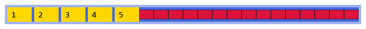
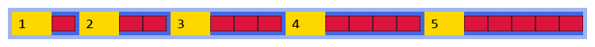

In this section, we're going to learn about a set of features and capabilities which are collectively known as CSS flexbox. They're defined in something called the CSS Flexible Box Layout Module, hence "flexbox"; the syntax was finalised around 2012, and achieved stable support across all mainstream browsers by 2017.

I spent a lot of time thinking about where to introduce flexbox in this course. There's one pretty strong argument that flexbox is the *de facto* standard layout model for modern CSS, and that if you know how to use flexbox effectively, you probably never need to use a lot of the things we've already seen, like floats and layout grids --- and so we could have learned about flexbox right at the beginning, used it for all the other demos and exercises, and skipped over all the other stuff entirely.

There are three reasons I didn't do that. First: you're going to find that stuff in the wild. Sure, if you're building a brand new greenfield web application starting today, you're probably going to build your layouts around flexboxes... but most of us aren't building greenfield applications, we're maintaining sites and systems which have been around for a while.

Second: I think taking the time to look at block and inline elements, floats, and layout grids provides a much better understanding of why flexbox was created, and what sort of problems it was intended to solve.

Third: flexbox is mind-meltingly complicated. It's a completely new layout model, with ten new properties to consider, all of which can interact with each other in complex and sometimes unexpected ways... for folks who've not worked with CSS before, it's a little overwhelming. But if you've already spent a bit of time using things like layout grids, flexbox will be like a breath of fresh air. Albeit slightly complicated air with a lot of interesting smells in it.

You ready? Let's see what it can do.

## Flexbox Fundamentals

Flexbox is designed to align elements in a container along a single axis; every flexbox container is fundamentally trying to be either a single row of things, or a single column of things. This is in contrast to the CSS Grid we'll meet a little later, which is all about two-dimensional layouts.

Also bear in mind that while you *can* use flexbox to lay out entire screens and applications, it's just as effective for building small standalone components, as we'll see later in this section.

To activate the flexbox layout system, you'll need a container element with `display: flex` on it --- or `display: inline-flex`, if you want your container to behave like an inline element.

That'll give you a container with a *main axis* and a *cross axis*, and just about everything else is defined in terms of those two axes.



By default, flex will try to fit every element onto the same row (or column), shrinking elements as necessary. Use `flex-wrap` if you want items to wrap across multiple lines



> You can also set the direction and wrap in one statement using the `flex-flow` shorthand property: `flex-flow: <direction> <wrap>;` 

## Mind the Gap

Flexbox layouts will respect element margins, but you can also specify a gap between the elements in a flex container using `row-gap`, `column-gap`, or the shorthand `gap` property.



Notice that the gap is only applied *between* items; if you want a gap between the container and the items, either set `padding` on the container, or add a `margin` to the elements.

## Justify and Align, Content and Items

This is where flexbox starts to get a bit gnarly, mainly because we just don't have enough specific words in everyday English for the number of different ways content inside a flexbox can be arranged.

I find it helpful to think of flexbox as three separate things - the container, the content, and the items. The container and items are the actual HTML elements, the *content* is the implied grouping created by the arrangement of the items:


`justify-content` controls how elements are arranged along the main axis, **if they don't fill the container**.



There are several values there which appear to do the same thing, but remember that not all web pages will read from left to right:

* `left` and `right` are fixed directions and are not affected by the document's writing direction.
* `start` and `end` will change based on the writing direction; in right-to-left reading systems like Hebrew and Arabic, `start` is the right, `end` is the left.
* `flex-start` and `flex-end` are relative to the `flex-direction` --- but this is also based on the writing direction; in a left-to-right reading system, `row` goes left to right, and `row-reverse` goes right-to-left, so as far as flexbox is concerned, `start` is always the same as `flex-start` and `end` is always the same as `flex-end`.

Remember, too, that this is justification **along the main axis**. You change the axis orientation or direction, it's going to produce a different effect:



and if you reverse the flex direction, the start becomes the end, so to speak:



To control how elements are laid out along the **cross axis**, use `align-items`:



If your flexbox container wraps, you'll end up with more than one row (or column) of items; to control how these wrapped rows are laid out, use the `align-content` property. Here's how it works with `flex-direction: row`:



and here's how it works with `flex-direction: column`:



____

## The Holy Grail of CSS

For many years, perfectly centring an element in its parent container has been a "Holy Grail" of CSS; horizontal alignment has been trivial since HTML 1.0, but to centre something vertically, developers had to resort to all sorts of tricks involving table cells, negative margins, JavaScript... well, no more. With the advent of flexbox, we can, *finally*, centre content within its container without resorting to hacks!



You can also use flexbox along with `justify-content`, `align-items` and `text-align` to centre text within its container without having to wrap it in an enclosing element:



If you've only recently started working with CSS, you're probably thinking "so what's the big deal?" --- but trust me, for those of us who've been around for a while, this will never stop being amazing.

## Flexbox Item Properties

All the properties we've looked at above apply to the *container* - the element with the `display: flex` property applied to it, which activates the flexbox layout module.

We can also target individual flexbox items, which comes in useful when we've got one or two elements that should be laid out differently to the rest.

### Flex Order

One very powerful, and potentially dangerous, application of CSS is causing elements to appear on the screen in a different order to how they appear in the underlying markup. We've already seen examples of this using `position: absolute` and `float`, to pull an element out of the regular document flow and render it somewhere else on the page. Flexbox goes a step further with this and gives us the `order` property, which will literally change the rendering order of elements in a container. Every item in a flex container has a default `order` of `0`; giving items a non-zero `order` will override the order in which they appear in their container. Use a negative `order` to move an element nearer the start of the main axis:



### Align Self

Individual flex items can also override the default item alignment for their flex container:



Watch out for using `align-self` with `baseline` values. Baseline alignment doesn't align elements relative to the container, it aligns them with each other, and so it doesn't make sense to specify baseline alignment for a single element. A collection of elements in the same flex container with the same baseline alignment is known as a *baseline sharing group*; in this example there are two such groups, one aligned to the default baseline, and one aligned to the last baseline:



### Flex Grow, Shrink and Basis

To control how the layout engine will resize an item, we can use `flex-grow`, `flex-shrink` and `flex-basis`, and this is where some seriously complex mathematics gets involved.

Let's start with `flex-basis` . The `flex-basis` property works like `width` or `height`, but it's aligned with the main axis of the flex container - so if your flex items are in a row`flex-basis` specifies a width; if you're using a column, `flex-basis` specifies a height. Flex basis *will* override `width` or`height`, but won't override `max-width`, `max-height`, `min-width` or `min-height` properties:



If you're using flex columns instead of flex rows:



Next up, let's meet `flex-grow`, and its counterpart `flex-shrink`. These both accept a *unitless value*, a non-negative integer value which controls how much that item will grow or shrink, proportional to the other items in the same flex container.

Let's walk through that slowly.

Say we have a flex container here, that's 730 pixels wide, with 5px of padding and a 5px flex gap. There are five `<div>` elements in the container, with their `flex-basis` set to 50px. Initially, they don't have a `flex-grow` property - or rather, they have the default `flex-grow` value, which is zero - so they only take up as much space as their content, and the container has a bunch of empty space at the end:


Now, let's assign the `flex-grow` property for each of our flex items - we'll set them to 1, 2, 3, 4, and 5, respectively:


The flexbox layout engine is going to add those `flex-grow` values together --- 1 + 2 + 3 + 4 + 5 = 15 --- and then divide the available free space into 15 equal parts:



Then --- this is the clever part --- it'll redistribute that space between the flex items based on their `flex-grow` values:

 

and then increase the size of each item to occupy the space allocated to it by that distribution:


`flex-shrink` is... more complicated.

The simple explanation is that a flex item with `flex-shrink: 2` will shrink twice as fast as an element with `flex-shrink: 1`, and an element with `flex-shrink: 0` will never shrink.



If you're interested, the mathematics behind it works like this:

1. Calculate the **overflow** - how much space do we need to lose? If we have 4 x 200px elements in a 500px container, we've got 800px of content in a 500px container, so the **overflow** is 300px. You'll also sometimes see this called the **negative free space**.
2. Calculate the **shrink factor** for each element: this is `flex-basis` (or `width`, if no flex basis is specified), multiplied by the `flex-shrink`
3. Determine each item's share of the total **shrink factor**
4. Reduce each item's width in proportion to its share of the shrink factor.

## Using the `flex` shorthand property

Although you can specify `flex-basis`, `flex-grow` and `flex-shrink` separately, it's usually much easier to use the `flex` shorthand property:

```css
.item {
  flex: <grow> <shrink> <basis>;
}
```

Every item in a flexbox container has a default `flex: 0 1 auto` --- i.e. don't grow, shrink equally with other elements as necessary, and set initial width based on the element's width.

If you use the `flex` property and only specify the `grow` value, the browser will set the `flex-basis` to `0%`; this might seem counterintuitive but what it's actually saying is "grow & shrink this item as necessary; don't worry what size it was supposed to be"



## Parting Thoughts about Flexbox

As you've seen in this section, flexbox gives us a whole new way to think about linear layouts in CSS. It's incredibly flexible - hence the name - but that flexibility has a cost; at a certain point, it becomes almost impossible to look at a given combination of properties and values and predict how it's going to behave.

Thing is: I don't think it matters. Working with flexbox, for me, is as much about trial and error as it is about precision engineering; I'll usually sketch out how I want something to appear at various device sizes, figure out how to create a flex layout that's broadly correct, and then play around with specific properties and values to smooth out the rough edges.

The other thing to remember about flexbox: it's just as valid for laying out a tiny component, like a button or a form field, as it is for laying out entire pages and sections. We'll look at some examples of that in the next section of the course.

## Review & Recap

In this section, we learned:

- Flexbox is part of the CSS Flexible Box Layout Module, finalised around 2012 and widely supported by 2017.
- It introduces a new layout model based on a *main axis* and a *cross axis*, activated with `display: flex` or `display: inline-flex`.
- Flexbox is one-dimensional: it arranges elements in a row *or* a column, unlike CSS Grid which handles two dimensions.
- We can control wrapping with `flex-wrap` or shorthand `flex-flow: <direction> <wrap>`.
- Gaps between items can be managed with `row-gap`, `column-gap`, or `gap`, while container spacing still requires `padding` or `margin`.
- Layout alignment uses `justify-content` (main axis), `align-items` (cross axis), and `align-content` (for multiple rows/columns).
- Flexbox makes it easy to centre elements horizontally and vertically—solving a long-standing CSS challenge.
- Individual items can override container rules using `order` (reordering), `align-self`, and baseline alignment.
- Sizing and distribution of space is handled with `flex-grow`, `flex-shrink`, and `flex-basis`, which determine how items expand or contract.
- The shorthand `flex: <grow> <shrink> <basis>` simplifies item sizing, with a default of `flex: 0 1 auto`.

## References

"Learn Flexbox with 30 Code Tidbits" by Samantha Ming
: A wonderful mini-course all about CSS flexbox, delivered as 30 short coding exercises: [https://www.samanthaming.com/flexbox30/](https://www.samanthaming.com/flexbox30/)

"CSS Flexbox Layout Guide" by Chris Coyler at css-tricks.com
: [https://css-tricks.com/snippets/css/a-guide-to-flexbox/](https://css-tricks.com/snippets/css/a-guide-to-flexbox/) - along with a handy high-res printable "quick reference" poster covering all the various flexbox properties and values

"CSS Flexible Box Layout" at MDN
: MDN's comprehensive documentation on the flexible box layout module and all the associated properties: [https://developer.mozilla.org/en-US/docs/Web/CSS/CSS_flexible_box_layout](https://developer.mozilla.org/en-US/docs/Web/CSS/CSS_flexible_box_layout)


