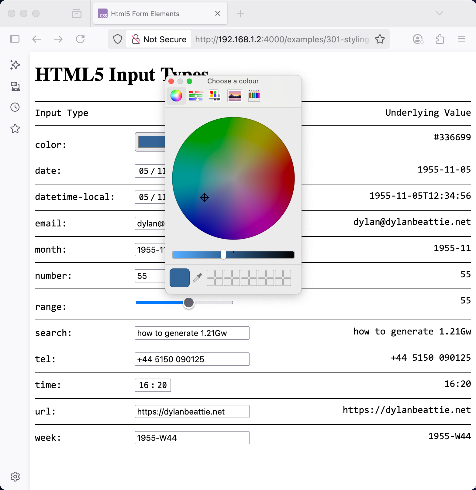
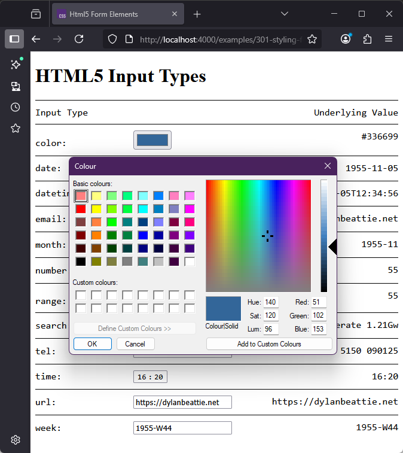
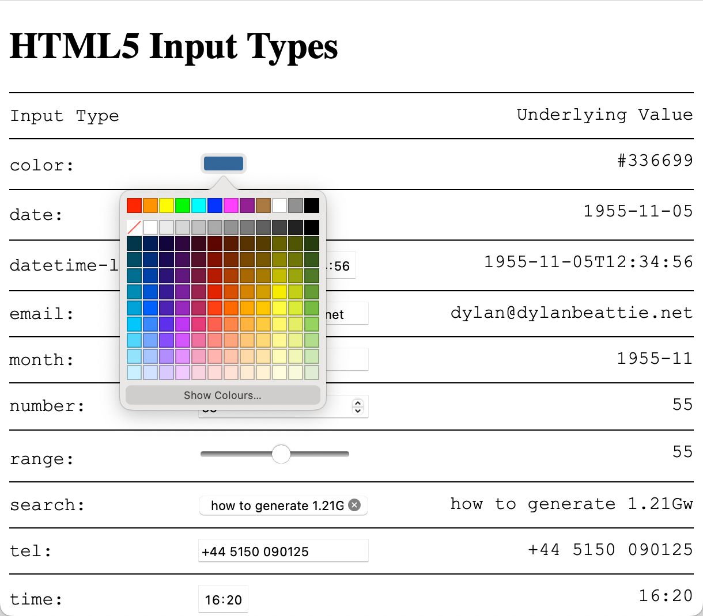
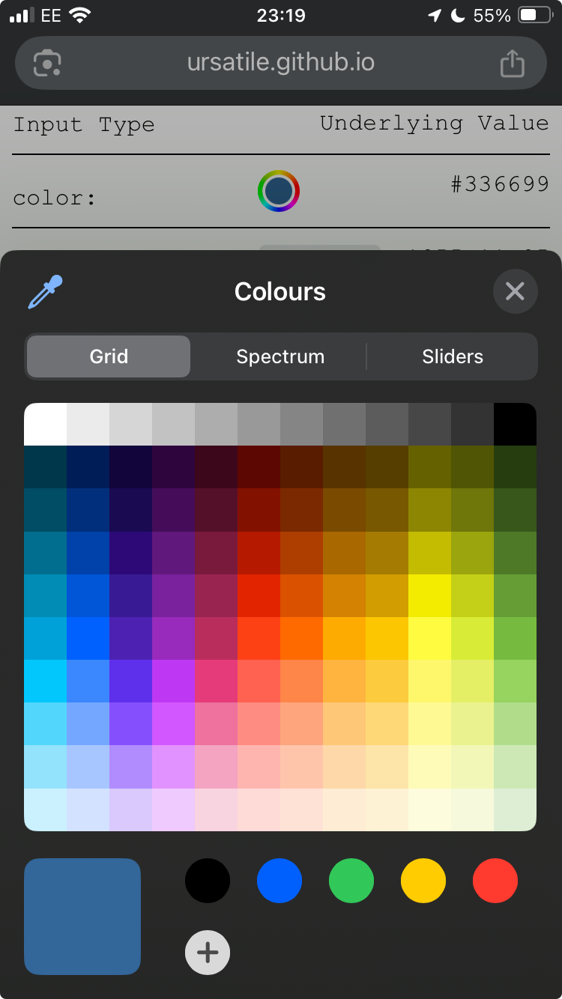
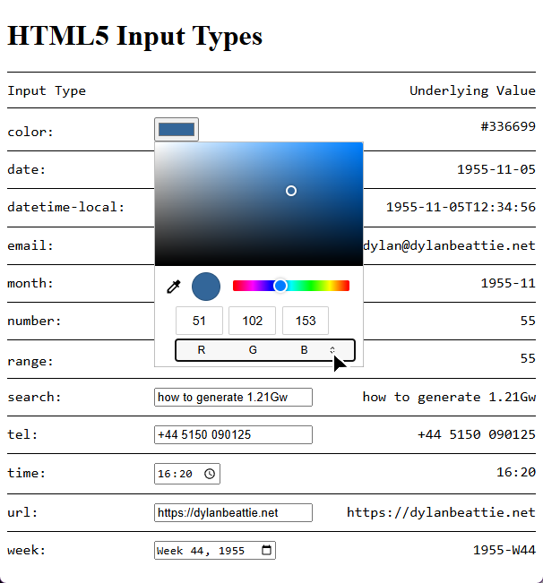
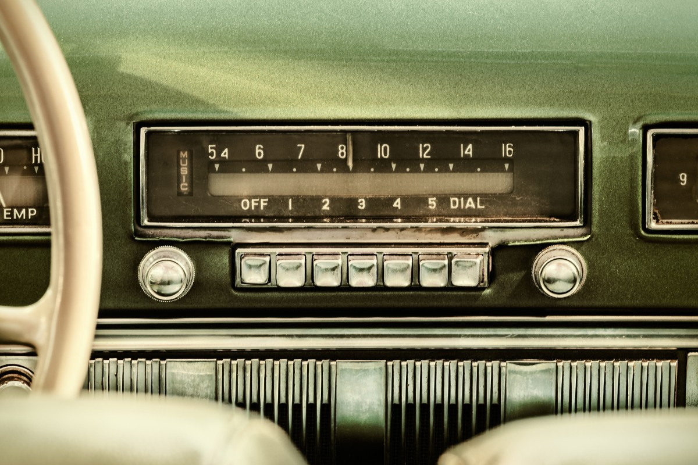

Forms are the fundamental building blocks of interactive web applications. Everything we've looked at so far has been static content: users can scroll, click, and navigate around our content, but they're not really interacting with it.

The first iteration of HTML forms included a basic set of input types:



HTML5 (which rolled out gradually from 2007-2014) introduced a whole bunch of new form types:



There's a few things to bear in mind when you're working with HTML inputs.

First: with the exception of `<input type="file">`, they are all fancy ways to make a string. Really. Everything gets reduced to text, 'cos that's all HTTP knows how to deal with; when the HTML5 input types were rolled, out, browsers that didn't support them yet would fall back to a plain old `<input type="text">` --- or, more accurately, to `<input>`, since `"text"` is the default type --- so even if you couldn't pick a colour using a nice colour picker, you could at least type `#ff9900` into the box.

Second: you have very little control over how these form inputs actually behave. Something like the colour picker, for example - if you're using Firefox, it'll pop up the system colour picker, which looks like this on macOS:

and like this on Windows:

Safari on macOS has its own built-in colour picker widget:

This is what you get on iOS:

and on Chrome and Edge on Windows, it's this:

The underlying problem here, of course, is that the web is a collision of conventions about what something like a button or a colour picker should look like. There's one argument that says that if you're running macOS, the buttons on the web pages should look like macOS buttons so your users know that they're buttons. There's another argument says that it's your website, your buttons should look like the rest of your website.

When it comes to styling form elements, you'll find there's a few different approaches used on sites around the web.

## Styling Inputs and Buttons

You can style text fields and buttons like just about any other element - backgrounds, borders, gradients, fonts; all the techniques we've looked at so far in the course:



## Styling Radio Buttons and Checkboxes

Historically, browsers haven't given developers a huge degree of control over the appearance of radio buttons and checkbox inputs.

Incidentally, if you've ever wondered why they're called radio buttons? It goes all the way back to old-fashioned car radios, which had buttons to choose a preset radio station - and because you can't tune in to two radio stations at the same time, pushing one button would release all the others. Just like how radio buttons work on the web.

Even 30 years after HTML 3.2, there's still a lot of subtle detail about radio buttons and checkboxes that many developers haven't encountered before. By way of  a quick recap: radio buttons only let the user select one value from a group - denoted by a set of inputs with the same `name` attribute. Radio buttons, and groups of related checkboxes, should always be contained in a `<fieldset>` element, along with a `<legend>` element which explains the what that group of inputs is for. 

Because they're relatively small, radio buttons and checkboxes should always have an associated `<label>` element - it's much easier to click on the adjacent label text than it is to click on the radio button or checkbox itself.

One way to accomplish this is to put the input *inside* the label:



Another way is to give each radio button an ID, and use the `for` attribute to associate the labels. Remember that radio buttons in a group have the same name, so you have to give them a unique ID which can't be the same as their name.



Despite this being part of the HTML standard since the 1990s, you'll still see a lot of forms in the wild where the "label" isn't actually a `<label>` element - it's just some text alongside the button. This *looks* the same, but try making a selection here:



If you find this easy, have a couple of drinks and then try doing it on your phone on a moving train - a completely valid technique for understanding what it's like to use your software for somebody who has limited dexterity. The WCAG refers to this particular issue as [target size](https://www.w3.org/WAI/WCAG21/Understanding/target-size.html); WCAG level AA requires a minimum target size of 24x24 pixels, and for compliance with level AAA (the highest accessibility standard) targets should be [at least 44x44 pixels](https://www.w3.org/WAI/WCAG21/Understanding/target-size.

The problem with styling radio buttons and checkboxes is that on almost all devices, they aren't drawn by the browser - they're drawn by the operating system, so properties like border and background have no effect.

One option if you're wrapping your inputs in a `<label>` element is to style the label; you'll need to tweak the positioning a bit to get it to look good, but thanks to modern CSS' support for the `:has()` selector, it's easy to style the label associated with the selected checkbox to make it more obvious which one's selected.

You *can* use the CSS `accent-color` property to change the colour of the selected input, and you can apply CSS transforms to checkboxes and radio buttons to change the element size:



If you want more control than that, you've got to completely strip out the native element and build a new one... and the good news is, CSS will totally let us do that.

## Replacing Inputs Using Appearance: None

CSS supports the `appearance` property for form elements. It's a slightly weird property, with idiosyncratic support across browsers (including the `appearance: --apple-pay-button` value baked into iOS that'll display an Apple Pay logo on those devices) , but `appearance: none` is widely supported, and does what you might expect: it'll completely remove the platform-native version of the widget so that we can build a new one using CSS rules.

Here's an example:



What we've done here:

* Remove the original widget using `appearance: none`
* Create a new widget using borders, backgrounds and other CSS styling rules.
* Use a `::before` pseudo-element to create an extra element corresponding to the element's checked state, and set it to `scale: 0` so doesn't appear
* Use the `:checked` selector to set the `::before` element to `scale: 1`, so it appears when the element is checked
* Use the `:focus` selector to draw an outline around the form element when it has the focus - often overlooked, but vital for making sure your forms are navigable by users relying on keyboard navigation.
* Use the `:disabled` selector to give the element a different style when it's marked as disabled and won't respond to user events.

Finally, because we're being *fancy*, there's a one-second `transition` on the `scale` property, which gives us a cute little animation effect when a form element changes state.

Of course, we're not restricted to recreating the original circular radio buttons and square checkboxes; we can use the same technique to create different styles of inputs with the same semantics as the original elements. Here's a pure CSS recreation of the toggle switches used in recent versions of iOS:

 

And here's a variant using emoji and rotation effects to replace on/off with thumbs-up / thumbs-down:

 

## Styling Select Lists

Drop-down lists, select lists, pick lists, whatever you & your team call them: styling them has always been a headache, to the extent that just about every project I've worked on, we've ended up plugging in some sort of custom component or JavaScript library to replace them.

Like checkboxes and radio buttons, browsers have historically relied on the underlying operating system when it comes to rendering select lists; this works great on mobiles devices, where the browser can display a completely different full-screen UI with dynamic scrolling, but it presents some challenges when it comes to styling them.

The good news is that CSS now specifies a way to target just about every part of the select list control. The bad news - you guessed it - is that they don't work across all browsers, and in some cases, they probably never will; styling choices that make sense on a desktop device often don't translate well to mobile, so iOS and Android browsers will fall back to their default rendering for these controls. Fortunately, the mobile browser vendors generally do a pretty good job of balancing styling and usability.

> The whole point of using built-in styles rather than hiding and rebuilding the control is that you still get the inherent advantages of the underlying native control - accessibility, keyboard navigation, scaling. Don't fight the browser; tell it your best case scenario, and let it figure out what makes sense for a particular user on a particular device.

In one sense, a `<select>` is a single HTML element. In another sense, it's a `<select>` - which renders as a text field with an adjacent button - that wraps a bunch of other elements. Historically, these all had to be `<option>` elements; today they can be just about anything.

## What Happened To `<selectmenu>` ?

In 2022, the [Open UI initiative](https://open-ui.org/), part of the W3C, proposed a new element, `<selectmenu>`, which would replace the older `<select>` and offer developers the control and customisation that we've been asking for since the days of HTML 3 and Netscape Navigator.

In September 2024, a [post on Google's Chrome for Developers blog](https://developer.chrome.com/blog/rfc-customizable-select) announced a proposed syntax for a customisable `<select>` element; a set of new selectors and pseudo-classes which developers could use to style the existing `<select>` control instead of replacing it with `<selectmenu>` - and browsers which don't support the new syntax will just show an old-style drop-down menu.

This was very positively received; support for customisable `<select>` [rolled out in Chrome in March 2025](https://developer.chrome.com/blog/a-customizable-select); at the time I'm writing this it's available in Chrome, Edge, and Chrome for Android, but mostly unsupported in Safari and Firefox. With widespread community support for the new customisable select features, `<selectmenu>` was relegated to a historical footnote: nice idea, but we had a better idea.

Problem is, as recently as early 2024 people were still writing very exciting blog posts about how `<selectmenu>` was the future; those posts are all still out there, they'll show up if you search for "style HTML select element", and they're part of the dataset that's used to train modern AI tools; according to ChatGPT, right now (September 2025):

> `<selectmenu>` is one of those *experimental* HTML elements that’s been bubbling up in the specs and some browsers, but not something you’d use in production just yet.

Don't use it. `<selectmenu>` is dead, and it's  not coming back.

## Styling a Customisable Select

Let's walk through styling a `<select>` component, one feature at a time.

Remember: everything I'm showing you here will work in Chrome and Edge today, it'll degrade gracefully in Firefox and Safari - in most cases all the way back to an ordinary  `<select>` - and iOS/Android will ignore most of it by design in favour of their own select widget that's optimised for mobile devices.

First: to opt in to the new styling features, you'll need to add `appearance: base-select` to the select element:



Let's add a little style. We're going to give our select a border and a background color. We can also use the `::picker-icon` pseudo-element to target the little arrow icon:



Looks great until we open it - but the *open* state - the actual dropdown menu bit doesn't match the *closed* state. 

To fix that, we need to use two new targets:

* The `select:open` pseudo-selector matches the input, but only when the dropdown is open
* The `::picker(select)` pseudo-element matches the actual drop-down list.

> Why `::picker(select)`? Because the `<select>` isn't the only input type that opens a picker, and at some future point there might be variants like `::picker(input[type=datetime])` and `::picker(input[type=color])`; the WHATWG decided that allowing developers to write `select::picker` was a bad idea because if you can do that, you can also write `form *::picker` or various other syntax variants that could mess things up really badly later on.

Note that `::picker(select)` also needs the `appearance: base-select` property to tell the browser we're opting-in to custom styling rules.

We're going to modify the border-width and border-radius to give our open select a single rounded border, and change the colour of the select when it's open.

We're also going to apply a `transform` to the `::picker-icon`, and add a `transition` so we get a bit of animation when we open the dropdown:



Next, let's style the options in the drop-down list, including the one which is currently selected. This uses three more selectors:

* `option` targets the `option` elements 
  * *this is a regular CSS element selector, it's just never worked before.*
* `option:checked` targets the selected option itself
* `option::checkmark` targets the checkmark indicator next to the selected option.

We'll give each option a 2px border (except the top one, 'cos the select already has a bottom border and we don't want to double it up), give the selected option a blue background, and replace the checkmark with a ▶ character:



So far, so good - it's still basically a drop-down list, it's just a very colourful drop-down list.

Let's go further.

## Beyond Dropdown Lists

One long-requested feature has been a way to activate the drop-down from something that doesn't look like a drop-down list. This is now possible thanks to another feature in the new customisable select module: if the first child element of the `<select>` is a `<button>`, that button will be used as the closed state of the control, and a new element, `<selectedcontent>`, will display the content of the currently selected `<option>`:

Here's a standalone example:



When you combine this with styling the `picker(select)`, and the fact that  `<option>` elements can contain additional HTML, you can end up with something that doesn't look anything like a regular drop-down list, but which still has all the same underlying semantics and behaviour.



---

https://moderncss.dev/pure-css-custom-styled-radio-buttons/

https://www.smashingmagazine.com/2021/09/simplifying-form-styles-accent-color/

https://www.scottohara.me/blog/2021/09/24/custom-radio-checkbox-again.html
