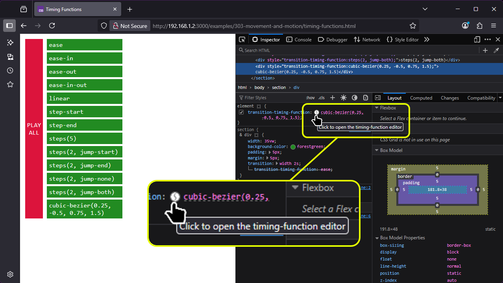
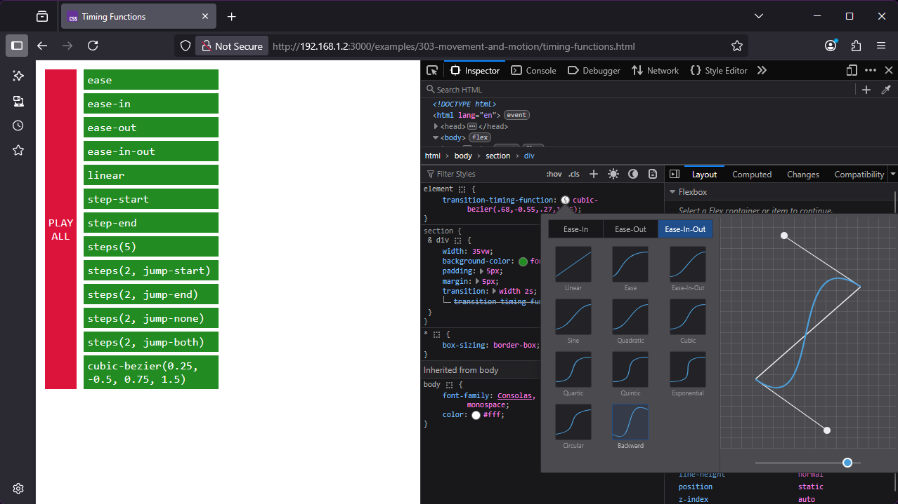
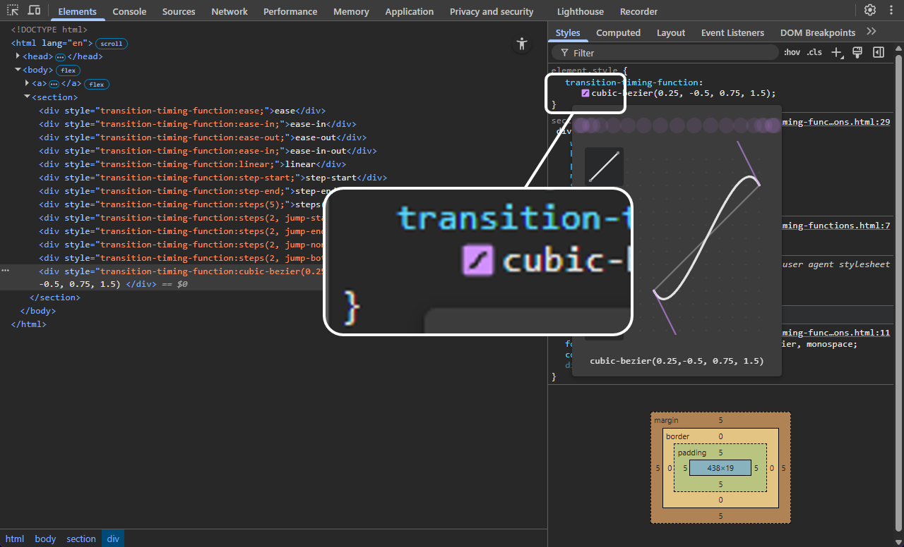

The web has always rested on three pillars: HTML controls structure, CSS controls presentation, JavaScript controls behaviour.

At least, that's the theory. It's valid up to a point... but like any taxonomy, the boundaries between the regions are a little fuzzy, and they even move around from time to time.

Animation was historically considered behaviour, but as the web has matured, we've realised that much of the time animation is actually about presentation. Movement and motion can be used to draw your user's attention to an element, such as an invalid form field; to show and hide dynamic navigation elements, or to create a sense of flow as people move between different parts of a page or application. None of these things change the underlying *behaviour* of the system—they’re all about how information is presented and how the experience feels. 

Consequently, animation features like transitions, keyframes and easing functions have gradually moved out of JavaScript and become part of CSS.

## Animation and Accessibility

TODO: write the stuff about animation and accessibility!

## Animation using `transition`

Here's a page with three `<div>` elements on it. Each of them does something different when you hover the mouse over it:



Usually, when we change a property of an element - change its background colour, make it wider, change its position - the change happens instantaneously. Using transitions, we can create smooth animations from the initial state to the final state by specifying:

* `transition-property`: what are we animating? *(Use `all` to animate everything that's animatable)*
* `transition-duration`: How long the transition should take - in seconds (`1s`) or milliseconds (`100ms`)
* `transition-timing-function`: for smooth animations, how should we calculate intermediate stages?
* `transition-delay`: how long to wait before running the transition (default: `0`)

You *can* specify each one individually:

```css
transition-property: color, margin-right, height;
transition-duration: 1s, 2s, 3s;
transition-timing-function: linear, ease-in, ease-out;
transition-delay: 3s, 2s, 1s;
```

But this is definitely a scenario where you're better off using the equivalent shorthand property:

```css
transition: 
	color 1s linear 3s,
	margin-right 2s ease-in 2s,
	height 3s ease-out 1s;
```

Here's our set of `<div>` elements with a very basic transition applied:



## What Can We Animate?

The short answer is... just about anything. The vast majority of properties in CSS can be animated; a full list of them all would take way more time than we have here, and by the end of it we'd all be extremely bored.

Broadly speaking, there are two kinds of animatable properties in CSS - *continuous*, and *discrete*. Continuous animation (also known as "computed value") means the browser can calculate the full range of intermediate values, and so create a smooth animated transition from the initial to the final state. 

For our `background-color` example, it calculates the intermediate red, green, and blue values for every animation frame; for the `height` example, it calculates the intermediate heights.

For something like `font-family`, there's no mathematical way to specify what's halfway between Times New Roman and Arial, so the animation is `discrete`. By default, this means it'll flip immediately, but in this case we've used the `transition-behavior: allow-discrete` property, which will flip it at the halfway point of the transition duration; in this case, we've specified the duration as `1s` so the font family changes after half a second.

## Transition Delays

Every transition can take an extra `delay` parameter, specified in seconds or milliseconds. 

Negative delays are allowed, which might seem impossible --- how can you have a  button that starts to change colour two seconds before the user has decided to click on it? --- but what they actually do is to start the transition partway through, as if it had already been running for the specified period. If the negative delay is equal to, or longer than, the transition duration, you won't see any animation - it's already done and jumps straight to the final state.



## Timing Functions

Timing functions create smooth, natural animations by simulating real-world physics effects like inertia. First, an interactive example:



Timing functions are based on a mathematical function called a cubic Bezier curve. Sounds complicated. It's not, really --- or rather, it uses some complicated mathematics behind the scenes, but you don't need to grok the maths to build your own curves, because there's a Bezier curve viewer and editor built in to browser dev tools.

I actually prefer the curve editor in Firefox, because it's easier to create curves which overshoot the animation range --- useful to create a sort of bouncy kinetic effect which I rather like. Open the Inspector, find an element with a transition timing function, and click the tiny icon next to it:



Once open, you can use the editor to select from various preset timing functions, or create your own timing curves by dragging the Bezier node handles; it'll update the CSS in the Styles inspector and you can copy the results back into your own code.



The equivalent in Chrome is accessed in a very similar way, and provides mostly the same capability --- the only limitation is that the size of the curve editor is limited because it assumes we're not going to overshoot.



You can even build your own timing function visualiser in a few lines of code, by animating the position (`top` and `left`) of an element and using the `linear` timing function for the `left` transition:



As we saw a moment ago, the `transition-property` property accepts a keyword `all`, meaning "animate every property that's animatable". You can use to create some fairly dramatic effects:



If you look closely, you'll also see that this example only animates in one direction. The `transition` property is only applied to the `:hover` state, so the animations will only play when the element transitions *from* normal *to* hover; when you mouse-out of the element, it snaps back immediately.

Oh, and watch out for horrible flicker loops... see what happens if you hover over the "put your mouse here" `<span>` in this example? Yeah. Not great user experience.

Now, in one sense, that's everything you need to know about CSS transitions: property, duration, timing function, delay, and `transition-behaviour: allow-discrete` to include discrete properties like font family. That's the complete transition feature set. In another sense, we've barely scratched the surface of what you can do with CSS transitions.

## Advanced Animation

Sometimes you need something more complex than a smooth interpolation between the initial and the final state. That's where the CSS `animation` module gets involved.

An **animation** in CSS has two components: a style describing the timing, duration and other parameters, and a **named set of keyframes** that dictate the initial state, final state, and any intermediate states.

### Defining Keyframes

Here's a simple keyframe animation that'll change an element's background colour from crimson to royal blue. This is the simplest possible example that actually works:



Things to notice here:

* The animation has a *name* - I've used `really-cool-animation-demo`
  * You can use anything you like, as long as it's a valid `<custom-ident>` - see below.
* The animation runs once, when the page loads.
* The only way to run it again is to reload the page.
* When the animation's done, it vanishes - we animate our `<div>` from crimson to royal blue, but it doesn't stay blue.

Custom Identifiers

Animation names in CSS must be a valid `<custom-ident`>: one or more characters, which can contain letters `A-Z a-z`, numbers `0-9`, hyphens `-`, underscores `_`

* Number `0-9`
* 


 

Course Content

- Animations and CSS transitions
- Triggering interactions: hover, click, scroll, JS events
- Parallax scrolling
- Exercise: animated airline departure board grid


- [Designing Safer Web Animation For Motion Sensitivity · An A List Apart Article](https://alistapart.com/article/designing-safer-web-animation-for-motion-sensitivity/)
- [An Introduction to the Reduced Motion Media Query | CSS-Tricks](https://css-tricks.com/introduction-reduced-motion-media-query/)
- [Responsive Design for Motion | WebKit](https://webkit.org/blog/7551/responsive-design-for-motion/)
- [MDN Understanding WCAG, Guideline 2.2 explanations](https://developer.mozilla.org/en-US/docs/Web/Accessibility/Guides/Understanding_WCAG/Operable#guideline_2.2_—_enough_time_provide_users_enough_time_to_read_and_use_content)
- [Understanding Success Criterion 2.2.2 | W3C Understanding WCAG 2.0](https://www.w3.org/TR/UNDERSTANDING-WCAG20/time-limits-pause.html)

## Notes


