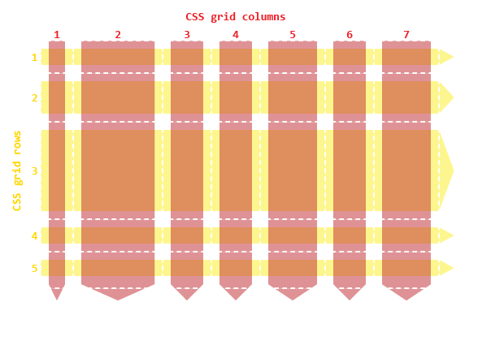
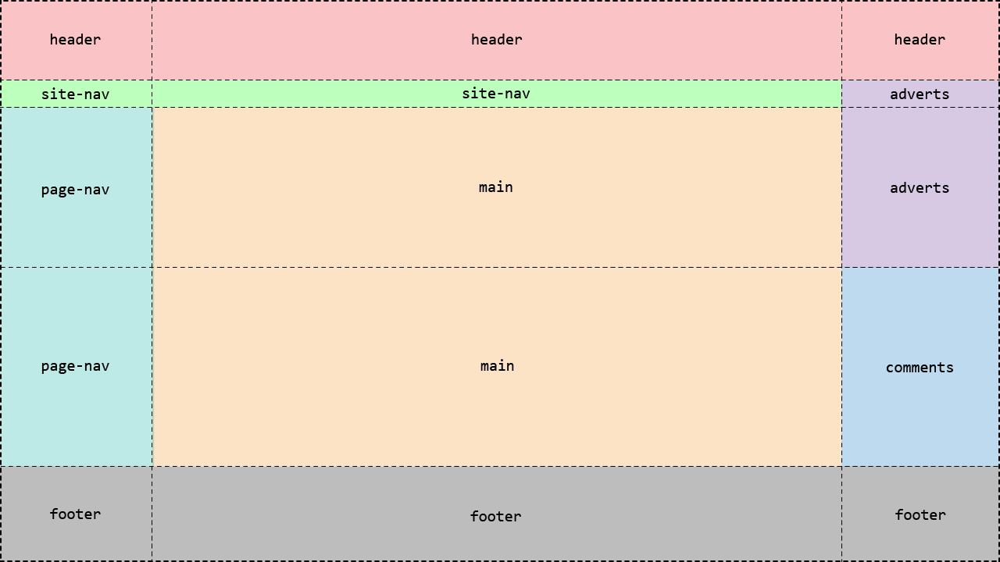

In the beginning, there was the document flow, and there were block and inline elements, and lo, it was sort of OK, and if it wasn't you could always use float, and developers went "but how do we get a header here and a footer there and a left and right hand navigation and have the whole thing responsive across different layouts" and the World Wide Web Consortium went "we don't know maybe you could do it using tables?"

And then there was the 12-column layout, and the CSS flexbox, and it was good, and developers went "yeah, this is all awesome but what if I want to a layout that's responsive in two different directions at the same time?" and the WHAT-WG, which by now had replaced the World Wide Web Consortium when it came to This Kind Of Thing, went "what, you want, like, flexbox, but with rows *and* columns?" and the developers went "yes!" and the WHAT-WG went "Oh, ok, I guess we could build some sort of grid system" and developers went "YES A GRID SYSTEM!"... and so CSS Grid was born.

## Why Use CSS Grid?

The first thing to remember --- and this applies to just about everything we've seen so far in this course --- is that none of it is mutually exclusive. Choosing CSS layout modules isn't like choosing Python vs nodeJS, or React vs Angular; you can mix and match. You can absolutely have a site where you have individual grid-based components used in flex-based sections in a page that's using a legacy 12-column layout grid; in fact, many of the examples I've shown so far in this course use a flex or a grid just to lay out a handful of elements inside a div or a section.

### Understanding Flow vs Grid vs Flex 

There's a lot of overlap between flex and grid; they share many of the same concepts and use the same syntax for properties like `gap`. The fundamental difference between them is that **flex always tries to fill the container**, whereas **grid always respects rows and columns**.

From time to time, somebody will ask online "I'm using CSS flexbox with wrap; how do I stop the last item stretching to fill the row?" and the answer comes back "use a CSS grid":



## Basic CSS Grid

Very broadly speaking, CSS grid boils down to three things.

1. Set `display: grid` or `display: inline-grid` on the container element
2. Define the rows and columns on the container
3. Override those if required for specific grid items

I learned most of what I know about using CSS grid from Chris House's excellent [CSS Grid Layout Guide](https://css-tricks.com/snippets/css/complete-guide-grid/) over at css-tricks.com, which also has a [one-sheet quick-reference guide](https://css-tricks.com/wp-content/uploads/2022/02/css-grid-poster.png) covering all the grid layout properties and values.

The rows and columns in a CSS grid layout are collectively known as *tracks*, so when you see a reference to a track or track size, we're talking about something which is either a row or a column.

<figure>
    
    <figcaption>CSS Grid Tracks</figcaption>
</figure>

The boundaries around the grid and between adjacent tracks are known as *grid lines* - and before you ask, there's no way to use CSS to make them visible the way you can with table cell borders.

<figure>
    
    <figcaption>CSS grid: columns, rows, and lines</figcaption>
</figure>

If it helps, think of the grid cells like city blocks, and the lines as the streets between them. The tracks in a grid are specified using the `grid-template-rows` and `grid-template-columns` properties; each property is a list of track sizes - absolute units, relative units, or the special `fr` unit which represents a proportion of the available space.

> `fr` is officially short for for *fraction* but when I first saw it I thought "oh, OK, `fr` for 'free space'" and that's stuck in my head now.



You can also use the `repeat` function to repeat the same track size:



## Explicit vs Implicit Grids

If there are more items in the grid than you've allocated spaces for, the grid layout module will add extra rows or columns to accommodate the extra elements.

By default, the grid layout adds additional rows to the end of the grid. 

>  These examples are interactive - click the button to add extra items to the grid:



To add additional *columns*, add `grid-auto-flow: column` to the grid container; this tells the layout module to add elements by filling each column first, and adding more columns as needed:



To control the size of the implicit tracks, use `grid-auto-rows` or `grid-auto-columns`:



Items within the grid can target specific rows and columns using the `grid-column-start`, `grid-column-end`, `grid-row-start` and `grid-row-end` properties.

Something which often trips people up when they first encounter this syntax: we're not specifying the row or column number, we're specifying the *line between them*. I think one of the reasons there's so much confusion here is that there's some really misleading behaviour baked into the CSS grid spec. Take a look at this code and the resulting output:



Div #1 - the red one - clearly starts and ends in column 3, and starts and ends in row 2... right?

No. This is actually invalid syntax. The numbers refer to lines, not rows/columns, so an item which starts *and ends* at column grid line 1 actually has zero width... but there's a fallback rule in the CSS grid spec which says that if the combination of a start and an end rule would create an element with zero (or negative) size, ignore the end rule... and because the default is to span a single row/column, it looks like it worked.

Here's an example that specifies start and end lines correctly. This example also creates some overlapping elements; these will be stacked in the order they appear in the HTML, unless you override this using a `z-index`:



## Named Tracks and Template Areas

Part of the power of CSS grid is the ability to name parts of the grid, and then use those names to allocate other elements in your document to named grid areas.

First up, let's take a look at named lines. To create a named line, put the name in `[]` square brackets between two tracks in the row or column template property.

* Remember, you aren't naming the tracks, you're **naming the lines between them**.

* A single line can have more than one name - useful when the end of one area also marks the start of another area, like when the `nav-end`

* A name can be applied to more than one line, and then used by qualifying it with a number - apparently useful if you put named lines into a `repeat()` statement.[^1]

[^1]: Don't ask me why anybody would do this. I have no idea.



Naming lines is just a prelude to the really good stuff: named grid areas. You can take whole chunks of the grid, give them names using a relatively simple format, and then link chunks of content to those areas.

How simple? Imagine the dumbest thing you can possibly think of: ASCII art. Actually, even simpler than ASCII art, because there aren't any lines: just names. Given a 3x5 grid layout, we can divide into areas like this:

```css
div { 
	grid-template-areas: 
        "header     header    header"
        "site-nav  site-nav   adverts"
        "page-nav    main     adverts"
        "page-nav    main    comments"
        "footer     footer    footer";
}
```

The resulting layout ends up like this:

<figure>
    
    <figcaption>CSS grid areas</figcaption>
</figure>

and then by specifying the `grid-area` property on the various elements that make up the page, we can lay those elements directly onto the grid:



## Subgrid and Masonry Grids

As well as specifying track sizes, the CSS `grid-template-row` and `grid-template-column` properties can take the value `subgrid`

Subgrid is used when a grid item is itself a grid container; it causes the tracks and lines of the child element to align with the grid of the parent element. Other grid properties, like `gap`, are not inherited, and can be declared separately on the child container:



There's also a popular layout used on a lot of sites, most notably Pinterest, which is known as a *masonry layout*; a way to arrange irregular content in columns such that it doesn't leave any gaps:

<figure>
    
    <figcaption>Example of a Masonry Layout</figcaption>
</figure>

There is a [proposal to add a masonry grid to CSS](https://css-tricks.com/css-masonry-css-grid/), so you could build a layout like the one above by specifying the grid columns as usual and setting `grid-template-rows` to `masonry`; however, at the time I'm writing this, it's only available as a technology preview in experimental versions of Safari, so I reckon it'll be mid-2026 at the earliest before we see any support across Chrome and/or Firefox for masonry grids; in the meantime, if you're trying to create this kind of layout, the only option is to use JavaScript to 

## Grid Shorthand

The property `grid` is a shorthand syntax covering:

* `grid-auto-columns`
* `grid-auto-flow`
* `grid-auto-rows`
* `grid-template-areas`
* `grid-template-columns`
* `grid-template-rows`

Like most CSS shorthand properties, it's redundant if you're only specifying a single property, useful if you're specifying two or three properties, and rapidly becomes unreadable if you pack in many more than that.


## Justify, Align, and Grid Item Properties

Like CSS flexbox, grid gives us a whole range of options when it comes to aligning and justifying items in the container, and for allowing individual items to override container-level styling.

