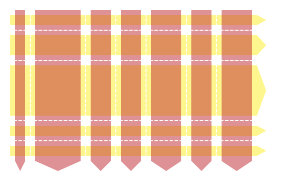

In the beginning, there was the document flow, and there were block and inline elements, and lo, it was sort of OK, and if it wasn't you could always use float, and developers went "but how do we get a header here and a footer there and a left and right hand navigation and have the whole thing responsive across different layouts" and the World Wide Web Consortium went "we don't know maybe you could do it using tables?"

And then there was the 12-column layout, and the CSS flexbox, and it was good, and developers went "yeah, this is all awesome but what if I want to a layout that's responsive in two different directions at the same time?" and the WHAT-WG, which by now had replaced the World Wide Web Consortium when it came to This Kind Of Thing, went "what, you want, like, flexbox, but with rows *and* columns?" and the developers went "yes!" and the WHAT-WG went "Oh, ok, I guess we could build some sort of grid system" and developers went "YES A GRID SYSTEM!"... and so CSS Grid was born.

## Why Use CSS Grid?

The first thing to remember --- and this applies to just about everything we've seen so far in this course --- is that none of it is mutually exclusive. Choosing CSS layout modules isn't like choosing Python vs nodeJS, or React vs Angular; you can mix and match. You can absolutely have a site where you have individual grid-based components used in flex-based sections in a page that's using a legacy 12-column layout grid; in fact, many of the examples I've shown so far in this course use a flex or a grid just to lay out a handful of elements inside a div or a section.

### Understanding Flow vs Grid vs Flex 

There's a lot of overlap between flex and grid; they share many of the same concepts and use the same syntax for properties like `gap`. The fundamental difference between them is that **flex always tries to fill the container**, whereas **grid always respects rows and columns**.

From time to time, somebody will ask online "I'm using CSS flexbox with wrap; how do I stop the last item stretching to fill the row?" and the answer comes back "use a CSS grid":



## Basic CSS Grid

Very broadly speaking, CSS grid boils down to three things.

1. Set `display: grid` or `display: inline-grid` on the container element
2. Define the rows and columns on the container
3. Override those if required for specific grid items

I learned most of what I know about using CSS grid from Chris House's excellent [CSS Grid Layout Guide](https://css-tricks.com/snippets/css/complete-guide-grid/) over at css-tricks.com, which also has a [one-sheet quick-reference guide](https://css-tricks.com/wp-content/uploads/2022/02/css-grid-poster.png) covering all the grid layout properties and values.

The rows and columns in a CSS grid layout are collectively known as *tracks*, so when you see a reference to a track or track size, we're talking about something which is either a row or a column.

<figure>
    
    <figcaption>CSS Grid Tracks</figcaption>
</figure>

Tracks are specified using the `grid-template-rows` and `grid-template-columns` properties; each property is a list of track sizes - absolute units, relative units, or the special `fr` unit which represents a proportion of the available space.

> `fr` is officially short for for *fraction* but when I first saw it I thought "oh, OK, `fr` for 'free space'" and that's stuck in my head now.



You can also use the `repeat` function to repeat the same track size:



## Explicit vs Implicit Grids

If there are more items in the grid than you've allocated spaces for, the grid layout module will add extra rows or columns to accommodate the extra elements.

By default, the grid layout adds additional rows to the end of the grid. 

>  These examples are interactive - click the button to add extra items to the grid:



To add additional *columns*, add `grid-auto-flow: column` to the grid container; this tells the layout module to add elements by filling each column first, and adding more columns as needed:



To control the size of the implicit tracks, use `grid-auto-rows` or `grid-auto-columns`:



# Using CSS Grid (30m)

## Course Content

- Display: `grid` and `inline-grid`
- Grid-template columns, rows, areas
- grid-colum (+ start and end)
- grid-row (+ start and end)
- grid-area
- place - items, content, self
- justify and align
- auto grids - flow, columns and rows

## Notes

