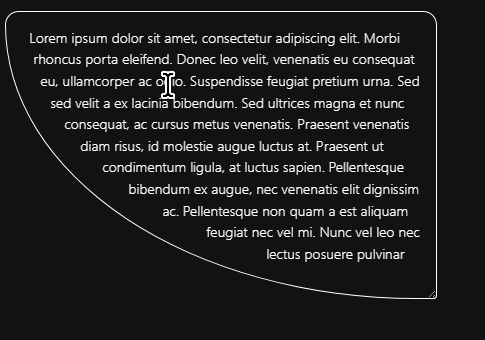

# Conclusion (20m)

## Course Content

- Review and recap
- The future of CSS
- FAQ (20m)
- Thank you

The Future of CSS

https://daverupert.com/2025/07/sci-fi-rectangles-with-corner-shape/

https://frontendmasters.com/blog/understanding-css-corner-shape-and-the-power-of-the-superellipse/

## Notes

CRAZY FUN STUFF

https://codepen.io/shannonmoeller/pen/XJbyQre



