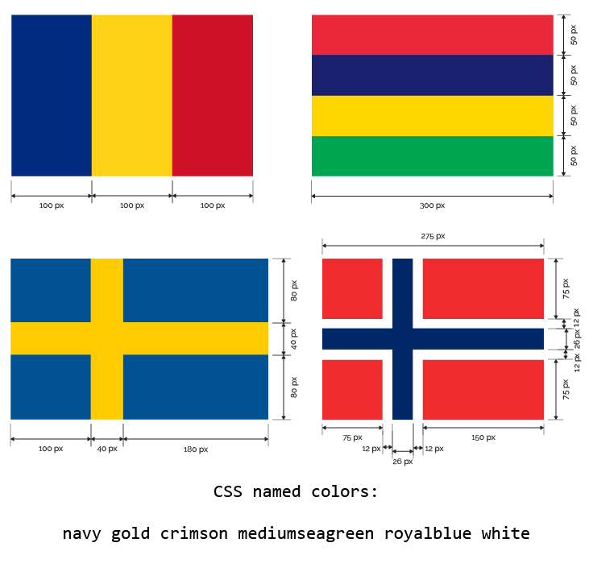

You're going to use the CSS properties we've learned about so far to recreate some country flags.

<figure>
    
</figure>

The specification for each flag is above, or you can find a PDF version here:

* **[css-flags.pdf](./css-flags.pdf)**

You'll find the HTML code in [flags.html](examples/flags.html), and the linked stylesheet in [flags.css](examples/flags.css)



**Do not edit the HTML.** Your task is to turn the provided HTML into the four flags of the countries above using **pure CSS**.

