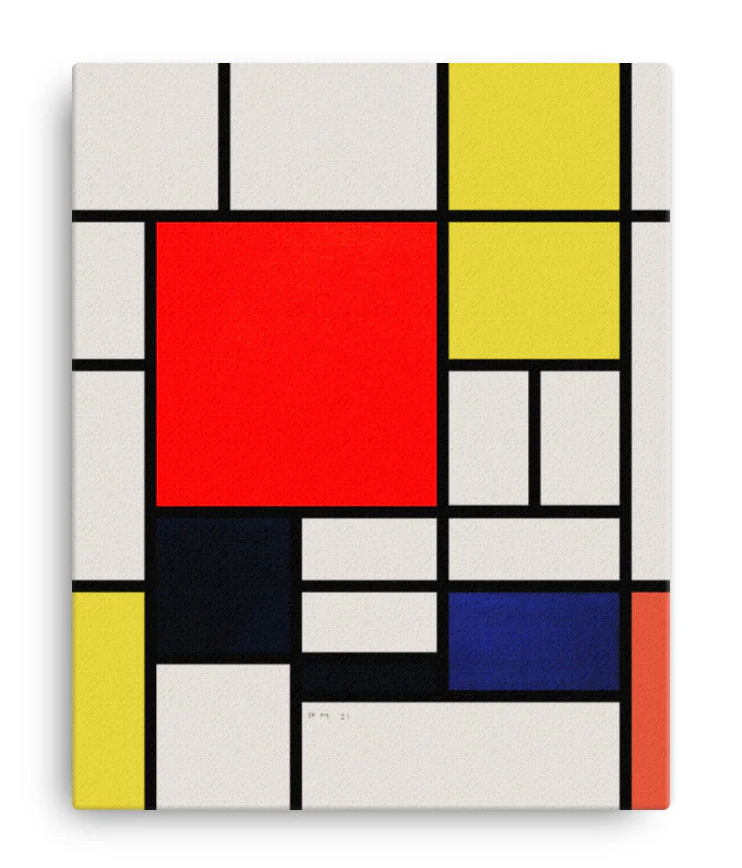

# Exercise: Piet Mondrian

Piet Mondrian (1872–1944) was a Dutch artist who moved from painting trees and landscapes to creating bold grids of lines and color. As part of the De Stijl movement, he believed that using just verticals, horizontals, and primary colors could express balance and harmony in the simplest way possible. His style went on to shape not only modern art but also design, fashion, and architecture.

*Composition with Red, Yellow, Black, Gray and Blue* shows Mondrian’s trademark approach: thick black lines dividing the canvas into rectangles, some filled with bright red, yellow, and blue, others left white or gray.

Use a CSS grid to recreate Mondrian's *Composition with Red, Yellow, Black, Gray and Blue*, based on a responsive layout that maintains the aspect ratio of the original piece but scales to fit the height of the browser viewport.

